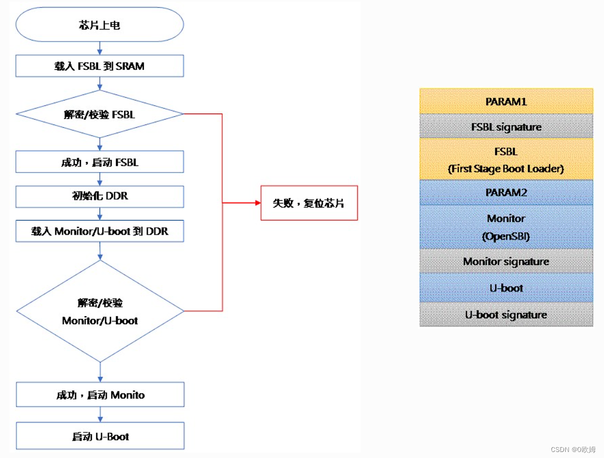
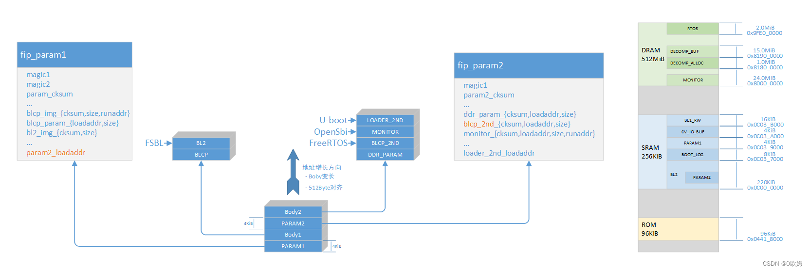

# 小型コアでRTOSをブートする - RISC-V C906

[オリジナル](http://www.hlln.cn/news/289259.html)

## 実行ログ

```bash
FSBL Jb2829:g362832ac6-dirty:2024-04-02T13:31:11+00:00  # バージョン情報
st_on_reason=40f0003
st_off_reason=800e0003
P2S/0x1000/0xc00a400.
SD/0x9400/0x1000/0x1000/0.P2E.
DPS/0xa400/0x2000.
SD/0xa400/0x2000/0x2000/0.DPE.
DDR init.                                               # DDRの初期化
ddr_param[0]=0x78075562.
pkg_type=1
D2_4_1
DDR3-4G-BGA
Data rate=1866.
DDR BIST PASS
PLLS/OD.
C2S/0xc400/0x9fe00000/0x3600.2RET.:00/0x3600/0x3600/0.RSC.[M1S./208x2f8a0000]/P0rxe8 0s0y0s0t0e0m0 /i0nxi1tb 0d0o0n.eRT: [1.289126]CVIRTOS Build Date:Apr  2 2024  (Time :13:31:11) # FreeRTOSのアクティベート
RT: [1.295040]Post system init done
RT: [1.298355]create cvi task
RT: [1.301172][cvi_spinlock_init] succeess
RT: [1.305076]prvCmdQuRunTask run
SD/0xfa00/0x1b000/0x1b000/0.ME.
L2/0x2aa00.
SD/0x2aa00/0x200/0x200/0.L2/0x414d3342/0xcafedbb7/0x80200000/0x37400/0x37400
COMP/1.
SD/0x2aa00/0x37400/0x37400/0.DCP/0x80200020/0x1000000/0x81900020/0x37400/1.
DCP/0x73c7a/0.
Loader_2nd loaded.                                      # 2ndローダ: Opensbi；
Switch RTC mode to xtal32k
Jump to monitor at 0x80000000.
OPENSBI: next_addr=0x80200020 arg1=0x80080000
OpenSBI v0.9
```

これから次のことを知ることができます。

- FSBL Jb2829... FSBLが起動し、バージョン情報が印刷される。
-  DDRの初期化が完了し、RTOSタスクが初期化される。その間、小型コアのブートジョブに関するログはない。

つまり、RTOSブートプロセスを確認する前に、FSBLの一般的な知識を持つ必要があります。

## `fip`ターゲット

`fip`ターゲットはRTOSに関連する以下の内容を持っています。

```Makefile
# fsbl/make_helpers/fip.mk
...
fip: fip-all    # fipはfip-allに依存する
...
fip-all: fip-dep$(print_target)
    ${Q}echo "  [GEN] fip.bin"
    ${Q}. ${BUILD_PLAT}/blmacros.env && \${FIPTOOL} -v genfip \
        '${BUILD_PLAT}/fip.bin' \
        '${BUILD_PLAT}/fip.bin' \
        --MONITOR_RUNADDR="$${MONITOR_RUNADDR}" \
        --BLCP_2ND_RUNADDR="$${BLCP_2ND_RUNADDR}" \
        --CHIP_CONF='${CHIP_CONF_PATH}' \
        --NOR_INFO='${NOR_INFO}' \
        --NAND_INFO='${NAND_INFO}'\
        --BL2='${BUILD_PLAT}/bl2.bin' \
        --BLCP_IMG_RUNADDR=${BLCP_IMG_RUNADDR} \
        --BLCP_PARAM_LOADADDR=${BLCP_PARAM_LOADADDR} \
        --BLCP=${BLCP_PATH} \
        --DDR_PARAM='${DDR_PARAM_TEST_PATH}' \
        --BLCP_2ND='${BLCP_2ND_PATH}' \
        --MONITOR='${MONITOR_PATH}' \
        --LOADER_2ND='${LOADER_2ND_PATH}' \
        --compress='${FIP_COMPRESS}'...
```

実際のコンパイルプロセスによって表示されたログを絶対パスのSDKトップレベルディレクトリを簡潔にするために
${SDK_TOP}に置き換えて以下に示します。

```bash
. ${SDK_TOP}/fsbl/build/cv1813h_milkv_duos_sd/blmacros.env && \
./plat/cv181x/fiptool.py -v genfip \
    '${SDK_TOP}/fsbl/build/cv1813h_milkv_duos_sd/fip.bin' \
    --MONITOR_RUNADDR="${MONITOR_RUNADDR}" \
    --BLCP_2ND_RUNADDR="${BLCP_2ND_RUNADDR}" \
    --CHIP_CONF='${SDK_TOP}/fsbl/build/cv1813h_milkv_duos_sd/chip_conf.bin' \
    --NOR_INFO='FFFFFFFFFFFFFFFFFFFFFFFFFFFFFFFFFFFFFFFFFFFFFFFFFFFFFFFFFFFFFFFFFFFFFFFF' \
    --NAND_INFO='00000000'\
    --BL2='${SDK_TOP}/fsbl/build/cv1813h_milkv_duos_sd/bl2.bin' \
    --BLCP_IMG_RUNADDR=0x05200200 \
    --BLCP_PARAM_LOADADDR=0 \
    --BLCP=test/empty.bin \
    --DDR_PARAM='test/sophon/ddr_param.bin' \
    --BLCP_2ND='${SDK_TOP}/freertos/cvitek/install/bin/cvirtos.bin' \
    --MONITOR='../opensbi/build/platform/generic/firmware/fw_dynamic.bin' \
    --LOADER_2ND='${SDK_TOP}/u-boot-2021.10/build/cv1813h_milkv_duos_sd/u-boot-raw.bin' \
    --compress='lzma'
```

この中の鍵となる情報を見てみます。

- --BLCP_2ND='${SDK_TOP}/freertos/cvitek/install/bin/cvirtos.bin'
    RTOSはBLCP_2NDとして定義されています。

    BLCP_2NDの実行アドレスは`board`ディレクトリにある`memmap.py`ファイルで定義されています。
    `build/boards/cv181x/cv1813h_milkv_duos_sd/memmap.py`

    ```python
    class MemoryMap:
    ...
    DRAM_BASE = 0x80000000
    DRAM_SIZE = 512 * SIZE_1M
    # ==================
    # C906L FreeRTOS
    # ==================
    FREERTOS_SIZE = 2 * SIZE_1M
    # FreeRTOSはDRAMの末尾にあります。
    FREERTOS_ADDR = DRAM_BASE + DRAM_SIZE - FREERTOS_SIZE
    FSBL_C906L_START_ADDR = FREERTOS_ADDR
    ```

    これからわかること
        - Duosメモリの開始位置: 0x80000000、サイズ: 512MB；
        - FreeRTOSイメージ実行アドレス(ロードアドレスではない): 0x9fe00000 (メモリカウントダウン2MB位置)、サイズ: 2MB；

    変換パス: mempa.py - build/scripts/mmap.mk --> build/output/${PROJECT_FULLNAME}/cvi_board_memmap.h.

    リンク方法: cvi_board_memmap.hファイルへのリンク: fsbl/build/cvi_board_memmap.h．

- --MONITOR='${SDK_TOP}/opensbi/build/platform/generic/firmware/fw_dynamic.bin'
    OpensbiはMONITORとして定義されています。

    ATFから拝借して、Milk-VはRisc-V OpensbiをATFのBL31と同一視しています。

    ```c
    # OpenSBI | arm-trusted-firmware
    # =========================================================
    # モニタは DRAMMの先頭にあります
    MONITOR_ADDR = DRAM_BASE
    ATF_SIZE = 512 * SIZE_1K
    OPENSBI_SIZE = 512 * SIZE_1K
    OPENSBI_FDT_ADDR = MONITOR_ADDR + OPENSBI_SIZE
    ```

    これからわかること
        - Opensbiイメージの実行アドレス: 0x80000000、サイズ: 512KB；

- --LOADER_2ND='${SDK_TOP}/u-boot-2021.10/build/cv1813h_milkv_duos_sd/u-boot-raw.bin'
    U-bootはLOADER_2NDとして定義されています；

    ATFから拝借して、Milk-VはRisc-V U-bootをATFのBL32と同一視しています。

    ```c
    # ===================
    # FSBL and u-boot-2021
    # ===================
    CVI_UPDATE_HEADER_SIZE = SIZE_1K
    UIMAG_SIZE = 16 * SIZE_1M
    # kernel image loading buffer
    UIMAG_ADDR = DRAM_BASE + 24 * SIZE_1M
    # u-boot's run address and entry pointCON
    FIG_SYS_TEXT_BASE = DRAM_BASE + 2 * SIZE_1M
    ```

    これからわかること
        - U-bootの実行アドレス: 0x8020000（メモリオフセット2MB）、サイズ: 2MB；

生成された値をリンクスクリプトの値と検証するのは実用です。リンクスクリプトは
blmacros.ldで以下のようになっています。

```bash
# fsbl/build/cv1813h_milkv_duos_sd/blmacros/blmacros.ld
SECTIONS {
    ...
    DEF_DRAM_BASE = 0x80000000;
    DEF_MONITOR_RUNADDR = 0x80000000;
    DEF_BLCP_2ND_RUNADDR = 0x9fe00000;
```

## ブートプロセス

前のセクションからBLCP_2NDへの参照をたどることで、RTOSがブートのためにどのように
ロードされるかをヘッダファイルなどで確認することができます：

// fsbl/plat/sg200x/include/mmap.h
#define BLCP_2ND_RUNADDR CVIMMAP_FSBL_C906L_START_ADDR
// fsbl/build/cvi_board_memmap.h ソフトチェーンは以下のエンティティファイルを指します。
// build/output/cv1813h_milkv_duos_sd/cvi_board_memmap.h
#define CVIMMAP_FSBL_C906L_START_ADDR 0x9fe00000 /* offset 510.0MiB */．

しかし、FSBLのソースコードのどこにもこのマクロへの直接の参照はないため、FSBLはアドレス情報を
直接エンコードせず、間接的に渡していると推測できます。実際には、ブートファイルfip.binは
キー情報BLCP_2ND_RUNADDRを含むカラムのペアの要件に従ってスプライスされることが知られています。

したがって、まずfip.binファイルの構成について理解する必要があります。

## fipファイルの構成

SG200xメーカーであるCalculus Energy社のマニュアル情報を参照すると
fip.binイメージの構成と起動プロセスは以下のようになっています。



そして、一般的な分割構造は構造定義ヘッダファイルを持つPythonのパッキング
スクリプトを参照して、特定の構造のサイズと配置を整理することができます。
ファイルは次のとおりです：

- `fsbl/plat/sg200x/fiptool.py`: `fip.bin`ファイルを生成するPythonスクリプト
    param1、body1、param2、body2の定義はクラス`FIP`で見ることができます。
- `fsbl/plat/sg200x/include/bl2.h`: struct param2の定義
- `fsbl/plat/${CHIP_ARCH}/include/platform.h`: param1構造体の定義；

まとめると次のようになります。



これからわかることは

1. Body1の最初のイメージは`BLCP`であり、その情報は`fip`ターゲットから知ることができます。

    --BLCP_IMG_RUNADDR=0x05200200 --BLCP_PARAM_LOADDR=0 --BLCP=test/empty.bin

    ここで、
        - BLCPのイメージファイルは`${FSBL_DIR}/test/empty.bin`です。
        - BLCPは空であるため、そのロードアドレス (BLCP_PARAM_LOADDR) とランアドレス
          (BLCP_IMG_RUNADDR) と情報はいみありません。

2. Body1の2番目のイメージは`BL2`であり、上記と同様にBL2の情報を知ることができます。

    --BL2='${SDK_TOP}/fsbl/build/cv1813h_milkv_duos_sd/bl2.bin'

    ここで
        - FSBLイメージファイルであるBL2は`${FSBL_DIR}/build/cv1813h_milkv_duos_sd/bl2.bin`を指しており、
          サイズは33KBです。
        - FSBLとはあるフェーズの総称でありBL2はその一部です。
        - BL2フェーズではDDRの初期化作業が行われます

3. Body2の最初のイメージは`DDR_PARAM`であり、DDR_PARAM情報は次のとおりです。

    --DDR_PARAM='test/sophon/ddr_param.bin'。

    ここで
        - DDR_PARAMはDDRの初期化パラメータであり、`${FSBL_DIR}/test/sophon/ddr_param.bin`を指しており、
          サイズは8KBです。
        - 16進数ダンプで見ると組織的な指定は見当たりません。特定のデータ構造に従って組織化されているか、
          暗号化されている可能性があります；

4. Body2の2番目のファイルは`BLCP_2ND`であり、次の情報を得ることができます。

    --BLCP_2ND_RUNADDR="${BLCP_2ND_RUNADDR}" --BLCP_2ND='${SDK_TOP}/freertos/cvitek/install/bin/cvirtos.bin'

    ここで
        - BLCP_2NDは2つ目のBLCPイメージファイルであり、`${SDK_TOP}/freertos/cvitek/install/bin/cvirtos.bin`を
        指しています。
        - これが探しているRTOSイメージファイルであり、アドレス`0x9FE0_0000`で実行されます；

5. Body2の`MONITOR`と`LOADER_2ND`についてはすでに解析しています。

まとめると、Bodyの構成順序はブートプロセスに従っているようです: `BLCP => BL2 => BLCP_2ND => MONITOR => LOADER_2ND`

BLCPは空ですのでブートプロセスの実際の内容は次のようになります: `bl2 => FreeRTOS => opensbi => U-boot`

したがって、`bl2 => FreeRTOS => opensbi => U-boot`と推測できます。

[途中省略]

## 感想

BootRomは非オープンのBL1に属し、BL2ではBL1のインタフェースが複数呼び出されることから、BL1には既に
多くの基本的な実装が統合されており、利用される可能性が高いことがわかります。

業界のシナリオからすると、これはRaspberry Piや他のハードウェアの非オープンソースソリューションと
同様であり、ICベンダのBL1機能が充実し、ボードレベルの適応（DDRなど）作業もICベンダが行うようになると、
最終製品側でのBSP開発の必要性がどんどん弱くなっていくという傾向を形成しているように思われます。
