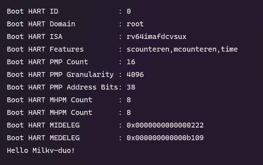

# OpenSBIを使って自作OSを起動する

[オリジナル](https://forum.sophgo.com/t/use-opensbi-to-boot-your-own-operating-system/340)

以前、[U-Bootを使って自作OSをブートストラップする](https://community.milkv.io/t/uboot/181)と
いう記事において、OpenSBIを使って自作OSをブートストラップしようとしました。しかし、FIP
(Firmware Image Package)を作成する際、および、ATF (Arm Trusted Firmware) をスタートアップ
する際にbl33イメージのフォーマットに要件があることがわかりました。

この間、RISC-Vのアセンブリとリンカスクリプトを掘り下げ、ATFとU-Bootのコードを再検討しました。
そして独自のbl33イメージを作るのは実はとても簡単だということに気づきました。必要なのは
プログラムの冒頭に以下の情報を含めることだけでした。

```
_start:
	/* BL33 information */
	j real_start
	.balign 4
	.word 0x33334c42  /* b'BL33' */
	.word 0xdeadbeea  /* CKSUM */
	.word 0xdeadbeeb  /* SIZE */
	.quad 0x80200000  /* RUNADDR */
	.word 0xdeadbeec
	.balign 4
	j real_start
	.balign 4
	/* BL33 end */
```

簡単な例を示します。

SDKをコンパイルしたことがない場合は、次の手順でFSBL (First Stage Bootloader)をコンパイルして、
bl2イメージを取得する必要があります。

```bash
export MILKV_BOARD=milkv-duo
source milkv/boardconfig-milkv-duo.sh

source build/milkvsetup.sh
defconfig cv1800b_milkv_duo_sd

build_fsbl
```

次に、uart8250を使って文字列をプリントする簡単なプログラムを書きます。

```
#define UART0_THR 0x04140000
#define UART0_LSR 0x04140014

	.section .text
	.global _start
_start:
	/* BL33 information */
	j real_start
	.balign 4
	.word 0x33334c42  /* b'BL33' */
	.word 0xdeadbeea  /* CKSUM */
	.word 0xdeadbeeb  /* SIZE */
	.quad 0x80200000  /* RUNADDR */
	.word 0xdeadbeec
	.balign 4
	j real_start
	.balign 4
	/* Information end */

real_start:
	la s0, str
1:
	lbu a0, (s0)
	beqz a0, exit
	jal ra, uart_send
	addi s0, s0, 1
	j 1b

exit:
	j exit

uart_send:
	/* Wait for tx idle */
	li t0, UART0_LSR
	lw t1, (t0)
	andi t1, t1, 0x20
	beqz t1, uart_send
	/* Send a char */
	li t0, UART0_THR
	sw a0, (t0)
	ret

.section .rodata
str:
	.asciz "Hello Milkv-duo!\n"
```

コンパイルします。

```bash
riscv64-unknown-elf-gcc -nostdlib -fno-builtin -march=rv64gc -mabi=lp64f -g -Wall -Ttext=0x80200000 -o bl33.elf start.S

riscv64-unknown-elf-objcopy -O binary bl33.elf bl33.bin
```

`hd`を使って生成された`bin`ファイルを調べると、検証用のデータが2行あることがわかります。
一方、OpenSBIは実際に0x80200020にジャンプしてプログラムを実行します。

```
00000000  05 a0 01 00 42 4c 33 33  ea be ad de eb be ad de  |....BL33........|
00000010  00 00 20 80 00 00 00 00  ec be ad de 11 a0 01 00  |.. .............|
```

`fsbl`ディレクトリに移動して`fip.bin`ファイルを生成します。

```bash
cd fsbl/

./plat/cv180x/fiptool.py -v genfip \
    'build/cv1800b_milkv_duo_sd/fip.bin' \
    --MONITOR_RUNADDR="0x0000000080000000" \
    --CHIP_CONF='build/cv1800b_milkv_duo_sd/chip_conf.bin' \
    --NOR_INFO='FFFFFFFFFFFFFFFFFFFFFFFFFFFFFFFFFFFFFFFFFFFFFFFFFFFFFFFFFFFFFFFFFFFFFFFF' \
    --NAND_INFO='00000000'\
    --BL2='build/cv1800b_milkv_duo_sd/bl2.bin' \
    --DDR_PARAM='test/cv181x/ddr_param.bin' \
    --MONITOR='../opensbi/build/platform/generic/firmware/fw_dynamic.bin' \
    --LOADER_2ND='/path/to/bl33.bin' \
    --compress='lzma'
```

最後に`fip.bin`ファイルをTFカードに置き、ボーレート128000でボードのシリアルポートに接続すれば
次の情報を見ることができます。



## 手元で作成

```bash
$ mkdir milkv_test
$ cd milkv_test
$ vi start.S
$ ~/riscv-gnu-toolchain/bin/riscv64-unknown-elf-gcc -nostdlib -fno-builtin -march=rv64gc -mabi=lp64f -g -Wall -Ttext=0x80200000 -o bl33.elf start.S
$ ~/riscv-gnu-toolchain/bin/riscv64-unknown-elf-objcopy -O binary bl33.elf bl33.bin
$ ls -l
total 16
-rwxrwxr-x 1 vagrant vagrant  104 Sep  2 16:45 bl33.bin
-rwxrwxr-x 1 vagrant vagrant 6440 Sep  2 16:45 bl33.elf
-rw-rw-r-- 1 vagrant vagrant  773 Sep  2 16:38 start.S
$ xxd bl33.bin
00000000: 05a0 0100 424c 3333 eabe adde ebbe adde  ....BL33........
00000010: 0000 2080 0000 0000 ecbe adde 11a0 0100  .. .............
00000020: 1704 0000 1304 6403 0345 0400 09c5 ef00  ......d..E......
00000030: a000 0504 d5bf 01a0 b702 1404 d122 03a3  ............."..
00000040: 0200 1373 0302 e309 03fe b702 1404 23a0  ...s..........#.
00000050: a200 8280 0000 4865 6c6c 6f20 4d69 6c6b  ......Hello Milk
00000060: 762d 6475 6f21 0a00                      v-duo!..

$ cd ../duo-buildroot-sdk/fsbl/
$ ./plat/cv180x/fiptool.py -v genfip '../../milkv_test/fip.bin' \
 --MONITOR_RUNADDR="0x0000000080000000" \
 --CHIP_CONF='build/cv1800b_milkv_duo_sd/chip_conf.bin' \
 --NOR_INFO='FFFFFFFFFFFFFFFFFFFFFFFFFFFFFFFFFFFFFFFFFFFFFFFFFFFFFFFFFFFFFFFFFFFFFFFF' \
 --NAND_INFO='00000000' \
 --BL2='build/cv1800b_milkv_duo_sd/bl2.bin' \
 --DDR_PARAM='test/cv181x/ddr_param.bin' \
 --MONITOR='../opensbi/build/platform/generic/firmware/fw_dynamic.bin' \
 --LOADER_2ND='../../milkv_test/bl33.bin' \
 --compress='lzma'
INFO:root:PROG: fiptool.py
DEBUG:root:  BL2='build/cv1800b_milkv_duo_sd/bl2.bin'
DEBUG:root:  BL2_FILL=None
DEBUG:root:  BLCP=None
DEBUG:root:  BLCP_2ND=None
DEBUG:root:  BLCP_2ND_RUNADDR=None
DEBUG:root:  BLCP_IMG_RUNADDR=None
DEBUG:root:  BLCP_PARAM_LOADADDR=None
DEBUG:root:  BLOCK_SIZE=None
DEBUG:root:  CHIP_CONF='build/cv1800b_milkv_duo_sd/chip_conf.bin'
DEBUG:root:  DDR_PARAM='test/cv181x/ddr_param.bin'
DEBUG:root:  LOADER_2ND='../../milkv_test/bl33.bin'
DEBUG:root:  MONITOR='../opensbi/build/platform/generic/firmware/fw_dynamic.bin'
DEBUG:root:  MONITOR_RUNADDR=2147483648
DEBUG:root:  NAND_INFO=b'\x00\x00\x00\x00'
DEBUG:root:  NOR_INFO=b'\xff\xff\xff\xff\xff\xff\xff\xff\xff\xff\xff\xff\xff\xff\xff\xff\xff\xff\xff\xff\xff\xff\xff\xff\xff\xff\xff\xff\xff\xff\xff\xff\xff\xff\xff\xff'
DEBUG:root:  OLD_FIP=None
DEBUG:root:  compress='lzma'
DEBUG:root:  func=<function generate_fip at 0x7f3f0bf897e0>
DEBUG:root:  output='../../milkv_test/fip.bin'
DEBUG:root:  subcmd='genfip'
DEBUG:root:  verbose=10
DEBUG:root:generate_fip:
DEBUG:root:add_nor_info:
DEBUG:root:add_nand_info:
DEBUG:root:add_chip_conf:
DEBUG:root:add_bl2:
DEBUG:root:ddr_param=0x2000 bytes
DEBUG:root:monitor=0x1af88 bytes
DEBUG:root:loader_2nd=0x68 bytes
DEBUG:root:make_fip1:
INFO:root:add BLCP (0x0)
INFO:root:add BL2 (0xba00)
DEBUG:root:len(body1_bin) is 47616
DEBUG:root:len(fip1_bin) is 51712
DEBUG:root:make_fip2:
DEBUG:root:pack_monitor:
DEBUG:root:pack_loader_2nd:
INFO:root:lzma loader_2nd=0x60 bytes wo header
DEBUG:root:len(param2_bin) is 4096
INFO:root:generated fip_bin is 175104 bytes
INFO:root:print(param1):
[   <MAGIC1: a=0x0 s=0x8 c=0xa31304c425643 <class 'int'>>,
    <MAGIC2: a=0x8 s=0x4 c=0x000000 <class 'int'>>,
    <PARAM_CKSUM: a=0xc s=0x4 c=0xcafec4ef <class 'int'>>,
    <NAND_INFO: a=0x10 s=0x80 c=0x000000 <class 'int'>>,
    <NOR_INFO: a=0x90 s=0x24 c=0xffffffffffffffffffffffffffffffffffffffffffffffffffffffffffffffffffffffff <class 'int'>>,
    <FIP_FLAGS: a=0xb4 s=0x8 c=0x000000 <class 'int'>>,
    <CHIP_CONF_SIZE: a=0xbc s=0x4 c=0x0002f8 <class 'int'>>,
    <BLCP_IMG_CKSUM: a=0xc0 s=0x4 c=0xcafe0000 <class 'int'>>,
    <BLCP_IMG_SIZE: a=0xc4 s=0x4 c=0x000000 <class 'int'>>,
    <BLCP_IMG_RUNADDR: a=0xc8 s=0x4 c=0x000000 <class 'int'>>,
    <BLCP_PARAM_LOADADDR: a=0xcc s=0x4 c=0x000000 <class 'int'>>,
    <BLCP_PARAM_SIZE: a=0xd0 s=0x4 c=0x000000 <class 'int'>>,
    <BL2_IMG_CKSUM: a=0xd4 s=0x4 c=0xcafe76a9 <class 'int'>>,
    <BL2_IMG_SIZE: a=0xd8 s=0x4 c=0x00ba00 <class 'int'>>,
    <BLD_IMG_SIZE: a=0xdc s=0x4 c=0x000000 <class 'int'>>,
    <PARAM2_LOADADDR: a=0xe0 s=0x4 c=0x00ca00 <class 'int'>>,
    <RESERVED1: a=0xe4 s=0x4 c=0x000000 <class 'int'>>,
    <CHIP_CONF: a=0xe8 s=0x2f8 c=0c00000e010000a00c00000e020000a0... <class 'bytes'>>,
    <BL_EK: a=0x3e0 s=0x20 c=00000000000000000000000000000000... <class 'bytes'>>,
    <ROOT_PK: a=0x400 s=0x200 c=00000000000000000000000000000000... <class 'bytes'>>,
    <BL_PK: a=0x600 s=0x200 c=00000000000000000000000000000000... <class 'bytes'>>,
    <BL_PK_SIG: a=0x800 s=0x200 c=00000000000000000000000000000000... <class 'bytes'>>,
    <CHIP_CONF_SIG: a=0xa00 s=0x200 c=00000000000000000000000000000000... <class 'bytes'>>,
    <BL2_IMG_SIG: a=0xc00 s=0x200 c=00000000000000000000000000000000... <class 'bytes'>>,
    <BLCP_IMG_SIG: a=0xe00 s=0x200 c=00000000000000000000000000000000... <class 'bytes'>>]
INFO:root:print(param2):
[   <MAGIC1: a=0x0 s=0x8 c=0xa3230444c5643 <class 'int'>>,
    <PARAM2_CKSUM: a=0x8 s=0x4 c=0xcafea5b3 <class 'int'>>,
    <RESERVED1: a=0xc s=0x4 c=00000000 <class 'bytes'>>,
    <DDR_PARAM_CKSUM: a=0x10 s=0x4 c=0xcafe667f <class 'int'>>,
    <DDR_PARAM_LOADADDR: a=0x14 s=0x4 c=0x00da00 <class 'int'>>,
    <DDR_PARAM_SIZE: a=0x18 s=0x4 c=0x002000 <class 'int'>>,
    <DDR_PARAM_RESERVED: a=0x1c s=0x4 c=0x000000 <class 'int'>>,
    <BLCP_2ND_CKSUM: a=0x20 s=0x4 c=0x000000 <class 'int'>>,
    <BLCP_2ND_LOADADDR: a=0x24 s=0x4 c=0x000000 <class 'int'>>,
    <BLCP_2ND_SIZE: a=0x28 s=0x4 c=0x000000 <class 'int'>>,
    <BLCP_2ND_RUNADDR: a=0x2c s=0x4 c=0x000000 <class 'int'>>,
    <MONITOR_CKSUM: a=0x30 s=0x4 c=0xcafe3e62 <class 'int'>>,
    <MONITOR_LOADADDR: a=0x34 s=0x4 c=0x00fa00 <class 'int'>>,
    <MONITOR_SIZE: a=0x38 s=0x4 c=0x01b000 <class 'int'>>,
    <MONITOR_RUNADDR: a=0x3c s=0x4 c=0x80000000 <class 'int'>>,
    <LOADER_2ND_RESERVED0: a=0x40 s=0x4 c=0x000000 <class 'int'>>,
    <LOADER_2ND_LOADADDR: a=0x44 s=0x4 c=0x02aa00 <class 'int'>>,
    <LOADER_2ND_RESERVED1: a=0x48 s=0x4 c=0x000000 <class 'int'>>,
    <LOADER_2ND_RESERVED2: a=0x4c s=0x4 c=0x000000 <class 'int'>>,
    <RESERVED_LAST: a=0x50 s=0xfb0 c=00000000000000000000000000000000... <class 'bytes'>>]
INFO:root:print(ldr_2nd_hdr):
[   <JUMP0: a=0x0 s=0x4 c=0x01a005 <class 'int'>>,
    <MAGIC: a=0x4 s=0x4 c=0x414d3342 <class 'int'>>,
    <CKSUM: a=0x8 s=0x4 c=0xcafeba83 <class 'int'>>,
    <SIZE: a=0xc s=0x4 c=0x000200 <class 'int'>>,
    <RUNADDR: a=0x10 s=0x8 c=0x80200000 <class 'int'>>,
    <RESERVED1: a=0x18 s=0x4 c=0xdeadbeec <class 'int'>>,
    <RESERVED2: a=0x1c s=0x4 c=0x01a011 <class 'int'>>]
$ ls ~/milkv_test
bl33.bin  bl33.elf  fip.bin  start.S
```

## 実行

```
$ minicom


Welcome to minicom 2.8

OPTIONS:
Compiled on Jan  4 2021, 00:04:46.
Port /dev/cu.usbserial-AI057C9L, 17:02:06
Using character set conversion

Press Meta-Z for help on special keys

C.SCS/0/0.WD.URPL.SDI/25000000/6000000.BS/SD.PS.SD/0x0/0x1000/0x1000/0.PE.BS.SD.
FSBL Jb28g9:g2c5bc4c38:2024-08-28T14:19:17+09:00
st_on_reason=d0000
st_off_reason=0
P2S/0x1000/0x3bc0da00.
SD/0xca00/0x1000/0x1000/0.P2E.
DPS/0xda00/0x2000.
SD/0xda00/0x2000/0x2000/0.DPE.
DDR init.
ddr_param[0]=0x78075562.
pkg_type=3
D3_1_4
DDR2-512M-QFN68
Data rate=1333.
DDR BIST PASS
PLLS.
PLLE.
C2S/0x0/0x0/0x0.
No C906L image.
MS/0xfa00/0x80000000/0x1b000.
SD/0xfa00/0x1b000/0x1b000/0.ME.
L2/0x2aa00.
SD/0x2aa00/0x200/0x200/0.L2/0x414d3342/0xcafeba83/0x80200000/0x200/0x200
COMP/1.
SD/0x2aa00/0x200/0x200/0.DCP/0x80200020/0x1000000/0x81500020/0x200/1.
DCP/0x48/0.
Loader_2nd loaded.
Use internal 32k
Jump to monitor at 0x80000000.
OPENSBI: next_addr=0x80200020 arg1=0x80080000
OpenSBI v0.9
   ____                    _____ ____ _____
  / __ \                  / ____|  _ \_   _|
 | |  | |_ __   ___ _ __ | (___ | |_) || |
 | |  | | '_ \ / _ \ '_ \ \___ \|  _ < | |
 | |__| | |_) |  __/ | | |____) | |_) || |_
  \____/| .__/ \___|_| |_|_____/|____/_____|
        | |
        |_|

Platform Name             : Milk-V Duo
Platform Features         : mfdeleg
Platform HART Count       : 1
Platform IPI Device       : clint
Platform Timer Device     : clint
Platform Console Device   : uart8250
Platform HSM Device       : ---
Platform SysReset Device  : ---
Firmware Base             : 0x80000000
Firmware Size             : 132 KB
Runtime SBI Version       : 0.3

Domain0 Name              : root
Domain0 Boot HART         : 0
Domain0 HARTs             : 0*
Domain0 Region00          : 0x0000000074000000-0x000000007400ffff (I)
Domain0 Region01          : 0x0000000080000000-0x000000008003ffff ()
Domain0 Region02          : 0x0000000000000000-0xffffffffffffffff (R,W,X)
Domain0 Next Address      : 0x0000000080200020
Domain0 Next Arg1         : 0x0000000080080000
Domain0 Next Mode         : S-mode
Domain0 SysReset          : yes

Boot HART ID              : 0
Boot HART Domain          : root
Boot HART ISA             : rv64imafdcvsux
Boot HART Features        : scounteren,mcounteren,time
Boot HART PMP Count       : 16
Boot HART PMP Granularity : 4096
Boot HART PMP Address Bits: 38
Boot HART MHPM Count      : 8
Boot HART MHPM Count      : 8
Boot HART MIDELEG         : 0x0000000000000222
Boot HART MEDELEG         : 0x000000000000b109
Hello Milkv-duo!
```
