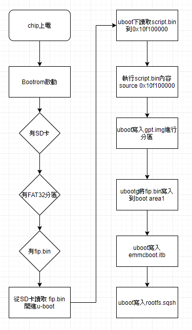
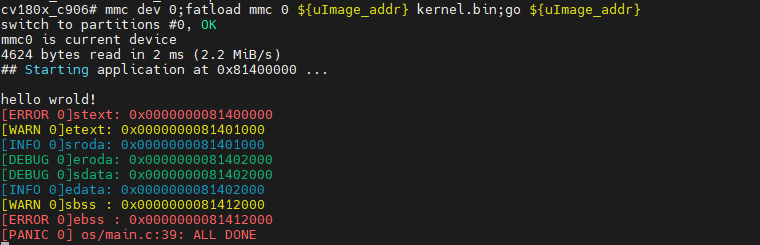

# ubootを使って自作OSを起動する

[オリジナル](https://community.milkv.io/t/uboot/181)

清華大学のuCore OSチュートリアルを勉強していたところ、たまたまRiscv開発
ボードMilkv-duoを知りました。

チップの公式ドキュメントによると、CV1800bは起動時にFAT32パーティションにある
`fip.bin`ファイルを探し、その中の`bl2->opensbi->uboot`を起動し、ubootは
`boot.sd`を起動します。



当初はubootを自作カーネルに置き換えて（つまりLOADER_2NDの位置に置いて）
opensbiから直接飛び込もうと考えたのですが、fip.binをコンパイルする過程で
LOADER_2NDはBL33の要件を満たす必要があることがわかり、BL33に関連する
チェックサムを無理やり削除してfip.binイメージを作成しても、ボードの起動時に
lzmaコーデックやデコードに関連するエラーが発生してしまいました。ボードの
BootromとBL2がオープンソースでないことに加え、私には詳細が理解できないので
この方法はあきらめました。

その後、[ベアメタルで始めよ](https://bbs.aw-ol.com/topic/132/share/1)という記事を読み、ubootを使ってOSを起動できることを知りました。

まず、ubootの起動プロセスを理解します。

- まず、tfカードのブートパーティションにfip.binファイルだけを置きます。
  ubootがboot.sdファイルを見つけられず、起動時に止まってしまうのを防ぐためです
  （ubootのデフォルトの待ち時間はわずか1秒です）
- 環境変数を見るには、bootコマンドラインでprintenvを使います。

```bash
cv180x_c906# printenv
...
bootargs=root=/dev/mmcblk0p2 rootwait rw console=ttyS0,115200 earlycon=sbi loglevel=9 riscv.fwsz=0x80000
bootcmd=run sdboot
...
sdboot=setenv bootargs ${root} ${mtdparts} console=$consoledev,$baudrate $othbootargs;echo Boot from SD ...;mmc dev 0 && fatload mmc 0 ${uImage_addr} boot.sd; if test $? -eq 0; then bootm ${uImage_addr}#config-cv1800b_sophpi_duo_sd;fi;
...
```

- 見ての通り、ubootがやっていることはboot.sdを${uImage_addr}にロードし、
  ${uImage_addr}にジャンプして実行を続けることです。

上の記事によると`bootm`はlinuxカーネルをブートするためのものでブートプロトコルの
ためのいくつかの引数を含んでいます。ubootのgoコマンドを使ってベアメタルの
アプリケーションに直接ジャンプするにはubootのdefconfigでgoコマンドの設定を
する必要があります（rls_defconfigの使い方がよくわからないので単純にすべて
変更してしまいます）。

```diff
diff --git a/boards/cv180x/cv1800b_sophpi_duo_sd/u-boot/cvitek_cv1800b_sophpi_duo_sd_defconfig b/boards/cv180x/cv1800b_sophpi_duo_sd/u-boot/cvitek_cv1800b_sophpi_duo_sd_defconfig
index 1bb7fde..e821fcb 100644
--- a/boards/cv180x/cv1800b_sophpi_duo_sd/u-boot/cvitek_cv1800b_sophpi_duo_sd_defconfig
+++ b/boards/cv180x/cv1800b_sophpi_duo_sd/u-boot/cvitek_cv1800b_sophpi_duo_sd_defconfig
@@ -32,7 +32,7 @@ CONFIG_BOOTM_OPENRTOS=y
 # CONFIG_BOOTM_VXWORKS is not set
 # CONFIG_CMD_ELF is not set
 # CONFIG_CMD_FDT is not set
-# CONFIG_CMD_GO is not set
+CONFIG_CMD_GO=y
 # CONFIG_CMD_IMI is not set
 # CONFIG_CMD_XIMG is not set
 # CONFIG_CMD_EXPORTENV is not set
diff --git a/boards/cv180x/cv1800b_sophpi_duo_sd/u-boot/cvitek_cv1800b_sophpi_duo_sd_rls_defconfig b/boards/cv180x/cv1800b_sophpi_duo_sd/u-boot/cvitek_cv1800b_sophpi_duo_sd_rls_defconfig
index b4250f2..4419c0c 100644
--- a/boards/cv180x/cv1800b_sophpi_duo_sd/u-boot/cvitek_cv1800b_sophpi_duo_sd_rls_defconfig
+++ b/boards/cv180x/cv1800b_sophpi_duo_sd/u-boot/cvitek_cv1800b_sophpi_duo_sd_rls_defconfig
@@ -32,7 +32,7 @@ CONFIG_BOOTM_OPENRTOS=y
# CONFIG_BOOTM_VXWORKS is not set
# CONFIG_CMD_ELF is not set
# CONFIG_CMD_FDT is not set
-# CONFIG_CMD_GO is not set
+CONFIG_CMD_GO=y
# CONFIG_CMD_IMI is not set
# CONFIG_CMD_XIMG is not set
# CONFIG_CMD_EXPORTENV is not set
```

変更した後`fip.bin`を再コンパイルします。

```bash
source build/cvisetup.sh
defconfig cv1800b_sophpi_duo_sd
clean_all
build_fsbl
```

コンパイルしてできた`install/soc_cv1800b_sophpi_duo_sd/fip.bin`ファイルと
自作の`kernel.bin`ファイルをtfカードのブートパーティションに入れ、起動後に
ubootコマンドラインで次のコマンドを入力してカーネルにジャンプします。

```bash
mmc dev 0;fatload mmc 0 ${uImage_addr} kernel.bin;go ${uImage_addr}
```

成功です。



ブート時にubootが自サックカーネルを直接ブートしたい場合は、u-boot-2021.10/include/config/cv180x-asic.hのbootcommandを変更します.

```diff
diff --git a/include/configs/cv180x-asic.h b/include/configs/cv180x-asic.h
index 08b70193..f1cfc95e 100644
--- a/include/configs/cv180x-asic.h
+++ b/include/configs/cv180x-asic.h
@@ -283,12 +283,9 @@
                    "console=$consoledev,$baudrate $othbootargs;"

    #define SD_BOOTM_COMMAND \
-               SET_BOOTARGS \
                "echo Boot from SD ...;" \
-               "mmc dev 0 && fatload mmc 0 ${uImage_addr} boot.sd; " \
-               "if test $? -eq 0; then " \
-               UBOOT_VBOOT_BOOTM_COMMAND \
-               "fi;"
+               "mmc dev 0 && fatload mmc 0 ${uImage_addr} kernel.bin; " \
+               "go ${uImage_addr}"

    #ifndef CONFIG_SD_BOOT
        #define CONFIG_BOOTCOMMAND  SHOWLOGOCMD "cvi_update || run norboot || run nandboot ||run emmcboot"
```

私は新人であり探求の過程で学んだことを提供しています。誤りがあれば訂正を
歓迎します。

**参考資料**:[ [Happy Hacking Nezha Board] 开始裸奔吧,少年 | 全志在线开发者论坛 100](https://bbs.aw-ol.com/topic/132/share/1)

## Judehahh: 2023/08

以前のリポジトリからgitリポジトリに変更され、ファイルパスがかわりました。

変更するuboot設定ファイルは `duo-buildroot-sdk/build/boards/cv180x/cv1800b_milkv_duo_sd/u-boot/cvitek_cv1800b_milkv_duo_sd_defconfig` で、
コンパイル済みファイルのパスは `duo-buildroot-sdk/install/soc_cv1800b_milkv_duo_sd/fip.bin` です。

## Juhan: 2023/12

CV1800bの起動プロセスはどのドキュメントですか

## Judehahh: 2023/12

1. [ベアボーンおよび非ベアボーンアップグレードユーザーズマニュアル](https://doc.sophgo.com/cvitek-develop-docs/master/docs_latest_release/CV180x_CV181x/zh/01.software/BSP/Cvitek_Bare_and_Non-Bare_Chip_Burning_Upgrade_Operation_Guide/build/html/index.html)
2. [セキュアブートユーザーガイド](https://doc.sophgo.com/cvitek-develop-docs/master/docs_latest_release/CV180x_CV181x/zh/01.software/BSP/Secure_Boot_User_Guide/build/SecureBootUserGuide_zh.pdf)

この2つだと思いますが、参考の度合いは特に大きくなく、主にソースコードを見るためのものです。
