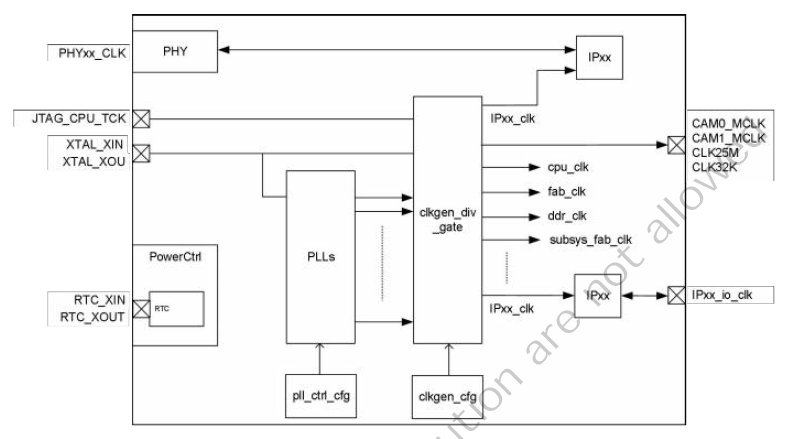

# 3.2 クロック

## 3.2.1 概要

クロック管理モジュールはチップクロックを管理します。管理する
項目は次のとおりです。

- クロック入力の管理と制御
- PLLクロックソースと関連する周波数の逓倍と分周の構成
- クロック周波数の分周と制御
- 各モジュール用のクロックの生成
- 各クロックの管理と制御

## 3.2.2 機能ブロック図

**図3.2: クロック管理モジュールのブロック図**

XTAL_XINはPLLの基準クロックであり、25MHzの水晶振動子を接続する必要があります。
RTC_XINはRTCの基準クロックであり、32.768KHzの水晶振動子を接続する必要が
あります。
