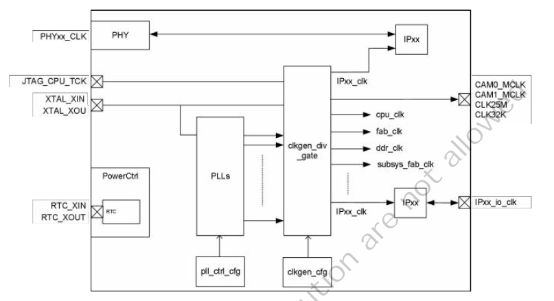
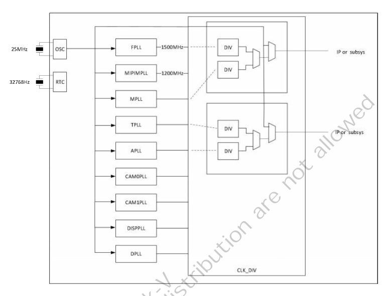

# 3.2 クロック

## 3.2.1 概要

クロック管理モジュールはチップクロックを管理します。管理する
項目は次のとおりです。

- クロック入力の管理と制御
- PLLクロックソースと関連する周波数の逓倍と分周の構成
- クロック周波数の分周と制御
- 各モジュール用のクロックの生成
- 各クロックの管理と制御

## 3.2.2 機能ブロック図

**図3.2: クロック管理モジュールのブロック図**

XTAL_XINはPLLの基準クロックであり、25MHzの水晶振動子を接続する必要があります。
RTC_XINはRTCの基準クロックであり、32.768KHzの水晶振動子を接続する必要が
あります。

## 3.2.3 クロックリソースと周波数分周構造

システムクロックは主に外部XTAL、PLL、外部入力クロックから供給されます。
図3-3に示すように一般に各IPはXTALかPLLをクロック源としています。クロックは
分周回路を経て生成され、IPやサブシステム用のクロックとして選択されます。

**図3.3: クロックソース周波数分周のブロック図**

## 3.2.4 PLLの構成

表3-1に示すようにチップには9個のPLLが内蔵されています（アナログIP内蔵PLLを
除く）。これらは整数周波数逓倍と分数周波数逓倍に分類されます。

表3.1: PLL構成レジスタ

| PLL | 制御レジスタ | パワーダウン制御レジスタ | プリセット周波数 | PLLパターン |
|:----|:-------------|:-------------------------|-----------------:|:------------|
| FPLL | fpll_csr | fpll_pwd (default On) | 1500MHz | 整数周波数 |
| MIPIMPLL | mipimpll_csr | mipimpll_pwd (default On) | 900MHz | 整数周波数|
| MPLL | mpll_csr mpll_ssc_syn_ctrl mpll_ssc_syn_set mpll_ssc_syn_span mpll_ssc_syn_setp | mpll_pwd (default On) | 1000MHz | 整数/分数周波数 |
| TPLL | tpll_csr tpll_ssc_syn_ctrl tpll_ssc_syn_set tpll_ssc_syn_span tpll_ssc_syn_setp | tpll_pwd (default On) | 1400MHz | 整数/分数周波数 |
| APLL | apll_csr apll_ssc_syn_ctrl apll_ssc_syn_set apll_ssc_syn_span apll_ssc_syn_setp | apll_pwd(default On) | 1050MHz | 整数/分数周波数 |
| CAM0PLL | cam0pll_csr cam0pll_ssc_syn_ctrl cam0pll_ssc_syn_set cam0pll_ssc_syn_span cam0pll_ssc_syn_setp | cam0pll_pwd(default On) | 1050MHz | 整数/分数周波数 |
| CAM1PLL | cam1pll_csr cam1pll_ssc_syn_ctrl cam1pll_ssc_syn_set cam1pll_ssc_syn_span cam1pll_ssc_syn_setp | cam1pll_pwd(default On) | 1025MHz | 整数/分数周波数 |
| DISPPLL | disppll_csr disppll_ssc_syn_ctrl disppll_ssc_syn_set disppll_ssc_syn_span disppll_ssc_syn_setp | disppll_pwd(default On) | 1200MHz | 整数/分数周波数 |

### 3.2.4.1 整数周波数逓倍PLL

整数PLLの調整プロセスは以下の通りです。

1. このPLLから生成されるクロックをオフにするか、他の安定したクロックを
   クロックソースに選択します。
2. 整数PLLパラメータ表に従って必要な`*_pll_CSR`レジスタを構成します。
3. `*_pll_pwd`をクリアします。

表3.2: 整数PLL構成パラメタ

| PLLパラメタ | パラメタ範囲 | 注意事項 |
|:------------|:-----|:---------|
| PLL_REF | 25MHz~2500MHz |   |
| PLL_VCO | 800MHz~2500MHz |   |
| Pre_div_sel | 1~127 | PLL_VCO = PLL_REF*Div_sel/Pre_div_sel |
| Div_sel | 6~127 | PLL_VCO/Post_div_sel |
| Post_div_sel | 1~127 |  |
| Ictrl | 0~7 | 0.2< 1.84*(1+Mode)*(1+Ictrl)/2/Div_sel <=0.35 |
| Mode | 0~3 |  |

### 3.2.4.2 分数周波数逓倍PLL

分数PLLの調整プロセスは以下の通りです。

1. このPLLから生成されるクロックをオフにするか、他の安定したクロックを
   クロックソースに選択します。
2. `*_ssc_syn_src_en`を構成してシンセサイザクロックを有効にします。
3. PLL周波数要件に従い`*_ssc_syn_set`を構成します。
4. `*_ssc_syn_up`をトグルして設定を有効にします。
5. 整数PLLパラメータ表に従って`*_pll_csr`レジスタを構成します。
6. `*_pll_pwd`をクリアします。

表3.3: 分数PLL構成パラメタ

| PLLパラメタ | パラメタ範囲 | 注意事項 |
|:------------|:-----|:---------|
| ssc_freq_in | DSIPLL: 1.2GHz DDRPLL : 1.5GHz Others 600MHz | Default clock gated , need enable |
| ssc_syn_set | > 4.x * 2^26 | ssc_freq_in*div_sel*2^26/PLL_VCO |
| PLL_REF | 100M~2500MHz | |
| PLL_VCO | 800MHz~2500MHz | |
| Div_sel | 6~127 | PLL_VCO = PLL_REF*div_sel |
| Post_div_sel | 1~127 | FOUT = PLL_VCO/Post_div_sel |
| Ictrl | 0~7 | 0.1< 1.84*(1+Mode)*(1+Ictrl)/2/Div_sel |
| Mode | 0~3 | <=0.24 |

## 3.2.5 CLK_DIVクロック周阿数分周の構成

以下はクロックリソース表です。この表は構成可能なクロックソース、プリセット
クロック周波数、各クロックの分周数を示しています。ソフトウェアはブート後に
クロックソースをXTALからPLLに切り替え、クロック周波数分周の構成を調整する
ことができます。

表3.4: クロックソースとプリセット周波数分周パラメタ

| クロック名 |  XTAL | DIV | SW | PLL SRC/DIV/FREQ | DIV_IN0 SRC | DIV_IN1 SRC |
|:-----------|:-----:|:---:|:--:|:-----------------|:------------|:------------|
| clk_sd0 | Y | Y |  | fpll/(15)/100M | fpll / disppll | |
| clk_sd1 | Y | Y |  | fpll/(15)/100M | fpll / disppll | |

### 3.2.5.1 IP/SYSソースとクロック周波数分割の構成

1. IPクロックをオフにします。クロックをオフにできない場合は、まず安定した
   クロックに構成する必要があります。
        - CPU周波数のスケーリング: 低すぎる周波数を避けるためにclk_sel_0を
          構成してSRC1に切り替えます。
        - IP周波数のスケーリング: clk_byp_0/1を構成してクロックをXTALに切り替えます。
2. クロックソースと分周器を構成して調整します。
3. 分周器レジスタのbit[2]を構成して、クロック分周器の構成を有効にします。
4. 構成したクロック分周器をクロックソースに設定します。

## 3.2.6 PLL制御レジスタの概要

### PLL_G2

**基底アドレス: 0x0300_2800**

| 名前 | オフセット | 記述 |
|:---- |-----------:|:-----|
| pll_g2_ctrl | 0x000 |  Group2 PLL Ctrl register  |
| pll_g2_status | 0x004 |  Group2 PLL Status register  |
| mipimpll_csr | 0x008 |  MIPIMPLL Ctrl register  |
| apll0_csr | 0x00c |  APLL0 Ctrl register  |
| disppll_csr | 0x010 |  DISPPLL Ctrl register  |
| cam0pll_csr | 0x014 |  CAM0PLL Ctrl register  |
| cam1pll_csr | 0x018 |  CAM1PLL Ctrl register  |
| pll_g2_ssc_syn_ctrl | 0x040 |  Group2 PLL Synthesizer ctrl register  |
| apll_ssc_syn_ctrl | 0x050 |  APLL synthesizer ctrl register  |
| apll_ssc_syn_set | 0x054 |  APLL synthesizer set register  |
| disppll_ssc_syn_ctrl | 0x060 |  DISPPLL synthesizer ctrl register  |
| disppll_ssc_syn_set | 0x064 |  DISPPLL synthesizer set register  |
| cam0pll_ssc_syn_ctrl | 0x070 |  CAM0PLL synthesizer ctrl register  |
| cam0pll_ssc_syn_set | 0x074 |  CAM0PLL synthesizer set register  |
| cam1pll_ssc_syn_ctrl | 0x080 |  CAM1PLL synthesizer ctrl register  |
| cam1pll_ssc_syn_set | 0x084 |  CAM1PLL synthesizer set register  |
| apll_frac_div_ctrl | 0x090 |  APLL frac divider ctrl register  |
| apll_frac_div_m | 0x094 |  APLL frac divider M parameter  |
| apll_frac_div_n | 0x098 |  APLL frac divider N parameter  |
| mipimpll_clk_csr | 0x0a0 |  MIPIMPLL clock Ctrl register  |
| a0pll_clk_csr | 0x0a4 |  a0pll clock Ctrl register  |
| disppll_clk_csr | 0x0a8 |  disppll clock Ctrl register  |
| cam0pll_clk_csr | 0x0ac |  cam0pll clock Ctrl register  |
| cam1pll_clk_csr | 0x0b0 |  cam1pll clock Ctrl register  |
| clk_cam0_src_div | 0x0c0 |  clk_cam0_src_div  |
| clk_cam1_src_div | 0x0c4 |  clk_cam1_src_div  |

### PLL_G6

**基底アドレス: 0x0300_2800**

| 名前 | オフセット | 記述 |
|:---- |-----------:|:-----|
| pll_g6_ctrl | 0x000 |  Group6 PLL Ctrl register  |
| pll_g6_status | 0x004 |  Group6 PLL Status register  |
| mpll_csr | 0x008 |  MPLL Ctrl register  |
| tpll_csr | 0x00c |  TPLL Ctrl register  |
| fpll_csr | 0x010 |  FPLL Ctrl register  |
| pll_g6_ssc_syn_ctrl | 0x040 |  Group6 PLL Synthesizer ctrl register  |
| dpll_ssc_syn_ctrl | 0x050 |  dpll synthesizer ctrl register  |
| dpll_ssc_syn_set | 0x054 |  dpll synthesizer set register  |
| dpll_ssc_syn_span | 0x058 |  dpll synthesizer span register  |
| dpll_ssc_syn_step | 0x05c |  dpll synthesizer step register  |
| mpll_ssc_syn_ctrl | 0x060 |  mpll synthesizer ctrl register  |
| mpll_ssc_syn_set | 0x064 |  mpll synthesizer set register  |
| mpll_ssc_syn_span | 0x068 |  mpll synthesizer span register  |
| mpll_ssc_syn_step | 0x06c |  mpll synthesizer step register  |
| tpll_ssc_syn_ctrl | 0x070 |  tpll synthesizer ctrl register  |
| tpll_ssc_syn_set | 0x074 |  tpll synthesizer set register  |
| tpll_ssc_syn_span | 0x078 |  tpll synthesizer span register  |
| tpll_ssc_syn_step | 0x07c |  tpll synthesizer step register  |
