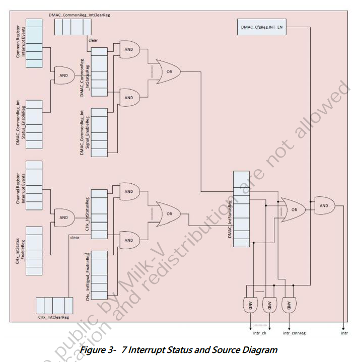

# 3.6 DMAコントローラ

## 3.6.1 概要

DMA (Direct Memory Access) はメモリとデバイス間でデータを直接転送することが
できます。このメカニズムにより、CPUのアクセス時間を大幅に短縮し、データ転送速
度を向上させることができます。大量データの転送に非常に適しています。チップが
動作する際、通常、マルチチャンネルのデータ転送が必要になります。各チャネルを
サポートするDMAハードウェアが必要であり、DMAC（DMAコントローラ）がマルチ
チャネルの制御を担当します。

次の図はDMACハードウェアの制御フローを示しています。ソースとデスティネーションは
様々なAXIバスに繋がれています。

## 3.6.2 特徴

DMACの特徴は以下の通りです。

1. 最大8つのDMAチャンネルを同時に確立可能
2. データソースとデータデスティネーションにメモリまたはデバイスを設定可能
3. 一方向転送構成のみ可能
4. DMA転送の一時停止、再開、キャンセルを提供
5. DMAバースト長の構成をサポート
6. DMAチャンネル優先順位の構成を提供
7. デバイス間でチャネルデータが転送される際、フロー制御はデバイスにより
   制御可能
8. ハードウェアリンクリスト機能をサポート
9. チャネルロック機能をサポート。チャネルロックが完了するまでは他の
   チャネル要求は無視される

## 3.6.3 機能説明

### 3.6.3.1 ペリフェラルリクエストライン

DMAには8グループのDMAチャンネルが組み込まれています。各チャネルのペリフェラル
リクエストをペリフェラルデバイスにマップするように構成する必要があります。
DMAチャネルを有効にする前に3.5.2.4 システム DMAチャネルマッピングを参照して
構成してください。

### 3.6.3.2 アクセス空間

### 3.6.3.3 基本転送

DMAデータ転送はブロック転送としてセットされ、バースト転送で完了します。
バースト転送の長さは設定できます。しかし、よくあることは、ブロックデータ量が
完全にはバースト転送長の整数倍にならないことです。最後の転送トランザクションの
長さが設定したバースト転送長より短い場合です。この場合は完了するために
シングル転送りくえすとを使用する必要があります。

最大8つのDMAチャネルのソースとデスティネーションは以下の4つの組み合わせに
なります。

1. メモリからメモリ
2. メモリからデバイス
3. デバイスからメモリ
4. デバイスからデバイス

個々のデータ転送量は以下のレジスタに書き込まれた値から計算できます。

- ソースからの転送データ量（バイト）:
    src_single_size_bytes = CHx_CTL.SRC_TR_WIDTH/8
- ソースからのバースト転送データ量（バイト）:
    src_burst_size_bytes = CHx_CTL.SRC_MSIZE * src_single_size_bytes
- ターゲット転送データ量（バイト）:
    dst_single_size_bytes = CHx_CTL.DST_TR_WIDTH/8
- ターゲットバースト転送データ量(bytes)：
    dst_burst_size_bytes = CHx_CTL.DST_MSIZE * dst_single_size_bytes

転送処理の制御権はDMAコントローラ、転送元デバイス、転送先デバイスのいずれかに
より制御することができます。データブロックを転送する場合、転送データ量は以下の
ように計算されます。

- DMAコントローラが転送処理を制御する場合:
    - blk_size_bytes_dma = CHx_BLOCK_TS.BLOCK_TS * src_single_size_bytes
- ソースデバイスが転送処理を制御する場合:
    - blk_size_bytes_src = (ソースデバイスからのバースト転送のブロック数 * src_burst_size_bytes) + (ソースデバイスの独立した転送ブロック数 * src_single_size_bytes)
- ターゲットデバイスが転送プロセスを制御する場合:
    - blk_size_bytes_dst = (ターゲットデバイスからのバースト転送のブロック数 * dst_burst_size_bytes) + (ターゲットデバイスの独立した転送ブロック数 * dst_single_size_bytes)

### 3.6.3.4 リンクリスト転送

リンクリスト転送は複数の不連続なアドレスのデータを転送する必要があるブロック
転送に使用されます。各ブロックデータの後に次のノードの情報を格納するための
リンクリスト情報が存在するため、データ転送はCPUの介入なしに直接次の不連続な
空間のブロック転送を実行することができます。図3-6にリンクリスト情報の構成
フォーマットを示します。リンクリスト転送を行うにはこの情報フォーマットに
準拠する必要があります。

### 3.6.3.5 割り込みとステータス

DMACの割り込みソースは次のとおりです。

1. DMA転送の完了
2. ブロック転送の完了
3. シングル転送の完了
4. 内部エラー
5. チャネル停止またはチャネル終了

### 3.6.3.6 チャネルセキュリティ構成

チャネルのセキュリティは各チャネルのawprot値とarprot値によって実現できます。
AXIプロトコルによれば、チャネルがセキュアチャネルである場合、arprotまたはawprotの
値は0x0でなければなります。そうでなければそれは非セキュアチャネルです。

## 3.6.4 作動モード

### 3.6.4.1 クロックとリセット

CLK_EN_1[1]に0x1を書き込むとDMACのクロックにパススルーして、クロックは正常に
動作することができます。REG_SOFT_RESET_X_SDMA_INITビットに0x0を書き込むと
DMACはリセットすることができ、0x1を書き込むとリセットが解除されます。

### 3.6.4.2 初期化

リセット後、以下の手順で初期化することができます。

1. ペリフェラルの構成: システムDMAチャネルマッピングの章でDMAペリフェラル
   リクエストラインの構成方法が説明されています。シナリオに従ってマッピングを
   構成する必要があります。
2. チャネル閉鎖の確認: DMA_ChEnRegに0x0を書き込んでチャネルが閉じていることを
   確認します。
3. 割り込みソースの確認: レジスタ DMAC_COMMONREG_INTSIGNAL_ENABLEREG と
   CHx_INSTATUS_ENABLEREGに0x0を書き込んですべての割り込みソースをオフにした後、
   必要な割り込みソースに0x1を書き込んでイネーブルにします。
4. チャネル優先順位の構成: 複数のチャネルが同時にデータを転送する場合、
   優先順位レベルに基づいて通過順番を決定します。CH_PRIORレジスタで構成した
   値が高いほど転送の優先順位は高くなります。

### 3.6.4.3 基本転送

同時に最大8チャンネルまで転送できます。初期化後、データ転送を開始する前に
DMACチャネルを有効にする必要があります。内部メモリから内部メモリへのデータ
転送については以下の手順を参照してください。

- レジスタDMAC_ChEnRegを読んでアイドルチャネルを取得する。
- チャネルレジスタ SRC_MULTBLK_TYPEとDST_MULTBLK_TYPEにそれぞれ0x0を書き込み、
  連続ブロック転送として構成する。
- レジスタ TT_FC に0x0を書き込み、メモリ対メモリ感のデータ転送用のチャネルを
  構成する。
- レジスタ CHx_SAR、CHx_ADR と CHx_BLOCK_TS、CHx_CTL に転送情報を書き込む。
- 選択したDMAチャネルを有効にするためにレジスタ DMAC_ChEnRegに0x1を書き込む。
- ソフトウェアは割り込みかポーリングによりBLOCK_TFR_DONEの状態を得ることが
  できる。BLOCK_TFR_DONEの値が1になったらデータ転送が完了したことを意味する。
  その後、DMAC_ChEnRegに0x0を書き込んでチャネルを閉じ、アイドルチャネルに戻す。

### 3.6.4.4 リンクリスト転送

リンクリスト転送ではノードの数に制限はありません。終了ノードを除いて、
各ノードは次のノードを指す情報を持っていなければならなりません。リンク
リスト転送は以下のステップを参照することで完了することができます。

1. レジスタDMAC_ChEnRegを読んでアイドルチャネルを取得する。
2. チャネルレジスタSRC_MULTBLK_TYPEとDST_MULTBLK_TYPEにそれぞれ0x3を書き込み、
   リンクリスト転送として構成する。
3. レジスタ CHx_LLP、CHx_CTL.ShadowReg_Or_LLI_Valid、CHx_CTL.LLI_Lastを構成する。
   最初のノードを指すために必要な情報を書き込む。
4. レジスタDMAC_ChEnRegに0x1を書き込み、選択したDMAチャネルを有効にする。
5. ソフトウェアは割り込みかポーリングによりBLOCK_TFR_DONEの状態を得ることが
   できる。BLOCK_TFR_DONEの値が1になったら、最後のノードのデータ転送が完了
   したことを意味する。その後、DMAC_ChEnRegに0x0を書き込んでチャネルを閉じ、
   アイドルチャネルに戻す。

### 3.6.4.5 割り込み処理

割り込みがトリガーされた後の処理は次の通りです。

1. レジスタCHx_INTSTATUSとDMAC_INSTATUSREGを読んで、その値が0x1である割り込み
   ソースを取得する。割り込みが発生すると、それは対応するビットに0x1として
   記録される。複数の割り込みが同時に発生した場合、ソフトウェアは優先順位に
   基づいて処理する。
2. 割り込みのクリア: CHx_INTCLEARREGまたはDMAC_INTCLEARREGの選択したビットに
   0x1を書き込む。この時点で、CHx_INTSTATUSとDMAC_INSTATUSREGの記録された割り込み
   状態は次の割り込み状態を記録するために0x0に戻る。

## 3.6.5 DMACレジスタ

| オフセット | 名前 |
|-----------:|:-----|
| 0x000 | DMAC_IDREG |
| 0x008 | DMAC_COMPVERREG |
| 0x010 | DMAC_CFGREG |
| 0x018 | DMAC_CHENREG |
| 0x030 | DMAC_INTSTATUSREG |
| 0x038 | DMAC_CMMONREG_INTCLEARREG |
| 0x040 | DMAC_COMMONREG_INTSTATUS_ENABLEREG |
| 0x048 | DMAC_COMMONREG_INTSIGNAL_ENABLEREG |
| 0x050 | DMAC_COMMONREG_INTSTATUSREG |
| 0x058 | DMAC_RESETREG |
| 0x100 | CHx_SAR |
| 0x108 | CHx_DAR |
| 0x110 | CHx_BLOCK_tS |
| 0x118 | CHx_CTL |
| 0x120 | CHx_CFG |
| 0x128 | CHx_LLP |
| 0x130 | CHx_STATUSREG |
| 0x138 | CHx_SWHSSRCREG |
| 0x140 | CHx_SWHSDSTREG |
| 0x148 | CHx_BLK_TFR_RESUMEREQREG |
| 0x150 | CHx_AXI_IDREG |
| 0x158 | CHx_AXI_OOSREG |
| 0x160 | CHx_SSTAT |
| 0x168 | CHx_DSTAT |
| 0x170 | CHx_SSTATAR |
| 0x178 | Chx_DSTATAR |
| 0x180 | CHx_INTSTATUS_ENABLEREG |
| 0x188 | CHx_INTSTATUS |
| 0x190 | CHx_INTSIGNAL_ENABLEREG |
| 0x198 | CHx_INTCLEARREG |
