# 12.4 SD/SDIOコントローラ

## 12.4.1 機能説明

### 12.4.1.1 機能ブロックダイアグラム

SD/SDIOコントローラ（以下、SDコントローラと略す）は、SDカードのデータ読み書きと
SDIOプロトコルがサポートされている外部デバイス（Bluetooth、WiFiなど）の操作の
処理に使用されます。チップは次の2組のSDコントローラを提供しています、

- SDIO0はセキュアデジタルメモリ (SD 3.0) プロトコルに準拠したデバイスを
  サポートします。
- SDIO1はセキュアデジタルI/O (SDIO 3.0) プロトコルに準拠したデバイスを
  サポートします。

チップ内のSDコントローラに対応する機能信号とピンを下の表に示します。

**表12-4: SDコントローラの機能信号とピン**

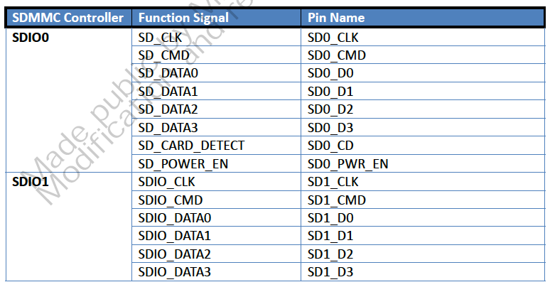

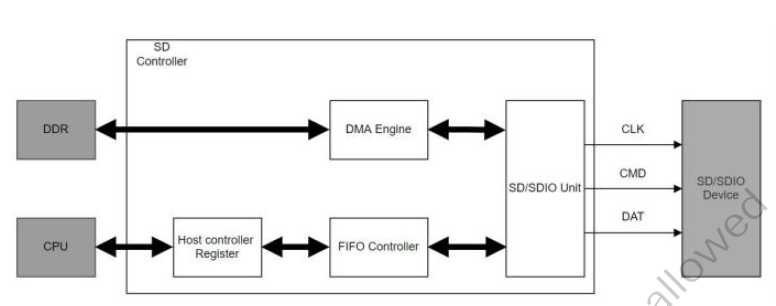

**図12-20: SDコントローラ機能ブロックダイアグラム**

SDMMCの機能は次のとおりです。

1. SDカードおよびSDIOデバイスのサポート
2. 内蔵のDMAコントローラによるSD/SDIOとシステムメモリ間のデータ転送
3. コマンドとデータのCRCの生成とチェックのサポート
4. 内部分周器による各モードで必要な周波数の生成が可能
5. 省電力のための内部クロックおよびインタフェースクロックのオフ化メカニズムの提供
6. デバイスとの通信に1ビットと4ビットのデータ伝送インターフェースを提供
7. 1-2048byteのサイズのブロックの読み書き操作をサポート
8. 割り込み間隔、サスペンド、レジューム、リードウェイトなどのSDIOプロトコルをサポート
9. AXI/AHBインタフェースのサポートと内部DMAを介したシステムメモリのアクセス
10. AHBインタフェースのサポートとCPUを介した内部レジスタのアクセス

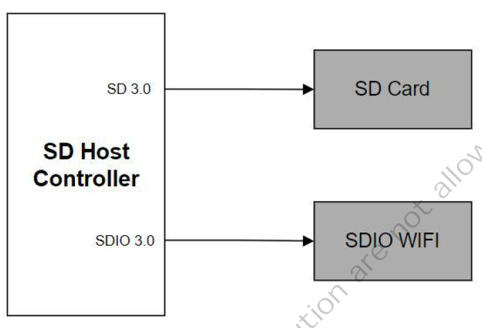

**図12-21: 典型的なアプリケーション**

### 12.4.1.2 コマンドとレスポンス

SDのバスパケットはコマンド、レスポンス、データの3つの部分で構成されます。
コマンドパケットとレスポンスパケットはCMD信号線を通して送信されます。

#### コマンドパケット

コマンドパケットは動作の開始を示すためにホストからデバイスに送信されます。
パケットフォーマットはスタートビット、送信ビット、コマンドインデックス、
コマンド引数、CRC検証コード、エンドビットを含む48ビットで構成されています。
図 12-22にコマンドパケットを示します。

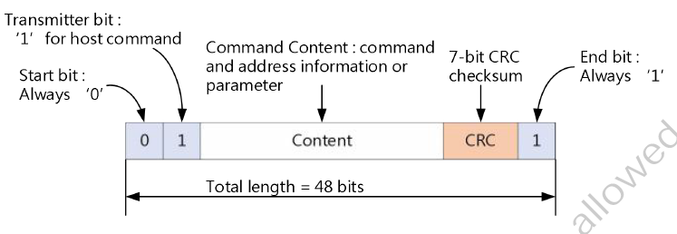

**図12-22: SD/SDIOコマンドパケット**

#### レスポンスパケット

コマンドを受け取るとデバイスはコマンドタイプに応じたレスポンスを返します。
これはデバイスのステータスやパラメータを表示するために使用されます。その長さは
48ビットまたは136ビットです。図 12-23にレスポンスパケットを示します。

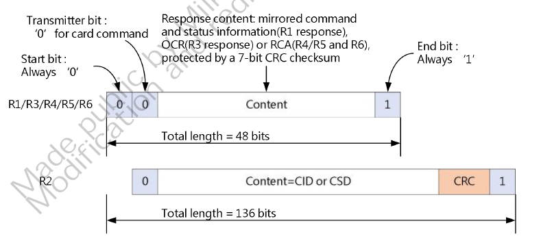

**図12-23: SD/SDIOレスポンスパケット**

#### データパケット

データパケットはホストとデバイスの間のデータ交換に使用されます。さまざまな
要求に応じて、1ビット (DATA0)、4ビット (DATA0-DATA3)、7ビット (DATA0-DATA7)を
選択できます。各クロックサイクルにおいて、各データ信号線は1ビット（シングル
データレート）または2ビット（デュアルデータレート）の転送を選択できます。
パケットフォーマットを図12-24から図12-26に示します。

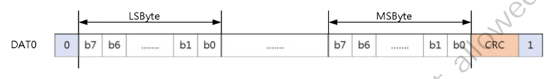

**図12-24: SD/SDIO 1ビットデータパケットフォーマット**

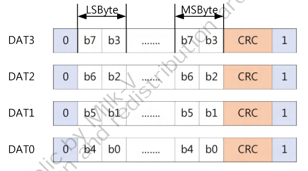

**図12-25: SD/SDIO 5ビットデータパケットフォーマット**

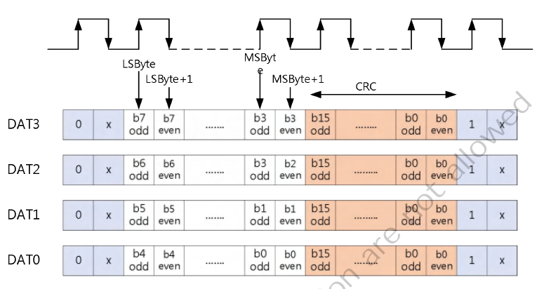

**図12-26: SD/SDIO 4ビットデータパケットフォーマット**

データ伝送の有無によりコマンドはさらに次の2種類に分けられます。

- **非データ転送コマンド**: CMD信号線を介してコマンドの送信とレスポンスの
  受信を完了します。

    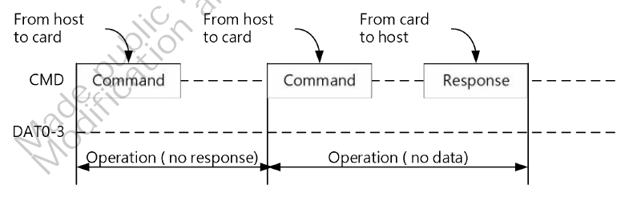

    **図12-27: 非データ転送コマンド: CMDを介して送信とレスポンス受信を完了**

- **データ転送コマンド**: CMD信号線を介した転送に加え、データ線DAT0-DAT3を
  介したデータ転送も存在します。

### 12.4.1.3 データ転送

ホストとデバイスの間のデータ転送は主にブロックに基づいて行われます。データに加えて、
データの正しさを検証するためのCRCチェックビットも含まれます。データのRead/Writeの
一般的な方法にはシングルブロックとマルチブロックがあります。シングルブロック
データ転送に比べてマルチブロックデータ転送は効率が高いです。注目すべきは
SDカードのブロックサイズは512バイトであることです。SDIOは特別です。SDIOは
1-2048バイトのブロックサイズをサポートしています。ユーザはデバイスに応じて
ブロックサイズの値を定義することができます。

(1) シングルブロックとマルチブロックのRead操作を図 12-30に示します。シングル
    ブロック転送はコマンド、レスポンス、データ、CRCで構成されます。マルチブロック
    転送はSTOP CMDで転送を終了します。

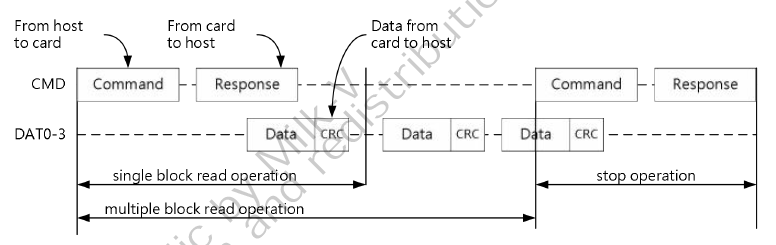

**図12-28: シングルブロックとマルチブロックのRead操作**

(2) シングルブロックとマルチブロックのWrite操作を図12-31に示します。送信過程に
    おいては書き込みデバイスが処理中であることをホストに通知するためにDAT0信号線を
    介してBUSY信号が送られます。

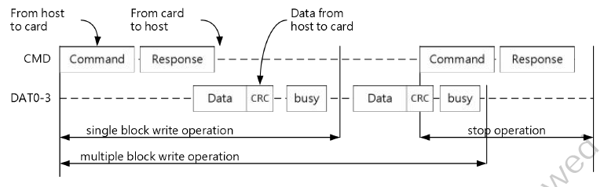

**図12-29: シングルブロックとマルチブロックのWrite操作**

### 124.1.4 SD3.0によりサポートされている速度モードと電圧の切り替え

#### 電圧の切り替え手順　(1.8V → 3.3V)

- ステップ1: `PWRSW`を3.0Vモードに設定します
    => `sd_pwrsw_ctrl (0x030001F4) = 0x00000009`

    (reg_pwrsw_auto=1, reg_pwrsw_disc=0, reg_pwrsw_vsel=0 (3.0v), reg_en_pwrsw=1)
- ステップ2: 電圧の切り替え完了まで1ms待ちます

#### 電圧の切り替え手順　(3.3V → 1.8V)

- ステップ1: `PWRSW`を1.8Vモードに設定します
    => `sd_pwrsw_ctrl (0x030001F4) = 0x0000000B`

    (reg_pwrsw_auto=1, reg_pwrsw_disc=0, reg_pwrsw_vsel=1(1.8v), reg_en_pwrsw=1)
- ステップ2: 電圧の切り替え完了まで1ms待ちます

#### サポートされている速度モードと電圧

SD3.0がサポートしている速度モードと電圧を表12-5に示します。

**表12-5: SD3.0がサポートしている速度モードと電圧**

| モード | 速度 | 電圧 |
|:-------|:-----|:-----|
| DS (Default speed) | 25MHz | 1.8V/3.3V |
| HS (High speed) | 50MHz | 1.8V/3.3V |
| SDR12 | 25MHz | 1.8V |
| SDR25 | 60MHz | 1.8V |
| DDR50 | 50MHz | 1.8V |
| SDR50 | 100MHz | 1.8V |
| SDR104 | 187.5MHz | 1.8V |

## 12.4.2 応用解説

### 12.4.2.1 クロックオフ制御

[図12-30](images/fig_12-30.png)はクロックオフ制御プログラムです。ホストはクロックをオフにする前に
バス上に伝送がないことを確認しなければなりません。

1. `PRESENT_STS`レジスタを読み出します
2. `CMD_INHIBIT`ビットと`DAT_INHIBIT`ビットがともに0であることを確認します
3. いずれかビットが0でない場合はまだ送信中であるので遅延させる必要があることを
   意味します
4. すべてが0の場合、`CTL[SD_ CLK_ EN] = 0`に設定してクロックをオフにすることが
   できます。

### 12.4.2.2 ソフトリセット

コントローラの動作に異常が発生した場合は構成レジスタ (ベースアドレス = 0x0300_ 3000)
をリセットしてソフトリセットを行います。使用するレジスタアドレスは以下の通りです。

6. SDIO0: SOFT_RSTN_0[reg_soft_reset_x_sd0]（アドレスオフセット: 0x000、Bit16）
7. SDIO1: SOFT_RSTN_0[reg_soft_reset_x_sd1]（アドレスオフセット: 0x000、Bit17）

### 12.4.2.3 インタフェースクロック構成

[図12-31](images/fig_12-31.png)にインタフェースクロック構成のフローチャートを
示します。SDコントローラは分周器を提供しており、これによりユーザはプロトコルと
速度モードに応じた必要なクロック周波数を調整することができます。その関係は次の
通りです。

    FSD_CLK_OUT> = FINT_CARD_CLK/ (2 x clk_divisor)

SDが周波数を変更する場合、コマンドやデータがまだ送信中でないことを確認することに
加え、SDデバイスにクロックグリッチが出力されるのを避けるためにインタフェース
クロック構成フローチャートに従ってSDを構成する必要があります。

1. インタフェースクロックをオフにします (`CLK_CTL[SD_CLK_EN] = 0`)
2. 分周率を計算します
3. 分周率をセットします。2項で計算したパラメータを`CLK_CTL[FREQ_SEL]`に設定し、
   内部クロックスイッチをONにします (`CLK_CTL[INT_CLK_EN] = 1`)
4. `CLK_CTL[INT_CLK_STABLE]`をチェックして周波数切り替えが完了したか確認します
5. 完了していない場合 (`CLK_CTL[INT_CLK_STABLE] = 0`) は待機します。
6. クロック周波数の切り替えが完了したらインタフェースクロックをONにします
   ((`CLK_CTL[SD_CLK_EN] = 1`))

### 12.4.2.4 非データ転送コマンド

#### コマンド転送シーケンス

コマンド転送手順を[図12-32](images/fig_12-32.png)に示します。

1. CMDラインが使用中でないことを確認するために `PRESENT[CMD_INHIBIT]` レジスタ
   ビットが0であることを確認します
2. CMDラインがアイドルの場合、ビジー状態のあるコマンドであるか否を確認します。ビジー
   コマンドでなければDATAラインの状態を確認する必要はないのでそのまま5項を実行
   します。ビジーコマンドの場合は3項を実行してAbortコマンドであるか否を確認します。
3. Abortコマンドの場合、CMDラインが送信を完了した時点でDATAラインもアイドル状態に
   なっているのでそのまま5項に進みます。Abortコマンドでない場合は4項に進んで、
   DATAラインのビジー状態が解除されているか否を確認します。
4. レジスタビット `PRESENT[DAT_INHIBIT]`が0であるか否かをチェックしてDATAラインが
   使用中であるか否かを確認します。使用中であれば送信が終了するまで待機してから
   5項を実行します
5. コマンド要求に従って`ARGUMENT `レジスタと`CMD`レジスタの値をセットします。

#### コマンド完了シーケンス

コマンド完了シーケンスを[図12-33](images/fig_12-33.png)に示します。

1. コマンド完了割り込み`NORM_INT_STS[CMD_CMPL]`がセットされるのを待ちます
2. 割り込みを受信したら`NORM_INT_STS[CMD_CMPL] = 1`をセットしてCMD_CMPL割り込み
   ステータスをクリアします
3. RESP1_0、RESP3_2、RESP5_4、RESP7_6を読み出してレスポンス値を取得します
4. データ送信を含むコマンドの場合は5項を実行します。そうでない場合は8項に進みます。
5. データ送信割り込み `NORM_INT_STS[XFER_CMPL]` を待ちます
6. 割り込みを受信したら `NORM_INT_STS[XFER_CMPL] = 1` をセットしてXFER_CMPL
   割り込みステータスをクリアします
7. RESP1_0, RESP3_2, RESP5_4, RESP7_6 レジスタをチェックしてエラー状態かないか
   確認します。エラー状態がない場合は8項に進み、エラーなしを返します。エラー
   状態がある場合は9項に進みエラーを報告します。
8. 状態（エラー無し）を返します
9. 状態（エラーレスポンスコンテンツ）を返します

### 12.4.2.5 データ転送のアボート

#### アボートコマンドシーケンス

アボートコマンドは、SDデバイスの場合はCMD12で、SDIOデバイスの場合はCMD52で
実行されます。アボートコマンドを使用するタイミングは主に2つの条件があります。

1. 無限ブロックのデータ送信を停止する
2. マルチブロックのデータ送信を停止する

アボートコマンドの手順を[図12-34](images/fig_12-34.png)に示します。

アボートコマンドには同期アボートコマンドと非同期アボートコマンドの2通りがあります。

##### 非同期アボートコマンドシーケンス

[図12-35](images/fig_12-35.png)に非同期アボートコマンドのダイアグラムを示します。
詳細な手順は以下の通りです。

1. 送信モードの違いに基づいてアボートコマンドを実行します
2. `SW_RESET`レジスタの`SW_RST_CMD`と`SW_RST_DAT`をセットしてCMDラインとDATラインを
   リセットします
3. `SW_RESET[SW_RST_CMD]`ビットと`SW_RESET[SW_RST_DAT]`ビットをチェックして
   リセットが完了したか確認します。両者が0になったら手順は終了してます。どちらかが
   1の場合は3項に戻って待機します

##### 同期アボートコマンドシーケンス

[図12-36](images/fig_12-36.png)に同期アボートマンドの図を示します。詳細な手順は
以下の通りです。

1. ビット`BG_CTL[STOP_BG_REQ]`をセットしてブロックギャップ内の送信を停止します
2. 転送完了割り込み`NORM_INT_STS[XFER_CMPL]`がセットされるのを待ちます
3. 割り込みを受信したら`NORM_INT_STS[XFER_CMPL] = 1`をセットしてXFER_CMPL
   割り込みステータスをクリアします
4. 送信モードの違いに基づいてアボートコマンドを実行します
5. `SW_RESET`レジスタの`SW_RST_CMD`と`SW_RST_DAT`をセットしてCMDラインとDATラインを
   リセットします
6. `SW_RESET[SW_RST_CMD]`ビットと`SW_RESET[SW_RST_DAT]`ビットをチェックして
   リセットが完了したか確認します。両者が0になったら手順は終了してます。どちらかが
   1の場合は6項に戻って待機します

### 12.4.2.6 DMAを使わないデータ転送モード

DMAを使わないデータ転送モードの手順を[図12-37](images/fig_12-37.png)に示します。
詳細な手順は以下の通りです。

1. `BLK_SIZE`レジスタにブロックサイズをセットします
2. `BLK_CNT`レジスタにブロック数をセットします
3. `ARGUMENT`レジスタにコマンド引数をセットします
4. `XFER_MODE`レジスタに送信モードをセットします。ホストは状況に応じて次の項目を
   選択できます: シングルブロックとマルチブロックの選択、DMAの使用、ブロック
   カウントの使用、データ転送方向、Auto CMDの使用
5. `CMD`レジスタにコマンドとレスポンスのタイプをセットします
6. コマンド完了割り込み`NORM_INT_STS[CMD_CMPL]`を待ちます
7. 割り込みを受信したら`NORM_INT_STS[CMD_CMPL] = 1`をセットしてCMD_CMPL割り込み
   ステータスをクリアします
8. RESP1_0、RESP3_2、RESP5_4、RESP7_6を読み出してレスポンス値を取得します
9. Read操作の場合は14項に、Write操作の場合は10項に進みます
10. Writeバッファレディ割り込み`NORM_INT_STS[BUF_WRDY]`を待ちます
11. 割り込みを受信したら`NORM_INT_STS[BUFF_WRDY] = 1`をセットしてBUFF_WRDY割り込み
   ステータスをクリアします
12. `BUF_DATA`レジスタに順番にデータを書き込みます
13. まだ書き込むブロックがある場合は最後のブロックを書き込むまで10項に戻り、
   すべて書き込んだら18項に進みます
14. Readバッファレディ割り込み`NORM_INT_STS[BUF_RRDY]`を待ちます
15. 割り込みを受信したら`NORM_INT_STS[BUFF_RRDY] = 1`をセットしてBUFF_RRDY割り込み
   ステータスをクリアします
16. デバイスから受信したデータを`BUF_DATA`レジスタから順番に読み出します
17. まだ読み込むブロックがある場合は最後のブロックを読み込むまで14項に戻り、
   すべて読み込んだら18項に進みます
18. シングルモジュール転送、マルチモジュール転送、無限モジュール転送のいずれで
   あるかを判断します。シングルモジュール転送かマルチモジュール転送の場合は
   19項に進みます。無限モジュール転送の場合は21項に進み、アボートコマンドを
   実行します。
19. データ送信の完了を通知する`NORM_INT_STS[XFER_CMPL]`割り込みを待ちます
20. 割り込みを受信したら`NORM_INT_STS[CMD_XFER] = 1`をセットしてXFER_CMPL割り込み
   ステータスをクリアします
21. アボートコマンド手順を実行します

### 12.4.2.7 SDMAによるデータ転送モード

SDMA (Single Operation DMA) によるデータ転送モードの手順を
[図12-38](images/fig_12-38.png)に示します。

1. `SDMA_SA`レジスタにデータ転送に使用するシステムメモリの開始アドレスをセットします
2. `BLK_SIZE`レジスタにブロックサイズをセットします
3. `BLK_CNT`レジスタにブロック数をセットします
4. `ARGUMENT`レジスタにコマンド引数をセットします
5. `XFER_MODE`レジスタに送信モードをセットします。ホストは状況に応じて次の項目を
   選択できます: シングルブロックとマルチブロックの選択、DMAの使用、ブロック
   カウントの使用、データ転送方向、自動CMDの使用
6. `CMD`レジスタにコマンドとレスポンスのタイプをセットします
7. コマンド完了割り込み`NORM_INT_STS[CMD_CMPL]`を待ちます
8. 割り込みを受信したら`NORM_INT_STS[CMD_CMPL] = 1`をセットしてCMD_CMPL割り込み
   ステータスをクリアします
9. RESP1_0、RESP3_2、RESP5_4、RESP7_6を読み出してレスポンス値を取得します
10. データ転送割り込みとDMA割り込みを待ちます
11. 割り込みステートレジスタ`NORM_INT_STS`を読み込んで割り込みのタイプを判断します。
   DMA割り込みの場合は12項に、データ転送割り込みの場合は14項に進みます。
12. `NORM_INT_STS[DMA_INT] = 1`をセットしてDMA_Int割り込みステータスをクリアします
13. `SDMA_SA`レジスタにDMAに使用するシステムメモリの次の開始アドレスをセットして
   10項にスキップします
14. `NORM_INT_STS[DMA_INT] = 1`, `NORM_INT_STS[XFER_CMPL] = 1`をセットして
   DMA_INTとXFER_CMPLの割り込みステータスをクリアしてシーケンスを終了します。

### 12.4.2.8 ADMAによるデータ転送モード

ADMA (Advanced DMA) によるデータ転送モードの手順を[図12-39](images/fig_12-39.png)に
示します。

1. ADMAディスクリプションテーブルをシステムメモリに書き込みます
2. `ADMA_SA_L`レジストと`ADMA_SA_H`レジスタにADMAディスクリプションテーブルが
   使用するシステムメモリの開始アドレスをセットします
3. `BLK_SIZE`レジスタにブロックサイズをセットします
4. `BLK_CNT`レジスタにブロック数をセットします
5. `ARGUMENT`レジスタにコマンド引数をセットします
6. `XFER_MODE`レジスタに送信モードをセットします。ホストは状況に応じて次の項目を
   選択できます: シングルブロックとマルチブロックの選択、DMAの使用、ブロック
   カウントの使用、データ転送方向、自動CMDの使用
7. `CMD`レジスタにコマンドとレスポンスのタイプをセットします
8. コマンド完了割り込み`NORM_INT_STS[CMD_CMPL]`を待ちます
9. 割り込みを受信したら`NORM_INT_STS[CMD_CMPL] = 1`をセットしてCMD_CMPL割り込み
   ステータスをクリアします
10. RESP1_0、RESP3_2、RESP5_4、RESP7_6を読み出してレスポンス値を取得します
11. データ転送割り込みとADMAエラー割り込みを待ちます
12. `NORM_INT_STS`レジスタと`ERR_INT_STS`レジスタを読み込んで割り込みのタイプを
   判断します。ADMAエラー割り込みの場合は13項に、データ転送割り込みの場合は15項に
   進みます。
13. `ERR_INT_STS[ADMA_ERR] = 1`をセットしてADMA_ERR割り込みステータスをクリアします
14. ADMAアボートトランザクションに入り、アボートコマンドを実行してデバイスとの
   データ転送を中止します。必要であればADMAエラーステータスレジスタをチェックして
   エラーの原因を調べます。
14. `NORM_INT_STS[DMA_INT] = 1`をセットしてXFER_CMPLの割り込みステータスを
   クリアしてシーケンスを終了します。

## 12.4.3 レジスタの概要

表12-6にSDレジスタの概要を示します。

| コントローラ | ベースアドレス |
|:-------------|:---------------|
| SDIO0 | 0x0431_0000 |
| SDIO1 | 0x0500_0000 |

**表12-6: SDレジスタの概要**

| レジスタ名 | オフセット | 説明 |
|:-----|:--------|:-------------------|
| SDMA_SADDR | 0x000 | SDMA System Memory Address/ Argument2 |
| BLK_SIZE_AND_CNT | 0x004 | Block Size and Block Count Register |
| ARGUMENT | 0x008 | Argument 1 Register |
| XFER_MODE_AND_CMD | 0x00c | Transfer Mode and Command Register |
| RESP31_0 | 0x010 | Response Bit 31-0 Regsiter |
| RESP63_32 | 0x014 | Response Bit 63-32 Regsiter |
| RESP95_64 | 0x018 | Response Bit 95-64 Regsiter |
| RESP127_96 | 0x01c | Response Bit 127-96 Regsiter |
| BUF_DATA | 0x020 | Buffer Data Port Register |
| PRESENT_STS | 0x024 | Present State Register |
| HOST_CTL1_PWR_BG_WUP | 0x028 | Host Control 1 , Power, Block Gap and Wakeup Register |
| CLK_CTL_SWRST | 0x02c | Clock and Reset Control Register |
| NORM_AND_ERR_INT_STS | 0x030 | Normal and Error Interrupt Status Register |
| NORM_AND_ERR_INT_STS_EN | 0x034 | Normal and Error Interrupt Status Enable Register |
| NORM_AND_ERR_INT_SIG_EN | 0x038 | Normal and Error Interrupt Signal Enable Register |
| AUTO_CMD_ERR_AND_HOST_CTL2 | 0x03c | Auto CMD Error Status Register and Host Control 2 register |
| CAPABILITIES1 | 0x040 | Capabilities 1 Register |
| CAPABILITIES2 | 0x044 | Capabilities 2 Register |
| FORCE_EVENT_ERR | 0x050 | Force Event Register for Auto CMD Error Status |
| ADMA_ERR_STS | 0x054 | ADMA Error Status Register |
| ADMA_SADDR_L | 0x058 | ADMA System Address Register for low 32-bit |
| ADMA_SADDR_H | 0x05c | ADMA System Address Register for high 32-bit |
| PRESENT_VUL_INIT_DS | 0x060 | Present Value Register for Initialization and Default Speed |
| PRESENT_VUL_HS_SDR12 | 0x064 | Present Value Register for High-speed and SDR12 |
| PRESENT_VUL_SDR25_SDR50 | 0x068 | Present Value Register for SDR25 and SDR50 |
| PRESENT_VUL_SDR104_DDR50 | 0x06c | Present Value Register for SDR104 and DDR50 |
| SLOT_INT_AND_HOST_VER | 0x0fc | Slot Interrupt Status and Host Controller Version Register |
| EMMC_CTRL | 0x200 | MSHC Control register |
| CDET_TOUT_CTL | 0x208 | Card Detect Control Register |
| MBIU_CTRL | 0x20c | MBIU Control register |
| PHY_TX_RX_DLY | 0x240 | PHY tx and rx delay line register |
| PHY_DS_DLY | 0x244 | PHY DS delay line register |
| PHY_DLY_STS | 0x248 | PHY delay line status register |
| PHY_CONFIG | 0x24c | PHY Configuration register |
