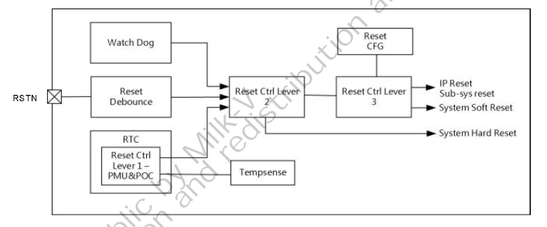

# 3.1 リセット

## 3.1.1 概要

リセット管理モジュールはチップサブシステムと機能モジュール全体の
リセットシーケンスを管理します。

## 3.1.2 リセット制御

**図3.1: リセット管理モジュールのブロック図**

### 3.1.2.1 パワーオンリセット

パワーオンリセット(POR)はリアルタイムクロック(RTC)モジュールによって
生成されます。詳細については3.9: リアルタイムクロックを参照してください。

### 3.1.2.2 システムハードリセット

システムハードリセットはリセット制御レベル2により生成され、
チップのすべてのサブシステムと機能モジュールのリセットに使用されます。
リセットソースは次のとおりです。

- パワーオンリセット
- ウォッチドッグリセット
- 過熱保護リセット
- 外部リセットピン (RSTN)
	- デバウンス回路内蔵、RSTNのHighレベルとLowレベルの有効信号は
      6.56msに達する必要があります

### 3.1.2.3 ソフトリセット

ソフトリセット制御は対応するリセット構成レジスタ( Reset CRG) を設定することで
トリガされます。これはリセット制御レベル3で実現されます。これには以下が含まれ
ます。

- システムソフトリセット: 一部の回路とRTC内部回路を除いたチップ全体を
  リセットします
- プロセッササブシステムのリセット: プロセッサとプロセッササブシステムを
  リセットします
- 機能サブシステムのリセット: 各機能サブシステムをリセットします
- 機能モジュールのリセット：各機能モジュールをリセットします

### 3.1.2.4 プロセッササブシステムのソフトリセット

プロセッサとサブシステムのリセットの生成にはSOFT_AC_RSTN_0を使用します。
構成レジスタに0を書き込んだ後、リセットコントローラは対応するプロセッサ
リセットをトリガする前に24us待機します。この期間、プロセッサはリセット後の
バスハングを避けるためにバスへのアクセスを停止する必要があります。リセットが
トリガされると対応するリセット信号は8us後に自動的に解除され、プロセッサと
プロセッササブシステムはリセットを完了し、起動します。

### 3.1.2.5 ソフトリセット機能サブシステムと機能モジュール

各機能モジュールのリセットの生成にはSOFT_RSTN_0~3を使用します。
リセット信号は自動的にはクリアされません。したがって、ソフトウェアが
対応するレジスタに0をセットしてリセットをトリガした後、リセットを解除する
ために1をセットする必要があります。リセットする前にバスへの内蔵DMAアクセスと
モジュールへのプロセッサアクセスがアイドルであることを確認してください。
そうしないと、リセットは失敗し、システムのハングアップを引き起こします。

## 3.1.3 リセット制御レジスタ

### 3.1.3.1 リセット制御レジスタ概要

**基底アドレス: 0x0300_3000**

| 名前 | オフセット | 記述 |
|:---- |-----------:|:-----|
| SOFT_RSTN_0 | 0x000 | soft-reset ctrl register 0 |
| SOFT_RSTN_1 | 0x004 | soft-reset ctrl register 1 |
| SOFT_RSTN_2 | 0x008 | soft-reset ctrl register 2 |
| SOFT_RSTN_3 | 0x00c | soft-reset ctrl register 3 |
| SOFT_CPUAC_RSTN | 0x020 | CPU auto clear soft-reset ctrl register |
| SOFT_CPU_RSTN | 0x024 | CPU soft-reset ctrl register |

### 3.1.3.2 リセット制御レジスタ詳細

いずれのビットもActive LOW

#### SOFT_RSTN_0

| ビット | 名前 | アクセス | 記述 | リセット値 |
|-------:|:---- |:---------|:-----|:-----------|
| 16 | reg_soft_reset_x_sd0 | R/W | SD0 IP ソフトリセット | 0x1 |
| 17 | reg_soft_reset_x_sd1 | R/W | SD1 IP ソフトリセット | 0x1 |
