# 12.4 SD/SDIOコントローラ

## 12.4.1 機能説明

### 12.4.1.1 機能ブロックダイアグラム

SD/SDIOコントローラ（以下、SDコントローラと略す）は、SDカードのデータ読み書きと
SDIOプロトコルがサポートされている外部デバイス（Bluetooth、WiFiなど）の操作の
処理に使用されます。チップは次の2組のSDコントローラを提供しています、

- SDIO0はセキュアデジタルメモリ (SD 3.0) プロトコルに準拠したデバイスを
  サポートします。
- SDIO1はセキュアデジタルI/O (SDIO 3.0) プロトコルに準拠したデバイスを
  サポートします。

チップ内のSDコントローラに対応する機能信号とピンを下の表に示します。

**表12-4: SDコントローラの機能信号とピン**

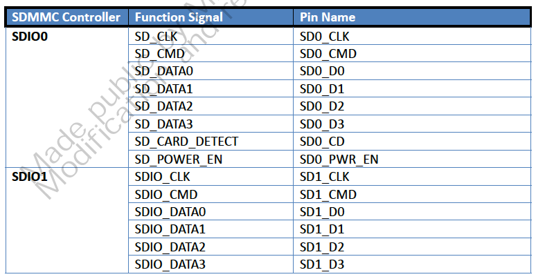

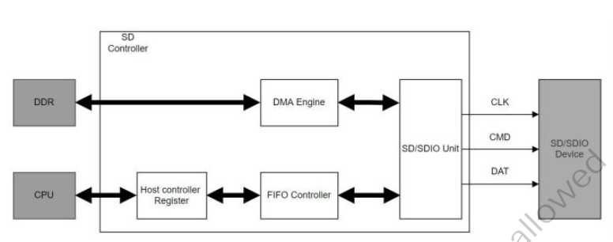

**図12-20: SDコントローラ機能ブロックダイアグラム**

SDMMCの機能は次のとおりです。

1. SDカードおよびSDIOデバイスのサポート
2. 内蔵のDMAコントローラによるSD/SDIOとシステムメモリ間のデータ転送
3. コマンドとデータのCRCの生成とチェックのサポート
4. 内部分周器による各モードで必要な周波数の生成が可能
5. 省電力のための内部クロックおよびインタフェースクロックのオフ化メカニズムの提供
6. デバイスとの通信に1ビットと4ビットのデータ伝送インターフェースを提供
7. 1-2048byteのサイズのブロックの読み書き操作をサポート
8. 割り込み間隔、サスペンド、レジューム、リードウェイトなどのSDIOプロトコルをサポート
9. AXI/AHBインタフェースのサポートと内部DMAを介したシステムメモリのアクセス
10. AHBインタフェースのサポートとCPUを介した内部レジスタのアクセス

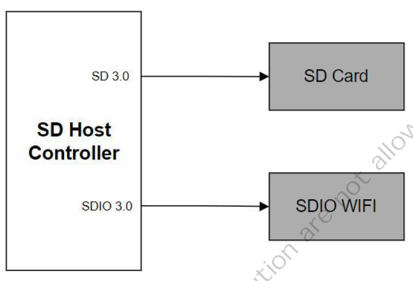

**図12-21: 典型的なアプリケーション**

### 12.4.1.2 コマンドとレスポンス

SDのバスパケットはコマンド、レスポンス、データの3つの部分で構成されます。
コマンドパケットとレスポンスパケットはCMD信号線を通して送信されます。

#### コマンドパケット

コマンドパケットは動作の開始を示すためにホストからデバイスに送信されます。
パケットフォーマットはスタートビット、送信ビット、コマンドインデックス、
コマンド引数、CRC検証コード、エンドビットを含む48ビットで構成されています。
図 12-22にコマンドパケットを示します。

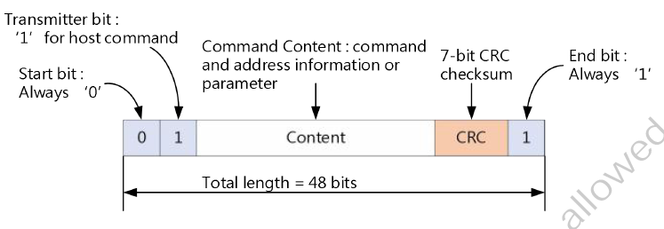

**図12-22: SD/SDIOコマンドパケット**

#### レスポンスパケット

コマンドを受け取るとデバイスはコマンドタイプに応じたレスポンスを返します。
これはデバイスのステータスやパラメータを表示するために使用されます。その長さは
48ビットまたは136ビットです。図 12-23にレスポンスパケットを示します。

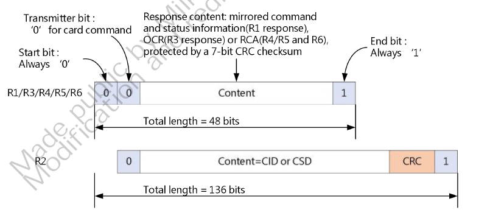

**図12-23: SD/SDIOレスポンスパケット**

#### データパケット

データパケットはホストとデバイスの間のデータ交換に使用されます。さまざまな
要求に応じて、1ビット (DATA0)、4ビット (DATA0-DATA3)、7ビット (DATA0-DATA7)を
選択できます。各クロックサイクルにおいて、各データ信号線は1ビット（シングル
データレート）または2ビット（デュアルデータレート）の転送を選択できます。
パケットフォーマットを図12-24から図12-26に示します。

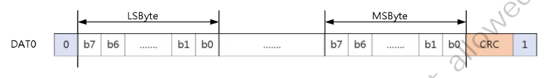

**図12-24: SD/SDIO 1ビットデータパケットフォーマット**

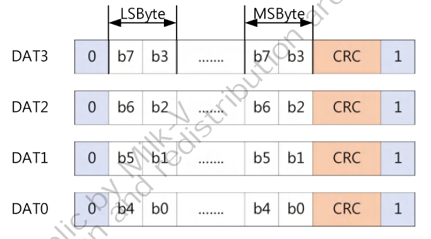

**図12-25: SD/SDIO 5ビットデータパケットフォーマット**

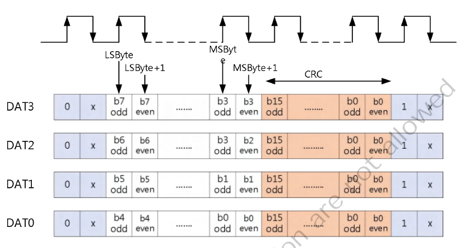

**図12-26: SD/SDIO 4ビットデータパケットフォーマット**

データ伝送の有無によりコマンドはさらに次の2種類に分けられます。

- **非データ転送コマンド**: CMD信号線を介してコマンドの送信とレスポンスの
  受信を完了します。

    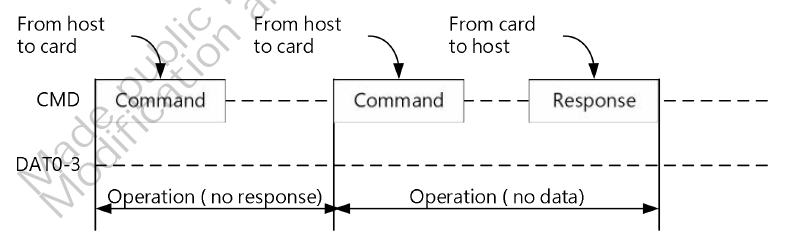

    **図12-27: 非データ転送コマンド: CMDを介して送信とレスポンス受信を完了**

- **データ転送コマンド**: CMD信号線を介した転送に加え、データ線DAT0-DAT3を
  介したデータ転送も存在します。

### 12.4.1.3 データ転送

ホストとデバイスの間のデータ転送は主にブロックに基づいて行われます。データに加えて、
データの正しさを検証するためのCRCチェックビットも含まれます。データのRead/Writeの
一般的な方法にはシングルブロックとマルチブロックがあります。シングルブロック
データ転送に比べてマルチブロックデータ転送は効率が高いです。注目すべきは
SDカードのブロックサイズは512バイトであることです。SDIOは特別です。SDIOは
1-2048バイトのブロックサイズをサポートしています。ユーザはデバイスに応じて
ブロックサイズの値を定義することができます。

(1) シングルブロックとマルチブロックのRead操作を図 12-30に示します。シングル
    ブロック転送はコマンド、レスポンス、データ、CRCで構成されます。マルチブロック
    転送はSTOP CMDで転送を終了します。

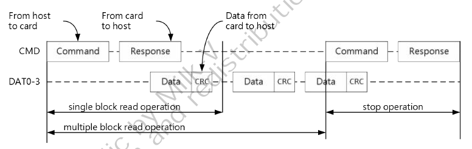

**図12-28: シングルブロックとマルチブロックのRead操作**

(2) シングルブロックとマルチブロックのWrite操作を図12-31に示します。送信過程に
    おいては書き込みデバイスが処理中であることをホストに通知するためにDAT0信号線を
    介してBUSY信号が送られます。

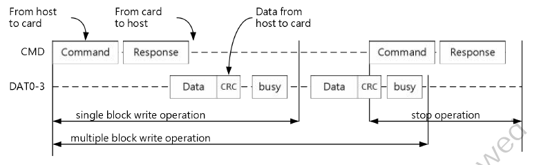

**図12-29: シングルブロックとマルチブロックのWrite操作**

### 124.1.4 SD3.0によりサポートされている速度モードと電圧の切り替え

#### 電圧の切り替え手順　(1.8V → 3.3V)

- ステップ1: `PWRSW`を3.0Vモードに設定します
    => `sd_pwrsw_ctrl (0x030001F4) = 0x00000009`

    (reg_pwrsw_auto=1, reg_pwrsw_disc=0, reg_pwrsw_vsel=0 (3.0v), reg_en_pwrsw=1)
- ステップ2: 電圧の切り替え完了まで1ms待ちます

#### 電圧の切り替え手順　(3.3V → 1.8V)

- ステップ1: `PWRSW`を1.8Vモードに設定します
    => `sd_pwrsw_ctrl (0x030001F4) = 0x0000000B`

    (reg_pwrsw_auto=1, reg_pwrsw_disc=0, reg_pwrsw_vsel=1(1.8v), reg_en_pwrsw=1)
- ステップ2: 電圧の切り替え完了まで1ms待ちます

#### サポートされている速度モードと電圧

SD3.0がサポートしている速度モードと電圧を表12-5に示します。

**表12-5: SD3.0がサポートしている速度モードと電圧**

| モード | 速度 | 電圧 |
|:-------|:-----|:-----|
| DS (Default speed) | 25MHz | 1.8V/3.3V |
| HS (High speed) | 50MHz | 1.8V/3.3V |
| SDR12 | 25MHz | 1.8V |
| SDR25 | 60MHz | 1.8V |
| DDR50 | 50MHz | 1.8V |
| SDR50 | 100MHz | 1.8V |
| SDR104 | 187.5MHz | 1.8V |
