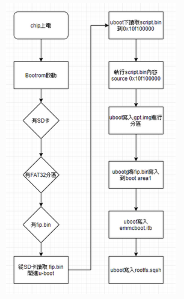
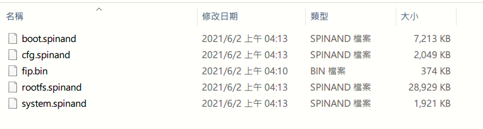
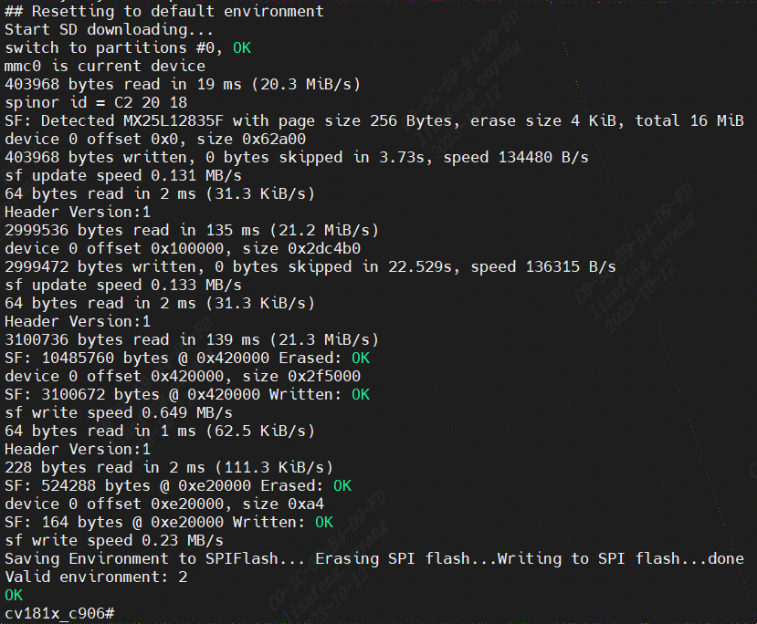

# ベアボーンおよび非ベアボーンアップグレードユーザーズマニュアル

## 2. ベアボーンでSDカードを使う

### 2.1 事前準備

1. 参考: "Linux開発環境ユーザーズガイド: 1.2 BSPのコンパイル方法"
    - fip.bin - bootloader + uboot
    - boot.emmc/boot.spinand/boot.spinor- minimal Linux イメージ (オプション)
    - rootfs.emmc/rootfs.spinand/rootfs.spinor - rootFS（オプション）
    - system.emmc/system.spinand/system.spinor - rw パーティション (オプション)
    - cfg.emmc/cfg.spinand/cfg.spinor - config rwパーティション（オプション）
2. FAT32フォーマットのTFカード（マイクロSD）

### 2.2 ベアボーンブートプロセス

### 2.3.手順

1. fip.bin、*.emmc/*.spinand/*.spinorをSDカードに入れる。
2. SDカードをCvitek EVBのSDカードスロットに挿入します。
3. Cvitek EVBプラットフォームの電源を入れます。

### 2.4 操作例

使用前にファイルを確認してください。

SDカードを挿入し、Cvitek EVBプラットフォームの電源を入れると自動的に書き込みが
開始されます。

書き込みが終了するとUARTポートに以下のメッセージが表示されます。

Cvitek EVBプラットフォームの電源を切り、再起動すると書き込みは完了です。

