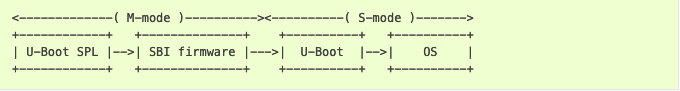

# U-Bootドキュメント

## RISC-Vに関するアーキテクチャ固有情報

[オリジナル](https://docs.u-boot.org/en/latest/arch/riscv.html)

### 概要

このドキュメントではRISC-VアーキテクチャのU-Bootブートプロセスの概要を説明します。
RISC-VはRISC (Reduced Instruction Set Computing) の原則に基づくオープンソースの
命令セットアーキテクチャ (ISA) です。RISC-Vは組み込みシステムから高性能サーバまで、
さまざまなユースケースに対応できるよう柔軟でカスタマイズ可能な設計となっています。

### 典型的なブートプロセス

U-BootはSBI (Supervisor Binary Interface) を提供するファームウェアの初期化前に
実行するか否かにより、MモードまたはSモードのいずれかで実行できます。ファームウェアは
SモードU-bootまたはオペレーティングシステムの例外を処理するSEE (Supervisor Execution
Environment) として機能するためRISC-Vのブートプロセスに必要です。

ブートフェーズ間において、hartidは`a0`レジスタを通じて、デバイスツリーの開始
アドレスは`a1`レジスタを通して渡されます。

ちなみに、`OpenSBI`は異なるモードのU-Bootで使用できるSBIの実装です。詳細については
[OpenSBIファームウェアドキュメント](https://github.com/riscv-software-src/opensbi/tree/master/docs/firmware)を参照してください。

#### MモードU-Boot

MモードのU-Bootで実行する場合、ファームウェアとSモードOSを含むペイロードイメージ
（たとえば[fw_payload](https://github.com/riscv-software-src/opensbi/blob/master/docs/firmware/fw_payload.md)）をロードします。この場合、`mkimage`を使ってペイロード
イメージを`uImage`フォーマットにパッケージ化し、`bootm`コマンドを使ってブートする
ことができます。

次の図は、ブートプロセスを示したものです。


QEMU virtマシンでブートプロセスを調べるには、ドキュメント
[QEMU RISC-V](https://docs.u-boot.org/en/latest/board/emulation/qemu-riscv.html)の
"Building U-Boot"のセクションの手順に従ってください。

#### SモードU-Boot

RISC-V製品のブートイメージにはプラットフォーム固有の初期化のための`U-Boot SPL`が
含まれている場合があります。U-Boot SPLはS-modeで動作する通常のU-Boot (U-Boot proper)
とSBIを提供するファームウェア（たとえば[fw_dynamic](https://github.com/riscv-software-src/opensbi/blob/master/docs/firmware/fw_dynamic.md)）を
含むFITイメージ (`u-boot.itb`) をロードします。そして、最後にSモードのOSがロード
されます。

次の図は、ブートプロセスを示したものです。



QEMU virtマシンでブートプロセスを調べるにはドキュメント
[QEMU RISC-V](https://docs.u-boot.org/en/latest/board/emulation/qemu-riscv.html)の
"Running U-Boot SPL"のセクションの手順に従ってください。

### ツールチェーン

[RISC-V GNUツールチェーン](https://github.com/riscv-collab/riscv-gnu-toolchain)は
ゼロからビルドすることも、[リリースページ](https://github.com/riscv-collab/riscv-gnu-toolchain/releases)から
ビルド済みのツールチェーンをダウンロードすることもできます。

## Milk-V Duoに関するボード固有情報

[オリジナル](https://docs.u-boot.org/en/latest/board/sophgo/milkv_duo.html)

### CV1800B RISC-V Soc

CV1800BはSophgo社の高性能、低消費電力の1+1 64ビットRISC-V SoCです。

### メインラインサポート

以下のドライバのサポートは既に有効になっています。

1. ns16550 UARTドライバ

#### ビルド

1. RISC-VツールチェーンをPATHに追加する。
2. ARCHとCROSS_COMPILE環境変数を設定する。

```bash
export CROSS_COMPILE=<riscv64 toolchain prefix>
cd <U-Boot-dir>
make milkv_duo_defconfig
make
```

これにより、`u-boot-dtb.bin`が生成されます。

#### ブート

現在のところ、クロックの初期化、u-bootイメージのロード、u-bootからの起動は
ベンダのFSBL (First Stage Boot Loader) に依存しています。

もう一つの方法として、FSBLの上で`u-boot-dtb.bin`を実行するには以下の手順に
従ってください。

1. ベンダが提供するツールを使用して`FSBL`, `OpenSBI`, `U-Boot`を含む
   `fip.bin`ファイルを作成する。
2. 生成された`fip.bin`ファイルをSDカードのFATパーティションに配置する。
3. SDカードをボードに挿入し、電源を入れる。

ボードは自動的に`fip.bin`ファイルから`FSBL`を実行します。続いて、`OpenSBI`に
移行し、最後に`OpenSBI`が`U-Boot`を起動します。

#### Milk-V Duoボードのサンプルブートログ

```bash
U-Boot 2024.01-rc5-00010-g51965baa36 (Dec 28 2023 - 13:15:53 +0800)milkv_duo

DRAM:  63.3 MiB
Core:  10 devices, 8 uclasses, devicetree: separate
Loading Environment from nowhere... OK
In:    serial@4140000
Out:   serial@4140000
Err:   serial@4140000
Net:   No ethernet found.
milkv_duo# cpu detail
  0: cpu@0      rv64imafdc
   ID = 0, freq = 0 Hz: L1 cache, MMU
milkv_duo#
```
