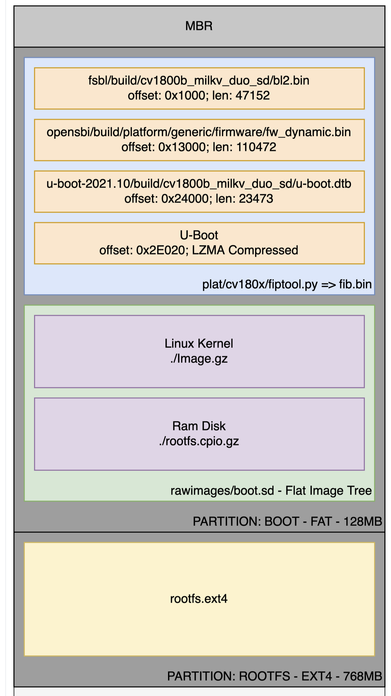
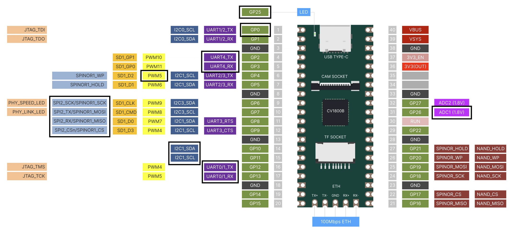

# RVSPOC-O2308参加者のpull reqeust

- virus-v (virusv), xhackerustc (xhack), BigBrotherJu (bbj) の3氏が応募
- 3実装ともxv6が実機(Milk-V Duo)で問題なく稼働
- 相違点
  1. 起動時のOpenSBI, u-bootの初期化画面
      - bbjは表示されない
      - virusv, xhackは表示される
  2. `fiptool.py`の使用
      - xhackは使用していない
      - bbj, virusvはともに`duo-buildroot-sdk/fsbl/plat/cv180x/fiptool.py`と同じソースを使用
  3. `mkimage`の使用
      - bbjは使用していない
      - xhackは使用: `mkimage -f xv6.its boot.sd`
      - virusvは使用: `mkimage -f ./multi.its -r ./boot.sd ./`
  4. `genimage`の使用
      - bbj
        ```bash
        genimage --config genimage.cfg --inputpath ../fip
        ```
      - xhack
        ```bash
        genimage --config xv6.cfg
        ```
      - virusv
        ```bash
        genimage --config genimage-milkv-duo.cfg
        ```
  4. OpenSBIライブラリ関数の使用
      - bbjは使用していない
      - xhackはSBI_TIME_SET_TIMERを使用
      - virusvはSBI_TIME_SET_TIMER, SBI_CONSOLE_PUTCHAR, SBI_CONSOLE_GETCHARを使用

| 開発者 | 表示 | fiptool | mkimage | genimage |
|:-------|:----:|:-------:|:-------:|:--------:|
| bbj    | ✕ | ◯ | ✕ | ◯ |
| xhack  | ◯ | ✕ | ◯ | ◯ |
| virusv | ◯ | ◯ | ◯ | ◯ |

- **fiptool**:  Firmware Image Packageの作成
- **mkimage**:  U-boot用imageを作成
- **genimage**: パーティション作成

- **fiptool.py**のオプション

**param1/body1**

| タグ | bbj | virusv | linux |
|:------|------|--------|---------:|
| **_NAND_INFO_**  | 0 | 0 | 0 |
| **_NOR_INFO_**  | 0xff | 0xff | 0xff |
| _BLCP_IMG_RUNADDR_  | 0x0520_0200 | 0x0520_0200 | 0x520_0200 |
| _BLCP_PARAM_LOADADDR_  | 0 | 0 | 0 |
| **_CHIP_CONF_**  | chip_conf.bin | chip_conf.bin | chip_conf.bin |
| **BLCP**  | empty.bin | empty.bin | empty.bin |
| **BL2**  | <font color="red">bl2_debug.bin</font> | bl2.bin | bl2.bin |

**param2/body2**

| タグ | bbj | virusv | linux |
|:------|------|--------|---------:|
| _BLCP_2ND_RUNADDR_  | 0x83f4_0000 | 0x83f4_0000 | 0x0x83F4_0000 |
| _MONITOR_RUNADDR_  | 0x8000_0000 | 0x8000_0000 | 0x800_00000 |
| **DDR_PARAM**  | - | ddr_param.bin | ddr_param.bin |
| **BLCP_2ND**  | - | cvirtos.bin | cvirtos.bin |
| **MONITOR**  | <font color="red">kernel/kernel.bin</font> | <font color="blue">fw_dynamic.bin</font> | <font color="blue">fw_dynamic.bin</font> |
| **LOADER_2ND**  | <font color="red">bl33.bin</font> | <font color="blue">u-boot-raw.bin</font> | <font color="blue">u-boot-raw.bin</font> |
| _compress_  | lzma | lzma | lzma |

* 太字のタグはbody（指定のパスからファイルを読み込む）
* イタリック体のタグはパラメタ（指定の値をそのまま使用）
* 太字イタリック体のタグはパラメタで、処理が必要

## #1/#3 virus-V氏

チーム: IEEE 80211チーム

1. XuanTieによるGCCツールチェーン: Xuantie-900 elf newlib gcc Toolchain V2.6.1 B-20220906
2. `make duo`コマンドを実行すると`vendor/milkv-duo/images/milkv-duo.img`イメージが自動的にビルドされる。
    1. プロジェクトで使用するelfとbinは公式のduo-buildroot-sdkにある。
    1. mkimage実行ファイルは`u-boot-2021.10/tools/mkimage.c`からコンパイルされる。
    1. fip_prebuiltディレクトリのbinは`fiptool.py`がduo-buildroot-sdkをビルドする際に使用する
       binをそのままコピーしたものである。
    1. gen_fip.shはfip.binを、gen_bootsd.shはboot.sdを、gen_images.shはmilkv-duo.imgを生成する。

3、ソースコードに対応するプルリクエストはdeb251df4bf44725d6a5e5f9c8722a3c6c4dd6e2 である。I2C、GPIO、SPI、PWMドライバの追加に基づいてこのPRのコードを提出した。



### 回答1

Userlandにgpiotest, pwmtest, spilcdtestテストルーチンを追加した。xv6を起動後に

1. gpiotestを実行すると、オンボードの青色LEDが点滅するのが見える。
2. pwmtestを実行した後、オシロスコープでPWM5ピンのPWM信号出力を見ることができ、デューティサイクルは100％から0に順番に減少する。
3. spilcdtestルーチンの実装では、SPI2_SCK、SPI2_TXピンでSPI信号出力を見ることができる。
4. I2Cドライバにはテストルーチンはなく、移植されたドライバだけである。

## #2 xhackerustc氏

xv6をMilkv DuoなどのSophgo CV1800Bプラットフォーム、Milkv-duo256、milkv Duo-SなどのSophgo SG00X
プラットフォーム、Sipeed Lichee Pi 4AなどのT-HEAD TH1520プラットフォームに移植した。Milkv Duoは
最も優先度の高い移植作業である。

現在、uart、gpio、adc、pwm、i2c、spiなどのペリフェラルはmilkv duoで十分にサポートされている。
QemuとTH1520はuartしかサポートしていない。ペリフェラルの使い方をデモするためのユーザースペースツールも
作成している。下記を参照されたい。

### 質問1

- ソースからコンパイルすると、イメージは得られますが、シェルのコマンドラインにたどり着けません。
  1. ツールチェーンのバージョンに関する要件はありますか？ 例: Xuantie-900-gcc-elf-newlib-x86_64-V2.6.1
  2. genimageの要件はありますか？ 例: duo-buildroot-sdk-Duoo-V1.0.7/buildroot-2021.05/output/milkv-duo_musl_riscv64/host/bin/genimage
  3. システムがエラーを報告した場合、その原因を分析するか、より詳細なコンパイル手順を直接教えてください。
     以下はuart1が出力したブートログです。

```bash
xv6 kernel is booting

SBI specification v0.3 detected
SBI TIME extension detected
SBI IPI extension detected
SBI RFNC extension detected
SBI HSM extension detected

usertrap(): unexpected scause 0xd pid=1
            sepc=0 stval=0x505050505
panic: init exiting
```

### 回答1

以下のパッチを適用

```diff
$ git diff kernel/trampoline.S
diff --git a/kernel/trampoline.S b/kernel/trampoline.S
index bf5851b..8c76b7f 100644
--- a/kernel/trampoline.S
+++ b/kernel/trampoline.S
@@ -147,6 +147,7 @@ userret:
        # restore user a0
         ld a0, 112(a0)

+        fence.i
         # return to user mode and user pc.
         # usertrapret() set up sstatus and sepc.
         sret
```

```diff
diff --git a/kernel/param.h b/kernel/param.h
index f7757af..eeb7962 100644
--- a/kernel/param.h
+++ b/kernel/param.h
@@ -9,7 +9,7 @@
 #define MAXOPBLOCKS  10  // max # of blocks any FS op writes
 #define LOGSIZE      (MAXOPBLOCKS*3)  // max data blocks in on-disk log
 #define NBUF         (MAXOPBLOCKS*3)  // size of disk block cache
-#define FSSIZE       1500  // size of file system in blocks
+#define FSSIZE       2000  // size of file system in blocks
 #define MAXPATH      128   // maximum file path name
 #ifndef INTERVAL
 #define INTERVAL     1000000UL
```


### # milkv duo用のビルド

```bash
./build_for_milkv_duo.sh
```

ビルドされたimgは`duo-imgtools/milkv-duo_sdcard.img`である。

### これをPCでtfカードにコピー

```bash
dd if=milkv-duo_sdcard.img of=/dev/sdX
```

"sdX"は実態に合わせて修正する必要がある。

### gpioのデモ

```bash
$ ./blink 5 //will link 5 loops
```

### adcのデモ

ADC1を使用している。

```bash
# まず、GP26をGNDに接続して
$ ./adc
$ adc raw: 0

# 次に、GP26を3v3(out)に接続して
$ ./adc
$ adc raw: 4095
```

### pwmのデモ

デモにはPWM6を使用する。発光ダイオード（適切な抵抗を忘れずに、私は100オームを使っている）の一方を
GP5に接続し、他端をGNDに接続する。

```bash
$ ./pwm 1000000 900000
$ ./pwm 1000000 800000
$ ./pwm 1000000 600000
$ ./pwm 1000000 500000
$ ./pwm 1000000 300000
$ ./pwm 1000000 200000
$ ./pwm 1000000 100000
```

など。デューティサイクルを変更するたびにダイオードのライトが変化する。

### i2cのデモ

デモにはI2C0を使用する。デモにはmax30102センサを使用した。他のI2Cデバイスを使用する場合は
デバイスのマニュアルを参照されたい。GP0をSCLピンに、GP1をSDAピンに接続する。GNDとVCC(3V3(out)に接続)の
接続も忘れないこと。

```bash
$ ./i2c 0x57 0xff
$ 0x15
$ ./i2c 0x57 0x21 1
$ ./i2c 0x57 0x1f
0xF
$ ./i2c 0x57 0x20
0x3
```

整数温度は15であり、温度のfarcは0x3なので、温度はおおよそ15.19℃である。(詳細は max30102 TRM を参照)

### spiのデモ

デモにはSPI2を使用する。外部SPIループテストをデモした。これはlinuxのspidev_testに相当する。
デモでは受信した内容を表示する。

```bsh
$ ./spi
$ 0 0 0 0 0 0 0 0 ...
# 次に、GP7とGP8を接続する
$ ./spi
$ 1 2 3 4 5 6 7 8 ...
```

### QEMU用のビルド

```bash
git checkout kernel/config.h
make
make kernel/kernel.bin
```

### TH1520用のビルド

```bash
cp kernel/config.h.th1520 kernel/config.h
make
make kernel/kernel.bin
```

### SG200X用のビルド

fip.binを置き換えて、milkv duoとしてビルドするだけである ;)

## ＃4. BigBrotherJu氏

### imageの作成

ルートディレクトリでsdカードのデバイスファイル名を指定して`./script /dev/sdb`を実行する。
すると`port/image/output/milkv-duo.img`が作成される。

### ドライバ

#### i2c

- SoCには5つのi2cコントローラがあり、開発ボードにはコントローラ0、1、3がピン出力されている。
- ドライバはi2c0-4のいずれか1つを制御する。ioctlでスレーブアドレスを設定し、値を読み書きすることができる。
- デモ用のテスト例ではi2c 1を駆動している。
- このテスト例では3軸加速度と角速度を取得するためにジャイロセンサーMPU6050を接続する必要があある
 （データは未処理の生データである）。

#### uart

- SoCには5つのuartコントローラがあり、ボードには5つすべてのコントローラがピン出力されている。
- uart 0はコンソールに接続されており、駆動されない。
- ドライバはuart 1-4のいずれか1つを制御する。ioctlで uart パラメータを設定し、値を読み書きすることができる。
- デモ用のテスト例ではuart 4を駆動している。
- テスト例では、開発ボードのuart 4をコンピュータのシリアルポートに接続する必要がある。まず文字列がシリアル
  シアルポートに出力され、次にシリアルポートから入力する。入力長はテスト例の最初のパラメータによって決定され、
  シリアルポートに入力された文字はシリアルポートに再表示される。

#### adc

- SoCにはadcコントローラが1つあり、ボートにはこのコントローラがピン出力されている。
- ドライバはこのコントローラの任意のチャネルを制御し、値の読み出すをサポートしている。
- デモ用のテスト例ではチャンネル 1を駆動している。
- チャンネル1に3.3Vを入力/キャンセルすることでチャンネル1が読み取るデジタル量の変化を観察することができる。

#### pwm

- SoCには4つのpwmコントローラがあり、ボードにはコントローラ 1と2がピン出力されている。
- ドライバは任意の1つのコントローラの任意の1つのチャンネルを制御し、ioctlはチャネルを設定し、有効にする。
- デモ用のテスト例ではpwm5（pwm1のチャンネル1）を駆動している。
- このテスト例ではDF9GMS 180マイクロサーボと接続する必要がある。pwm5に異なるデューティを設定することで
  サーボの舵を異なる角度で回転させることができる。

#### gpio

- SoCには4つのgpioコントローラがあり、ボードには4つのコントローラすべてがピン出力されている。
- ドライバは任意の1つのコントローラの任意の1つのチャネルを制御し、ioctlは入出力を設定し、値の読み込会を
  することができる。
- デモ用のテスト例ではボード上のGP0（gpio 0のチャンネル28）とGP25（gpio 2のチャンネル24）を駆動している。
- テスト例ではボードの青色LEDを点滅させ、GP0の入力を10回読み取る。GP0の元の入力は1であり、入力が接地されると
  0になる。

#### spi

- SOCには4つのspiコントローラがあり、開発ボードにはコントローラ2がピン出力されている。
- ドライバは1つのコントローラを制御し、ioctlはモードと周波数を設定し、リード/ライトを開始する。
- デモ用のテスト例ではspi 2を駆動している。
- テスト例はspiループバックテストであり、spi 2の両データピンをショートする必要がある。 送信された
  データは全く同じように受信される。

### ピンの割り当て

図中の黒枠で囲ったピンがテストで使用するピンであり、ピンは多重化用に設定されており、対応するペリフェラルを
接続してテストすることができる。



### 例

- 各ドライバのサンプルユーザプログラムは、イメージに含まれている`xxxtest`であり、ボードの電源投入後に
  実行できる。
- pwmドライバサーボの例: https://youtu.be/HcWbFNFGxGc
- i2cドライバジャイロスコープの例: https://youtu.be/O51iY6FCdak
- その他のドライバ例には特別なペリフェラルはないので各自で確認してほしい。
- uart0の設定は115200、8データビット、1ストップビット、パリティなしであり、uart4の設定はは
  user/uarttest.cで変更が可能である。デフォルトはuart0の設定と同じである。uart0とuart4の使用では
  シリアルポートツールの必要があるかもしれない、シリアルポートでは`lf`は`crlf`と入力される。
