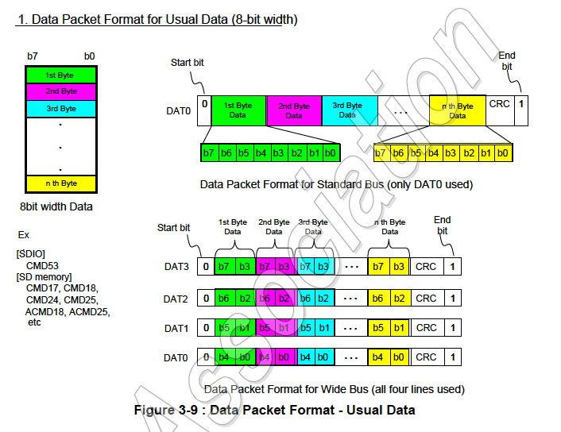

# 第3章 SDメモリカードシステムのコンセプト

## 3.6 バスプロトコル

### 3.6.1 SDバスプロトコル

SDバスを介した通信はコマンドとデータビットストリームに基づいています。これらは
スタートビットに始まり、ストップビットで終わります。

- **コマンド**: コマンドは処理を開始するトークンです。コマンドはホストから
  1枚のカード（アドレス指定コマンド）または接続されているすべてのカード
  （ブロードキャストコマンド）に送信されます。コマンドはCMDライン上をシリアルに
  転送されます。
- **レスポンス**: レスポンスは直前に受信したコマンドに対する返答としてアドレス
  指定されたカードまたは接続されているすべてのカードから（同期的に）ホストに
  送信されます。
- **データ**: データはカードからホスト、またはホストからカードに送ることができます。
  データはデータラインを介して送信されます。

カードのアドレス指定は初期化フェーズ中にカードに割り当てられるセッションアドレスを使用して
実装されています。コマンド、レスポンス、データブロックの構造は第4章で説明されています。
SDバス上の基本的なトランザクションはコマンド/レスポンストランザクションです（図3-4を参照）。
このタイプのバストランザクションは直接情報をコマンドまたはレスポンスの構造を使って直接転送
します。さらに、データトークンを持つ操作もあります。

SDメモリカードへの/からのデータ転送はブロックで行われます。データブロックのあとには常に
CRCビットが続きます。単一ブロック操作と複数ブロック操作が定義されています。より高速な
書き込み操作には複数ブロック操作モードが優れていることに注意してください。複数ブロック転送は
CMDライン上で停止コマンドが続くと終了します。データ転送に単一データラインを使用するか、
複数データラインを使用するかはホストで構成することができます。

ブロック書き込み操作ではデータの転送に使用されるデータラインの数に関係なく、DATOデータ
ライン上での書き込み操作の間にシンプルなビジー信号を使用します（図3-6を参照）。

コマンドトークンは次のコーディングスキームを持ちます。

各コマンドトークンの前には開始ビット（0）が付き、最後には終了ビット（1）が付きます。
全長は48ビットです。各トークンはCRCビットで保護されているので送信エラーを検出して、
操作をやり直すことができます。

レスポンストークンには内容に応じて4つのコーディングスキームのいずれを採ります。トークンの
長さは48ビットか136ビットです。コマンド定義と応答定義定義の詳細はセクション4.7に記載されて
います。ブロックデータのCRC保護アルゴリズムは16ビットCCITT多項式です。使用が許可されている
すべてのCRCタイプはセクション4.5で説明されています。

CMDラインでは、MSB (Most Signiicat Bit) が最初に送信され、LSB (Least Significant 
Bit) が最後が送信されます。

ワイドバスオプションが使用された場合、データは一度に4ビットずつ転送されます（図3-10を参照）。
開始ビットと終了ビット、CRCビットはすべてのDATラインで送信されます。CRCビットはDATライン
ごとに個別に計算され、チェックされます。CRCステータスレスポンスとビジー表示はDAT0上だけで
カードからホストに送信されます（その期間のDAT1-DAT3は気にする必要はありません）。

SDカードには次の2種類のデータパケット形式があります。

1. 通常データ（8ビット幅）: （8ビット幅の）通常データはLSBが先に送信され、MSBは最後に
   送信されます。ただし、個々のバイト内ではMSBが先で、LSBが最後に送信されます。
2. ワイド幅データ（SDメモリレジスタ）: ワイド幅データはMSBビットからシフトされます。

### 3.6.2 SPIバスプロトコル

SPIバスプロトコルの詳細は第7章に記載されています。

## 3.6.3 UHS-IIバスプロトコル

UHS-IIバスプロトコルはUHS−II補遺で定義されています。

## 3.6.4 PCIe/NVMeバスプロトコル

PCleプロトコルとNVMeプロトコルはこの文書に記録されている詳細を除いて、付録A.2に
記載されているPCleおよびNVMe仕様により定義されています。

## 3.7 SDメモリカード - ピンとレジスタ

### 3.7.1 SDバスのピン割当

SDメモリカードのフォームファクタは24 mm x 32 mm x 2.1 mm、または、
24 mm x 32 mm x 1.4 mmです。

図3-11はSDメモリカードの標準サイズとインタフェース接点の一般的な形状を示しています。
物理的寸法の詳細と機械的説明はパート1 機械的補遺に記載されています。MicroSDとminiSDの
フォームファクタも利用可能です。それらの物理的寸法、機械的説明、ピン割り当てはパート1 
microSDカード補遺とパート1 miniSDカード補遺に記載されています。

1. S: 電源; プッシュプルドライバを使用した I: 入力; O: 出力; PP: プッシュプルドライバを
   使用したI/O; 
2. 拡張DATライン (DAT1-DAT3)は電源投入時は入力です。SET_BUS_WIDTHコマンドの後に
   DATラインとして動作し始めます。ホストは使用していない間もDAT1-DAT3ラインを入力モードに
   保つ必要があります。
3. 電源投入時、このラインはカード内で50Kオームのプルアップが有効になっています。この抵抗は
   カード検出とモード選択の2つの機能を提供します。モード選択の場合、ホストはラインをhighに
   駆動するか、プルアップを維持することでSDモードを選択できます。SPIモードを選択したい場合、
   ホストはラインをlowにドライブする必要があります。カード検出の場合、ホストはラインが
   プルアップされていることを検出します。このプルアップをユーザは通常のデータ転送中に
   SET_CLR_CARD_DETECT（ACMD42）コマンドを使用して切断する必要があります。
4. DAT1ラインはデータ転送操作に使用されていないすべての時間の間、SDIOモードでは
  （カードからの）割り込み出力として使用することができます（詳細については「SDIOカード仕様」を
   参照してください）。
5. DAT2ラインはSDIOモードではRead Wait信号として使用することができます（詳細については
  「SDIOカード仕様」を参照してください）。

各カードは一組の情報レジスタを持ちます（物理レイヤ仕様の第5章も参照）。

### 表3-2: SDメモリカードレジスタ

| 名前 | 幅 | 説明 |
|:----|---:|:----|
| CID | 128 | カード識別番号; 識別のためのカード個別番号 (5.2を参照)。**必須**
| RCA (1) | 16 | 相対カードアドレス; カードのローカルシステムアドレス、カードにより動的に提案され、初期化中にホストにより承認される (5.4を参照)。**必須** | 
| DSR | 16 | ドライバステージレジスタ; カードの出力ドライバを構成する (5.5を参照)。**オプション** | 
| CSD | 128 | カード固有データ; カードの動作条件に関する情報（5.3を参照）。**必須** | 
| SCR | 64 | SD構成レジスタ; SDメモリカードの特殊機能に関する情報（5.6を参照）。**必須** | 
| OCR | 32 | 操作条件レジスタ;（5.1を参照。**必須** | 
| SSR | 512 | SDステータス; カード独自の機能に関する情報（4.10.2を参照）。**必須** | 
| CSR | 32 | カードステータス: カードステータスに関する情報（4.10.1を参照）。**必須** | 

(1) RCAレジスタはSPIモードでは使用されません（利用可能）

ホストは電源をオフにして再度オンにすることでカードをリセットすることができます。各カードは
電源投入後にカードを定義された状態にする独自の電源投入検出回路を持つ必要があります。
明示的なリセット信号は必要ありません。カードもGO_IDLE（CMDO）コマンドを送信することで
リセットすることができます。

### 3.7.2 UHS−IIのピン割当

以下、省略

### 3.7.３ １レーンSD Expressのピン割当

以下、省略

### 3.7.4 2レーンSD Expressのピン割当

以下、省略

## 3.8 ROMカード

省略

## 3.9 UHS-I (Ultra High Speed Phase I)カード

省略

## 3.10 UHS-II (Ultra High Speed Phase II)カード

省略

## 3.11 - 3.21 

省略
