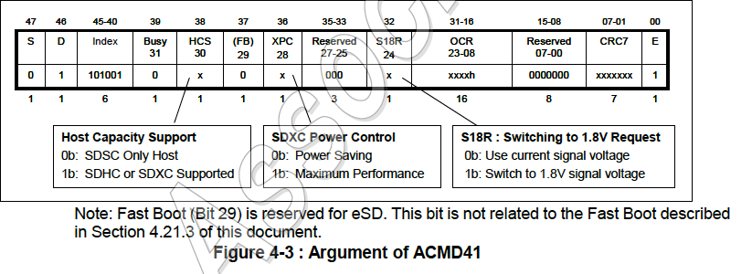

# 第4章 メモリカード機能説明

## 4.1 概要

ホストとカードの間のすべてのコミュニケーションはホスト（マスター）により
制御される。ホストはブロードキャストコマンドとアドレス指定（point-to-point）
コマンドの2種類のコマンドを送信する。

- **ブロードキャストコマンド**

  ブロードキャストコマンドはすべてのカードに向けたものである。これらのコマンドの
  中には応答を必要とするものもある。

- **アドレス指定コマンド**

  アドレス指定のコマンドは指定されたアドレスのカードに送信され、そのカードから
  応答を受け取る。識別モード (Identification mode) のコマンドフローの一般的な
  概要を図4-1に、データ転送モード (Data transfer mode) を図4-13に示す。現在の
  状態と受け取ったコマンド、それによる状態の依存関係を表4-35に示す。以下の節では
  まず、様々なカード操作モードを説明する。次に、クロックシグナルを制御する際の
  制限を定義する。すべてのSDメモリカードコマンド、それに対する応答、状態遷移、
  エラー条件、タイミングについてはその後の節で説明する。
  SDメモリカードシステム（ホストとカード）では2つの操作モードが定義されている。

- **カード識別 (Card identification) モード**

  ホストはリセット後、バス上で新しいカードを探している間、カード識別モードにある。
  カードはリセット後、`SEND_RCA`コマンド (`CMD3`) を受信するまでカード識別モードに
  ある。

- **データ転送 (Data transfer) モード**

  カードはRCAが発行されるとデータ転送モードになる。ホストはバス上のすべてのカードの
  識別が終わるとデータ転送モードになる。

- **初期化前 (Pre-init) モード**

  このモードはLVS識別とFast Bootに関連する状態遷移を定義するために導入された。
  ホストが3.3vのシグナルをサポートしていない場合、アイドル状態に遷移する前に
  LVS識別が必要となる。さらに、Fast Bootを実行するためにホストは74クロック以上
  CMDラインをLowに駆動するか、特別な引数でCMD0を発行する。

表4-1は操作モードとカード状態の間の依存関係を示している。SDメモリカード状態図
（図4-1参照）における各状態は1つの操作モードに関係している

表4-1: カード状態と操作モードの関係

## 4.2 カード識別モード

カード識別モードにある間、ホストはカード識別モードにあるすべてのカードを
リセッ トし、動作電圧範囲を評価し、カードを識別し、RCA (Relateive Card Address)を
発行するように要求する。この操作は各カードに対して各自のCMDラインで個別に行われる。
カード識別モードにおけるすべてのデータ通信はコマンド (CMD) ラインだけを使用する。

カード識別処理中、カードは識別クロックレートfodのSDクロック周波数で
動作しなければならない（6.6.6節参照）。

### 4.2.1 カードリセット

SDモードでは`GO_IDLE_STATE` (`CMD0`) コマンドはソフトウェアリセットコマンドであり、
各カードをそれまでのカードの状態に関係なく`Idele State`に設定する。ただし、
`Inactive State`のカードはこのコマンドの影響を受けない。

ホストによる電源投入後はそれまで`Incative State`であったカードを含むすべての
カードが`Idle State`になる。

電源投入または`CMD0`発行の後、すべてのカードのCMDラインは入力モードになり、次の
コマンドの開始ビットを待つ。カードはデフォルトの相対カードアドレス(RCA=0x0000)と
クロック周波数400KHzのデフォルトドライバ強度で初期化される。3.3V 信号の場合、
サポートされており、かつ最大駆動電流ケーパビリティが選択されていれば、デフォルト
ドライバ強度はDSR (Driver Stage Register) により指定される。1.8V 信号の場合、
デフォルトのドライバ強度はタイプBドライバにより指定される。UHS-IIモードの場合、
RCAはCMD0では0x0000にクリアされず、エヌメレーションにより決定されたDevice IDは
保持される。

### 4.2.2 動作条件の検証

ホストとカード間の通信を始める際、ホストはカードがサポートしている電圧を知らず、
カードは現在供給されている電圧に対応しているかどうかを知らない可能性がある。
ホストはカードがサポートしていると仮定して指定した電圧でリセットコマンド (`CMD0`)
を発行する。電圧を確認するために物理層仕様2.00版で以下の新しいコマンド(`CMD8`) が
定義された。

`SEND_IF_COND` (`CMD8`) はSDメモリカードインタフェースの動作条件を確認するために
使用される。カードはCMD8の引数を解析して動作条件の妥当性をチェックし、ホストは
CMD8の応答を解析して妥当性をチェックする（4.3.13節参照）。供給電圧は引数のVHS
フィールドで示される。カードはVHSで指定された電圧を現在の供給電圧と仮定する。
VHSの1ビットだけが常に1に設定されなければならない。ホストとカード間の通信の
有効性をチェックするためにCRCとチェックパターンの両者がホストで使用される。

カードが供給電圧で動作可能であれば、応答は供給電圧とコマンド引数で設定された
チェックパターンをエコーバックする。

カードは供給された電圧で動作できない場合、応答を返さず、アイドル状態に留まる。
SDHC, SDXC, SDUCの各カードを初期化するには最初のACMD41を発行する前にCMD8を発行
することが必須である（図 4-1参照）。CMD8の受信によりカードはホストが物理層仕様
2.00版以降をサポートしていることを認識し、カードは新しい機能を有効にすることが
できる。

`SD_SEND_OP_COND` (`ACMD41`) は、SD メモリーカードホストに、ホストが希望する
VDD範囲と一致しないカードを識別してリジェクトするメカニズムを提供
するために設計された。これはホストが必要とするVDD電圧ウィンドウを
コマンドのオペランドとして送信することで実現される（5.1節参照）。指定された
範囲内でデータ転送を行うことができないカードはそれ以降のバス動作から自身を切り
離し、`Inactive State`になる。OCRレジスタのレベルはそれに応じて定義されなければ
ならない（5.1節参照）。ACMD41はアプリケーション固有コマンドあるのでACMD41の前に
常に`APP_CMD` (`CMD55`) を発行しなければならない。`idle_state`にある場合に
`CMD55`に使用されるRCAはカードのデフォルトRCAである`RCA = 0x0000`でなければ
ならない。

リセットコマンド (`CMD0`) を発行してカードをリセットした後、ホストは`ACMD41`の
前に`CMD8`を発行してSDメモリカードを再初期化する必要がある。

図4-1にSD I/Fのカード識別モードの状態図を示す。UHS-IIモードの場合はUHS-II補遺の
SD-TRANの節を参照すること。また、Fast Bootを実行する場合は4.21.5節を参照
すること。

ACMD41の引数でOCRをゼロに設定することでホストは各カードに問い合わせをして、
`Inactive State` (Query mode)にある範囲外のカードに送信する前に共通の電圧範囲を
決定できる。この問い合わせはホストが共通の電圧範囲を選択できる場合、または
スタック内の使用できないカードのアプリケーションに通知が必要な場合に使用する
必要がある。ACMD41が問い合わせとして発行された場合、カードは初期化を開始しせず、
引数にあるHCSは無視する（4.2.3節を参照）。その後、ホストは動作電圧を選択し、
この条件でACMD41を再発行し、互換性のないカードを`Inactive State`に送る。

初期化プロセスの間、ホストは動作電圧範囲を変更することはできない。6.4節で説明する
パワーアップシーケンスを参照されたい。

### 4.2.3 カードの初期化と識別プロセス

バスが起動されるとホストはカードの初期化と識別プロセスを開始する（図4-2を参照）。
初期化プロセスは動作条件とOCRのHCSビットを設定した`SD_SEND_OP_COND` (`ACMD41`)
から始まる。HCS (Host Capacity Support) ビットに1をセットすることはホストがSDHC
またはSDXCカードをサポートしていることを示す。HCSビットに0をセットすることは
ホストがSDHCまたはSDXCカードをサポートしていないことを示す。

`CMD8`の受信により`ACMD41`の機能が拡大される。引数のHCSと応答のCCS (Card Capacity
Statu) である。HCSは`CMD8`に応答しなかったカードによって無視される。しかし、
カードが`CMD8`に応答しなかった場合、ホストはHCSに0をセットする必要がある。標準
容量のSDメモリカードはHCSを無視する。HCSに0がセットされている場合、SDHCカードと
SDXCカードは準備状態に戻ることはない（ビジービットを0に保つ）。OCRのビジービットは
`ACMD41`の初期化が完了したか否かをホストに通知するためにカードによって使用される。
ビジービットに0をセットすることはカードがまだ初期化中であることを示す。ビジー
ビットに1をセットすることは初期化が完了したことを示す。カードの初期化は最初の
`ACMD41`から1秒以内に完了する必要がある。ホストは、少なくとも1秒間、またはビジー
ビットに1が設定されるまで`ACMD41`を繰り返し発行する。

カードは最初の`ACMD41`の場合にのみOCRの動作条件とHCSビットをチェックして引数に
電圧ウィンドウをセットする。`ACMD41`を繰り返している間、ホストは`CMDO`以外の
他のコマンドを発行してはならない。

カードが`CMD8`に応答する場合、`ACMD41`の応答にはCCSフィールド情報を含める。CCSは
カードが準備完了（ビジービットに1を設定）を返したときに有効になる。CCS=0は
カードがSDSCであることを意味する。CCS=1はカードがSDHCまたはSDXCであることを意味
する。

ホストはシステムにあるすべての新しいカードに対して同じ初期化シーケンスを実行する。
互換性のないカードは`Inactive State`に送られる。ホストは次に各カードに対し
`ALL_SEND_CID` (`CMD2`) コマンドを発行しそのカードのユニークなカード識別 (CID)
番号を取得する。未識別だったカード（つまり、`Ready State`にあったカード）は
（CMDライン上で）応答としてCID番号を送信する。カードによりCIDが送信されるとその
カードは`Indentification State`になる。その後、ホストは`CMD3` (`SEND_RELATIVE_ADDR`) を
発行し、カードに新しい相対カードアドレス（RCA）を発行するように要求する。RCAは
CIDよりも短く、将来のデータ転送モードでカードを指定するアドレスとして使用される。
RCAを受け取るとカードの状態は`Stand-by State`に変わる。この時点でホストが別の
RCA番号を割り当てたい場合、カードに別の`CMD3`コマンドを送信して新しい番号の発行を
要求できる。最後に発行されたRCAがカードの実際のRCA番号である。

ホストはシステムにあるすべてのカードに対してこの識別プロセス、すなわち、`CMD2`と
`CMD3`のサイクルを繰り返す。

SDXCの初期化はSDHCと同じである。SDXCカードのユーザ領域容量はC_SIZEによって
指定され、それは32GB以上でなければならない。

SDUCカードの初期化については8.3節を参照されたい。

図4-2はSD I/Fのカードの初期化と識別を示している。 UHS-IIモードの場合はUHS-II
補遺のSD-TRANの節を参照されたい。

    アプリケーションノート:
    ホストはカードが準備完了を示さない場合、ACMD41発行の繰り返しを中止するために
    ACMD41のタイムアウトを1秒以上に設定する必要がある。タイムアウトカウントは
    引数に電圧ウィンドウが設定された最初のACMD41から始まる。

#### 4.2.3.1 初期化コマンド (ACMD41)

以下は`ACMD41`の引数の一般的な規則である。

1. 引数の電圧ウィンドウフィールド (bit 23-0) に0がセットされている場合は
   「問い合わせACMD41」と呼ばれ、初期化は開始せず、OCRの取得に使用される。
   問い合わせACMD41は引数の他のフィールド (bit 31-24) を無視する必要がある。
2. 引数の電圧ウィンドウフィールド (bit 23-0) に初めて0以外がセットされた場合は
   「最初のACMD41」と呼ばれ、初期化を開始する。引数の他のフィールド (bit 31-24)
   は有効である。
3. 引き続き発行されるACMD41の引数は最初のACMD41の引数と同じでなければならない。

図4-3は引数の形式を示し、図4-4は応答の形式を示している。ACMD41の引数に2つの新しい
フィールドが追加されている。

SDXCカードがXPC=0で初期化された場合、カードはデフォルト速度またはSDR12で最大
0.36W（VDD1上で3.6V, 100mA）で動作し、カードがスピードクラスをサポートして
いない場合、SDステータスにおけるクラス0であることを示す。SDXCカードがXPC=1で
初期化された場合、カードはデフォルト速度またはSDR12で最大0.54W（VDD1上で3.6V,
150mA）で動作し、カードがスピードクラスをサポートしている。XPCの選択を変更する
には再初期化が必要である。

UHS-IをサポートしているホストがACMD41の引数でS18R=1をセットしてカードに1.8V
信号レベルを切り替えるように要求した場合、（3.3V信号モードの場合）
UHS-IカードはACMD41にS18A=1で応答したら、ホストは電圧切り替えコマンドを発行
できる。電圧切り替えが実行されたら、UHS-IカードはS18A=0を示し、電流信号電圧を
維持する。UHS-IIモードではカードは常にS18A=0を示す。

##### (1) ACMD41の引数

##### (2) ACMD41の応答

CCS (Bit 30), UHS-II (Bit 29), S18A (Bit 24)はビジー (Bit 31)に1がセットされた
場合に有効である。SDUCをサポートしているホストとカードについては4.20.2節の
図4-75を参照されたい。

### 4.2.4 バス信号電圧切り替えシーケンス

LVインタフェースカード初期化については低電圧インタフェース補遺を参照されたい。
また、Fast Boot時の信号電圧切り替えについては4.21.3節を参照されたい。

#### 4.2.4.1 UHS-Iの初期化シーケンス

図4-5は電圧切り替えを実行するコマンドシーケンスを、図4-6はUHS-Iホストの初期化
フローチャートを示している。赤と黄色のボックスはUHS-Iカードを初期化するための
新しい手順である。

信号レベルが3.3Vの場合、ホストは応答が準備完了を示すまでHCS=1とS18R=1をセットした
ACMD41の発行を繰り返す。最初のACMD41の引数（HCSとS18R）は有効であるが、続く
すべてのACMD41は同じ引数で発行する必要がある。ビット31が準備完了を示した場合、
ホストはCCSとS18Aを確認する必要がある。カードがS18A=0を示した場合、電圧切り替えは
許されておらず、ホストは現在の信号レベルを使用する必要があることを意味する。
S18A=1は電圧切り替えが許されていることを意味し、ホストは`CMD11`を発行して電圧
切り替えシーケンスを実行する。`CMD11`を受信したらカードはR1応答を返し、電圧
切り替えシーケンスを開始する。`CMD11`に応答がないということは、S18Aが0であった
ことを意味し、そのため、ホストは`CMD11`を送信すべきではなかったことを意味する。
電圧切り替えシーケンスの完了はDAT[3:0]のhighレベルによりチェックされる。ホストの
能力に応じてDAT[3:0]の任意のビットをチェックできる。

転送状態に入る際、R1応答のCARD_IS_LOCKEDステータスをチェックする必要がある
（`CMD7`の応答と同じ）。カードがロックされている場合、カードのロックを解除する
ために`CMD42`が必要である。カードがロックされていない場合、`CMD42`はスキップする
ことができる。

UHS-Iカードの場合、適切なドライバ強度がCMD6ファンクショングループ3により選択され、
UHS-Iモードの1つがCMD6ファンクショングループ1により選択される。

SDR50モードとSDR104モードでサンプリングポイントのチューニングが必要な場合、
チューニングが完了するまで`CMD19`が繰り返し発行される。

#### 4.2.4.2 信号電圧切替のタイミング

[この節は短縮版仕様では空白]

#### 4.2.4.3 電圧切替エラー検知のタイミング

[この節は短縮版仕様では空白]

#### 4.2.4.4 電圧切り替えコマンド

図4-9は電圧切り替えコマンド (`CMD11`) の定義を示している。`CMD11`は`Ready State`で実行でき、
状態は変更しない。たとえカードがロックされていても`CMD11`は実行できる。R1タイプの応答を返すと
いうことはカードが電圧切り替えシーケンスを開始したことを意味する。ホストは応答がないことを検出
した場合、電源サイクルを実行する必要がある。

カードが`CMD11`に応答しないことを示すケースは次の4つある。

1. カードが電圧切り替えをサポートしていない
2. カードは電圧切り替えをサポートしているが`ACMD41`がS18R=0を受信した。
3. カードは`Ready State`にないときに`CMD11`を受信した
4. 信号レベルがすでに1.8Vに切り替えられていた

上記のすべての場合、`CMD11`は違法コマンドとして扱われる。

#### 4.2.4.5 チューニングコマンド

 既知のデータブロック（「チューニング ブロック」）をチューニングが必要なホストのサンプリング
 ポイントとしてチューニングすることができる。サンプリングポイントのチューニング機能は
 HOST-SDR-VDでは必須であり、HOST-SDR-FDではオプションである。この手順は特定のホストとカードの
 組み合わせでシステムに最適なタイミングを与え、プロセス、電圧、様々なPCB負荷とスキューを含む
 タイミング量の静的遅延を補償する。
 
`CMD19`はチューニングブロック送信コマンドとして定義されている。R1タイプの応答が定義されている。
`CMD19`はカードがアンロックされている間、1.8V信号モードの`Transfer state`で実行できる。
他のケースでは`CMD19`は違法コマンドとして扱われる。DAT[3:0]によって運ばれるデータブロックには、CMDラインとDAT[3:0]ラインでデータを受信するためのサンプリング位置を調整するためのパターンが
含まれている。`CMD19`のブロック長は固定されており、`CMD16`は不要である。

チューニングコマンド（`CMD19`）は図4-10に示すシングルブロック読み取りコマンドのタイミングに
従う。

このシーケンスはホストから送信され、カードによって応答される複数の`CMD19`の連続した実行として
定義され、それらの間に他のコマンドは混在しない。

カードは40回の`CMD19`実行のシーケンスを150ミリ秒以内で完了する必要がある。チューニングプロセスは
通常、40回の`CMD19`実行よりも短いため150msよりも短いはずである。シーケンス期間の定義にはホストの
処理時間は含まれていない。ホストが実行中に`CMD19`の処理に時間が必要な場合はシーケンスはこの時間
より長くなる場合がある。

#### UHS-Iシステムブロックダイアグラムの例

[この節は短縮版仕様では空白]

## 4.3 データ転送モード

カード識別モードが終了するまでホストはfod周波数を維持する必要がある。一部のカードで
カード識別モードにおいて動作周波数が制限される可能性があるためである。データ転送モードでは
ホストはfpp周波数範囲でカードを操作できる（6.6.6節を参照）。ホストはS
`SEND_CSD` '`CMD9`) を発行して、ブロック長やカードのストレージ容量などのカード固有のデータ
（CSDレジスタ）を取得する。

ブロードキャストコマンドである`SET_DSR` (`CMD4`) は識別されたすべてのカードのドライバ
ステージを構成する。これはアプリケーションバスのレイアウト（長さ）とバス上のカード数、データ
転送周波数に対応するDSRレジスタをプログラムする。この時点でクロックレートもfod
からfppに切り替わる。`SET_DSR`コマンドはカードとホスト両者ともにオプションである。

CMD7は1枚のカードを選択して`Transfer State`に入れるために使用される。ある時点で
`Transfer State`にいることができるカードは1枚だけである。以前に選択したカードが
`Transfer State`にある場合、そのホストとの接続は解放され`Stand-by State`に戻される。
`CMD7`が予約済みの相対カードアドレス "0x0000" で発行されるとすべてのカードが`Stand-by State`
に戻される（カード選択解除のためにRCA=0を予約するのはホストの責任であることに注意。表4-23、
CMD7を参照）。UHS-IlのSDメモリカード状態図はUHS-II補遺で定義されている。

これはすでに登録されている他のカードをリセットすることなく新しいカードを識別する前に使用できる。
すでにRCAがあるカードはこの状態では識別コマンド（`ACMD41`, `CMD2`、4.2.3節を参照）に応答
しない。UHS-IIモードでは`CMD48`、`CMD49`、`CMD58`、`CMD59`も利用できる。

**重要な注意**: カードが一致しないRCAを持つ`CMD7`を取得した場合、そのカードの選択解除が
行われる。

選択が別のカードに行われ __CMDラインが共通__ の場合、これは自動的に発生する。したがって、SD
メモリカードシステムでは（初期化完了後に）共通のCMDラインで作業するかを決めるのはホストである。
共通ラインで作業する場合、カードの選択解除は自動的に行われる。CMDラインが分離されている場合、
ホストはカードの選択解除の必要性を認識しなければならない。

データ転送モードにおけるすべてのデータ通信は（アドレス指定コマンドを使って）ホストと選択した
カード間でポイントツーポイントで行われる。アドレス指定のすべてのコマンドはCMDライン上の応答に
よって承認される。

さまざまなデータ転送モード間の関係は以下のようにまとめられる。

- すべてのデータ読み取りコマンドは停止コマンド（`CMD12`）によっていつでも中止できる。
  データ転送は終了し、カードは`Transfer State`に戻る。読み取りコマンドにはブロック読み取り 
  (`CMD17`)、複数ブロック読み取り (`CMD18`)、送信書き込み保護 (`CMD30`)、送信SCR 
  (`ACMD51`)、読み取りモードの一般コマンド `(CMD56)`などがある（詳細については図4-13を参照）
- すべてのデータ書き込みコマンドは停止コマンド（`CMD12`）によっていつでも中止できる。`CMD7`で
  書き込みコマンドはカードの選択を解除する前に停止する必要がある。書き込みコマンドにはブロック
  書き込み (`CMD24`と`CMD25`)、プログラムCSD `(CMD27)`、ロック/アンロックコマンド 
  `(CMD42)`、書き込みモードでの一般コマンド `(CMD56)`などがある（詳細については図4-13を参照）
- データ転送が完了するとすぐにカードはデータ書き込み状態を終了し、`Programming State`（転送が
  成功）または`Transfer State`（転送失敗）に移行する。
- ブロック書き込み操作が停止されたが最後のブロックのブロック長とCRCが有効である場合、データは
  プログラムされる。
- カードはブロック書き込み用のバッファリングを提供することができる。これは前のブロックが
  プログラムされている間に次のブロックをカードに送信できることを意味する。書き込みバッファが
  すべて満杯でカードが`Programming State`にある場合（SDメモリカード状態図図図4-13を参照）、DATOラインはLowを保持する (BUSY)。
- 書き込みCSD、書き込み保護、消去にはバッファリングオプションはない。これはカードがこれらの
  コマンドのいずれかのサービスに忙しい間、他のデータ転送コマンドは受け入れられないことを意味
  する。カードがビジーで`Programming State`にある限りDATOラインはLowを保持する。実際、
  カードのCMDラインとDATOラインが分離されており、ホストがビジーなDATOラインを（他のカードの）
  DATOラインから切り離しておけば、カードがビジー状態の間、ホストは他のカードにアクセスする
  ことができる。
- カードがプログラミング中はパラメータセットコマンドは許可**されない**。パラメータセット
  コマンドにはブロック長のセット `(CMD16)`、ブロック開始の消去 `(CMD32)`、ブロック終了の
  消去 `(CMD33)`がある。
- カードがプログラミング中は読み取りコマンドは許可**されない**。
- （`CMD7`を使って）別のカードを`Stand-by State`から`Transfer State`を使用）に移行
  させても消去操作やプログラミング操作は終了しない。カードは`Disconnect State`に切り替わり、
  DATラインが解放される。
- `Disconnect State`にあるカードを`CMD7`を使用して再選択することができる。この場合、カードは
  `Programming State`に移行し、ビジー表示を再度アクティブ化する。
- （`CMDO`または`CMD15`を使って）カードをリセットするすると保留中またはアクティブな
  プログラミング操作が終了する。これによりカード上のデータ内容が破壊される可能性がある。
  これを防ぐのはホストの責任である。
- `CMD34-37`、`CMD50`、`CMD57`はSDコマンドシステムの拡張用に予約されている。これらの
  コマンドの状態遷移は各コマンドシステム仕様で定義されている。

### 4.3.1 ワイドバスの選択/選択解除

ワイドバス（4ビットバス幅）操作モードは`ACMD6`を使って選択と選択解除ができる。電源投入
または`GO_IDLE`（`CMDO`）後のデフォルトのバス幅は1ビットバス幅である。バス幅を変更するには
次の2つの条件を満たす必要がある。

1. カードが`trans state`にある
2. カードがロックされていない

ロックされたカードは違法なコマンドとして`ACMD6`に応答する。

### 4.3.2 2Gバイトカード

2Gバイトカードを作成するには最大ブロック長（READ_BL_LEN=WRITE_BL_LEN）を1024バイトに設定
する必要がある。ただし、`CMD16`により設定するブロック長は512バイトの最大ブロック長カード
（2Gバイトカード以下）との一貫性を維持するために最大512バイトにする必要がある。

### 4.3.3 データ読み取り

DATバスラインのレベルはデータが送信されない場合、プルアップによりHighになっている。送信される
データブロックは開始ビット（1または4ビットのLOW）とそれに続く連続データストリームで構成される。
データストリームにはペイロードデータ（とオフカードECCを使用する場合はエラー修正ビット）が
含まれている。データストリームはエンドビット（1または4ビットのHIGH）で終了する。データ伝送は
クロック信号に同期して行われる。ブロック指向のデータ転送のペイロードは1ビットまたは4ビットの
CRCチェックサムで保護されている（4.5節を参照）。

電源を切るとSDメモリカードからの読み取り操作が中断される場合がある。SDメモリカードは突然の
シャットダウンや取り出しの場合でも、ホストによって発行された書き込みまたは消去操作を除くすべての
条件でデータが破壊されないことを保証する。

BLOCK_LEN_ERROR、またはADDRESS_ERRORが発生した場合、読み取りコマンドは受け付けられず、
データの転送は行われない。

#### ブロック読み取り

ブロック読み取りはブロック指向のデータ転送である。データ転送の基本単位はブロックであり、その
最大サイズは常に512バイトである。開始アドレスと終了アドレスが完全に512バイトの境界内に含まれる
小さなブロックは送信することができる。

`CMD16`によって設定されるブロック長はREAD _BL_LENに関係なく、最大512バイトに設定できる。

データ転送の整合性を確保するために各ブロックの最後にCRCが追加される。`CMD17` (READ_SINGLE_BLOCK) はブロック読み取りを開始し、転送が完了するとカードは
`Transher State`に戻る。`CMD18`（READ_MULTIPLE_BLOCK）は複数の連続したブロックの転送を
開始する。STOP_TRANSMISSIONコマンド（`CMD12`）が発行されるまでブロックは連続的に転送される。
シリアルコマンド送信のために停止コマンドの実行には遅延がある。データ転送は停止コマンドの終了
ビットの後に停止する。

`CMD18`を使ってユーザ領域の最後のブロックを読み込んだ際、ホストはシーケンスが正しい場合でも
発生する可能性のあるOUT_OF_RANGEエラーを無視する必要がある。

ホストが累積長がブロックアラインしていな部分ブロックを使用し、ブロックのミスアラインが
許可されていない場合、カードは最初のミスアラインブロックの開始時にブロックのミスアラインを検出し、
ステータスレジスタにADDRESS_ERRORエラービットを設定し、送信を中止し、`Data State`で
停止コマンドを待つ。

表4-4は部分ブロックアクセスが有効の際のカードの動作を定義している。

ミスアラインブロックがコマンドの最初のデータブロックである場合（すなわち、ADDRESS_ERRORが
コマンドへの実際の応答で報告された場合）、データは転送されず、カードは`TRAN State`に留まる。

### 4.3.4 データ書き込み

データ転送形式はデータ読み取り形式と同様である。ブロック指向の書き込みデータ転送の場合、
CRCチェックビットが各データブロックに追加される。カードは書き込み操作する前に受信した各データ
ブロックに対して1ビットまたは4ビットのCRCパリティチェック（4.5節を参照）を実行する。この
メカニズムにより誤って転送されたデータの書き込みを防ぐことができる。

BLOCK_LEN_ERROR または ADDRESS_ERROR が発生した場合、書き込みコマンドは受け付けられず、
データの転送は行われない。

#### ブロック書き込み

ブロック書き込みの間（`CMD24-27`、`42`、`56`（w））1つ以上のデータブロックがホストから
カードに転送される。各ブロックの最後にはホストにより追加された1ビットまたは4ビットのCRCが
追加されている。ブロック書き込みをサポートするカードはWRITE_BL_LENが1kまたは2kバイトに
設定されているか否かにかかわらず、`CMD16`によって設定されるブロック長が512バイトである
ことを要求する必要がある。

表4-5は部分ブロックアクセスが無効の際（WRITE_BL_PARTIAL = 0）のカードの動作を定義する。

WRITE_BL_PARTIALが許可されている場合（=1）、最大1バイト単位のより小さなブロックも
使用できる。CRCが失敗した場合、カードはDATラインで失敗を示し（下記参照）、転送されたデータは
破棄し、書き込みは行わず、さらに送信されるすべてのブロック（複数ブロック書き込みモード）を
無視する。

書き込み操作を高速化するためにシングル書き込みコマンドを連続して発行するのではなく、複数ブロック
書き込みコマンドを使用する必要がある。

ホストが累積長がブロックアラインしていな部分ブロックを使用し、ブロックのミスアラインが
許可されていない（CSDパラメタでWRITE_BLK_MISALIGNが設定されていない）場合、カードは
最初のミスアラインブロックの開始時にブロックのミスアラインを検出し、プログラムを中止する
必要がある。カードはステータスレジスタにADDRESS_ERRORエラービットを設定し、さらなるすべての
データ転送を無視する一方、`Receive-data-State`で停止コマンドを待つ。

書き込みコマンドで最初のデータブロックがミスアラインだった（すなわち、書き込みコマンドの実際の
応答でADDRESS_ERRORが報告された）場合、カードは`Trans State`にとどまり、データは
プログラムされないことに注意されたい。

ホストが書き込み保護領域に書き込みを試みた場合も書き込み操作は中止される。ただし、この場合、
カードはWP_VIOLATIONビットを設定する必要がある。

CSDレジスタのプログラミングには以前のブロック長の設定は必要ない。転送されたデータもCRCで
保護されている。CSDレジスタの一部がROMに保存されている場合、この変更できない部分は受信
バッファの対応する部分と一致する必要がある。この一致が失敗した場合、カードはエラーを報告し、
レジスタの内容は変更しない。

カードの中にはデータブロックを書き込むのに長く予測不可能な時間がかかるものがある。データ
ブロックを受け取り、CRCチェックを完了すると、カードは書き込みを開始する。書き込みバッファが
いっぱいで新しいWRITE_BLOCKコマンドから新しいデータを受信できない場合、カードはDATOラインを
Lowに保持する。ホストは、いつでも`SEND_STATUS`コマンド `(CMD13)`を使用してカードの状態を
ポーリングすることができる。カードはステータスを応答する。ステータスビットREADY_FOR_DATAは
カードが新しいデータを受け入れることができるか、または書き込みプロセスがいまだ進行中であるかを
示す。ホストは（別のカードを選択するために）`CMD7`を発行することでカードの選択を解除できる。
これによりカードは`Disconnect State`に変わり、書き込み操作を中断することなくDATラインが
解放される。カードを再選択した際、プログラミングがいまだ進行中で書き込みバッファが利用できない
場合はDATをLowに引き下げることでビジー表示が再度アクティブになる。実際、ホストはインタリーブ
プロセスにより複数のカードに同時に書き込み操作を実行できる。インタリーブプロセスは他のカードが
ビジー状態にあるときにカードに個別にアクセスすることで実行できる。このプロセスは適切なCMDラインと
DATO-3ラインの操作（ビジーカードの切り離し）によって実行できる。

#### 複数ブロック書き込み操作の前の事前消去設定

事前に消去する書き込みブロックの数を設定する (`ACMD23`)と、続けて行う複数ブロック書き込み操作が
先に`ACMD23`を実行しない場合に比べて高速になる。ホストはこのコマンドを使用して次の書き込み操作で
送信される書き込みブロックの数を決定する。すべてのデータブロックがカードに送信される前に、ホストが
（送信停止を使用して）書き込み操作を終了した場合の残りの書き込みブロックの内容は未定義である
（消去されるか、古いデータが保持されるかのいずれか）。ホストが`ACMD23`で決めたよりも多くの
書き込みブロックを送信した場合、カードは（新しいデータを受信するたびに）ブロックを1つずつ消去する。
この数は複数のブロック書き込み操作の後、デフォルト（=1）値にリセットされる。

`CMD25`の前にはこのコマンドを使用すること勧める。一部のカードで複数ブロックの書き込み操作が
高速になるからである。事前消去機能を使用したい場合はホストはWRITEコマンドの直前にA`CMD23`を
送信する必要があることに注意されたい。そうでないと別のコマンド（セキュリティアプリケーション
コマンドなど）が実行された際に`pre-erase-count`が自動的にクリアされる可能性があるからである。

#### 書き込みブロック数の送信

データバッファ管理にパイプラインメカニズムを使用するシステムでは、場合によって、複数のブロック
書き込み操作の途中でエラーが発生した場合、フラッシュに最後に適切に書き込まれたブロックを判断
できない。カードは正しく書着込まれたブロック数を`ACMD22`に応答する。

## 4.7 コマンド

### 4.7.1 コマンドタイプ

- bc:   broadcast without response
- bcr:  broadcast with response
- ac:   addressed, no data transfer
- adtc: addressed, data transfer

### 4.7.2 コマンドフォーマット

すべてのコマンドは48ビット固定長である。

| ビット位置 | ビット幅 | 値 | 説明 |
|-----------:|---------:|---:|:-----|
| 47  | 1 | '0' | スタートビット |
| 46  | 1  | '1' | 転送ビット |
| [45:40] | 6 | x | コマンドインデックス |
| [39:8]  | 32 | x | 引数 |
| [7:1] | 7 | x | CRC7 |
| 0 |  1 | '1' | エンドビット |

### 4.7.3 コマンドクラス

コマンドは機能セットによりいくつかのクラスに分けられている。
クラス0, 2, 4, 5, 8は必須ですべてのSDカードはサポートする必要がある。
CMD40を除くクラス7はSDHC, SDXC, SDUCで必須。その他のクラスはオプション。

0. 基本
1. 共通かつキュー
2. ブロックRead
3. 予約
4. ブロックWrite
5. 消去
6. 書き込み保護
7. カードのロック
8. アプリケーション固有
9. I/Oモード
10. スイッチ
11. 拡張

### 4.7.4 コマンド一覧

| インデックス | タイプ | 引数 | 応答 | 略称 | クラス | 要件 | 記述 |
|-------------:|:-------|:-----|:-----|:-----|:------:|:----:|:-----|
| CMD0 | bc | [31:0] stuff |  | GO_IDLE_STATE | 0 | M | すべてのカードをアイドル状態にリセット |
| CMD2 | bcr | [31:0] stuff | R2 | ALL_SEND_CMD | 0 | M | CMDライン上にCIDを送信するよう全てのカードに依頼 |
| CMD3 | bcr | [31:0] stuff | R6 | SEND_ RELATIVE_ADDR | 0 | M | 新規相対アドレス(RCA)を発行するようカードに依頼 |
| CMD4 | bc | [31:16] DSR, [15:0] stuff| - | SET_DSR | 0 | M | すべてのカードのDSRをプログラム |
| CMD6 | adtc | [31] Mode, etc | R1 | SWITCH_FUNC | 10 | M | スイッチ可能機能のチェックとスイッチ |
| CMD7 | ac | [31:16] RCA, [15:0] stuff | R1b | SELECT / DESELECT_CARD | 0 | M | スタンバイ/転送、プログラミング/切断を切り返す。RCAでカードを選択/解除 |
| CMD8 | bcr | [11:8] VHS, [7:0] チェックパターン | R7 | SEND_IF_COND | 0 | M | インタフェース条件を送信。VHSのサポートを問い合わせ |
| CMD9 | ac | [31:16] RCA | R2 | SEND_ CSD | 0 | M | 指定されたアドレスのカードはカード固有データ(CSD)を送信 |
| CMD10 | ac | [31:16] RCA | R2 | SEND_CID | 0 | M | 指定されたアドレスのカードはカード識別子(CID)を送信 |
| CMD11 | ac | all '0' | R1 | VOLTAGE_SWITCH | 0 | M/U, O/NU | 1.8Vのバス信号レベルにスイッチ |
| CMD12 | ac | [31:0] stuff | R1b | STOP_TEANSISSION | 0 | M | カードに転送を中止させる |
| CMD13 | ac | [31:16] RCA, [15] 0/1 | R1 | SEND_STATUS / SEND_TASK_STATUS | 0 | M | 指定されたアドレスのカードは状態レジスタ、タスク状態レジスタを送信 |
| CMD15 | ac | [31:16] RCA | - | GO_INACTIVE_STATE | 0 | M | 指定されたアドレスのカードにinactive状態になるよう送信 |
| CMD16 | ac | [31:] block len | R1 | SET_BLOCKLEN | 2/4/7 | M | SDHCでは使用されず、常に512バイト |
| CMD17 | adtc | [31:0] data address | R1 | READ_SINGLE_BLOCK | 2 | M | SDHCでは512バイト読み込む |
| CMD18 | adtc | [31:0] data address | R1 | READ_MULTIPLE_BLOCK | 2 | M | STOP_TRANSMISSIONコマンドで割り込まれるまでデータブロックを継続的に転送 |
| CMD19 | adtc | all  '0' | R1 | SEND_TUNING_BLOCK | 2 | M/U, O/NU | 64バイトのチューニングパタンが送信される |
| CMD20 | ac | [31:28] speed class, [27:0] | R1b | SPEED_CLASS_CONTROL | 2/4 | M/DHC | スピードクラス制御,[27:0]はスピードクラス / UHSスピードグレード |
| CMD23 | ac | [31:0] block count | R1 | SET_BLOCK_COUNT  | 2/4/8 | M |  |
| CMD24 | adtc | [31:0] data address | R1 | WRITE_BLOCK | 4 | M | データブロック(512バイト)を書き込む |
| CMD25 | adtc | [31:0] data address | R1 | WRITE_MULTIPLE_BLOCK | 4 | M | STOP_TRANSMISSIONがくるまでデータブロックを継続的に書き込む |
| CMD27 | adtc | [31:0] stuff | R1 | PROGRAM_CSD | 4 | M | CSDをプログラム |
| CMD28 | ac | [31:0] data address | R1b | SET_WRITE_PORT | 6 | O | SDHCは未サポート |
| CMD29 | ac | [31:0] data address | R1b | CLR_WRITE_PROT | 6 | O | SDHCは未サポート |
| CMD30 | adtc | [31:0] 書き込み保護data address | R1 | SEND_WRITE_PROT | 6 | O | SDHCは未サポート |
| CMD32 | ac | [31:0] data address | R1 | ERASE_WR_BLK_START | 5 | M | 消去する最初のwriteブロックアドレスをセット |
| CMD33 | ac | [31:0] data address | R1 | ERASE_WR_BLK_END | 5 | M | 消去する最後のwriteブロックアドレスをセット |
| CMD38 | ac | [31:0] erase funciton | R1b | ERASE | 5 | M | 消去コマンド |
| CMD42 | adtc | all '0' | R1 | LOCK_UNLOCK | 7 | M | カードのlock/unlock |
| CMD55 | ac | [31:16] RCA | R1 | APP_CMD | 8 | M | 次のコマンドがアプリケーション固有コマンドであることを示す |
| CMD56 | adtc | [0] RD/WR | R1 | GEN_CMD | 8 | M | 1: Read, 0: Write |
| ACMD6 | ac | [1:0] バス幅 | R1 | SET_BUS_WIDTH | 8 | M | バス幅を定義, 00: 1bit, 10: 4bit |
| ACMD13 | adtc | [31:0] stuff | R1 | SD_STATUS | 8 | M | SD Statusを送信 |
| ACMD22 | adtc | [31:0] stuff | R1 | SEND_NUM_WR_BLOCKS | 8 | M/W | 書き込まれたブロック数を送信 |
| ACMD23 | ac | [22:0] No of blocks | R1 | SET_WR_BLK_ERASE_COUNT | 8 | M/W | 書き込み前に消去するブロック数をセット |
| ACMD41 | bct | [30] HCS(OCR[30]) | R3 | SD_SEND_OP_COND | 8 | O | ホスト容量サポート情報(HCS)を送信し、アクセスされたカードに動作状態レジスタ(OCR)の内容を CMD ラインのレスポンスで送信するように要求する。 HCS はカードが SEND_IF_COND コマンドを受信した時に有効となる |
| ACMD42 | ac | [0] set_cd | R1 | SET_CLR_CARD_DETECT | 8 | M | 1: connect, 0: disconect |
| ACMD51 | adtc | [31:0] stuff | R1 | SEND_SCR | 8 | M | Configurationレジスタを読み込む |

### 4.9 応答

#### 4.9.1 R1 （通常の応答コマンド）

コード長は48ビット。[45:40]の6ビットはコマンドインデックスを、[39:0]の32ビットはステータスを表す。

| ビット位置 | ビット幅 | 値 | 説明 |
|-----------:|---------:|---:|:-----|
| 47  | 1 | '0' | スタートビット |
| 46  | 1 | '0' | 転送ビット |
| [45:40] | 6 | x | コマンドインデックス |
| [39:8]  | 32 | x | [カードステータス](#表4-42-カードステータス) |
| [7:1] | 7 | x | CRC7 |
| 0 |  1 | '1' | エンドビット |

#### 4.9.2 R1b

R1と同じだが、ビジーシグナルがデータラインで送信される。カードはコマンド
受信前の状態によりコマンド受信後にビジー状態になる可能性がある。ホストは
応答時にビジーであるか否かをチェックしなければならない。

#### 4.9.3 R2 (CID, CSDレジスタ)

コード長は136ビット。CMD2, CMD10への応答としてCIDレジスタの内容、
CMD9のへの応答としてCSDレジスタの内容が送信される。これらは[127:1]の
127ビットを使って送信される。これにはCRC7を含む。

| ビット位置 | ビット幅 | 値 | 説明 |
|-----------:|---------:|---:|:-----|
| 135 | 1 | '0' | スタートビット |
| 134 | 1 | '0' | 転送ビット |
| [133:128] | 6 | '111111' | 予約 |
| [127:1]  | 127 | x | [CID](#52-cid)/[CSD](#53-csd) (CRC7を含む) |
| 0 |  1 | '1' | エンドビット |

#### 4.9.4 R3 (OCRレジスタ)

コード長は48ビット。ACMD41のへの応答としてOCR (Operation Condition Register)
の内容が[39:8]の32ビットを使って送信される。

| ビット位置 | ビット幅 | 値 | 説明 |
|-----------:|---------:|---:|:-----|
| 47  | 1 | '0' | スタートビット |
| 46  | 1 | '0' | 転送ビット |
| [45:40] | 6 | '111111' | 予約 |
| [39:8]  | 32 | x | [OCR](#51-ocr)|
| [7:1] | 7 | '1111111' | 予約 |
| 0 |  1 | '1' | エンドビット |

#### 4.9.5 R6 (発行されたRCA応答)

コード長は48ビット。

| ビット位置 | ビット幅 | 値 | 説明 |
|-----------:|---------:|---:|:-----|
| 47  | 1 | '0' | スタートビット |
| 46  | 1 | '0' | 転送ビット |
| [45:40] | 6 | '000011' | 応答すべきコマンドインデックス(CMD3) |
| [39:24]  | 16 | x | 新規発行されたRCA |
| [23:8]  | 16 | x | [カードステータス](#表4-42-カードステータス)ビット[23,22,19,12:0] |
| [7:1] | 7 | x | CRC7 |
| 0 |  1 | '1' | エンドビット |

#### 4.9.6 R7 (カードインタフェース条件)

コード長は48ビット。カードがサポートする3.3Vレンジの電源ピンの電圧情報が
CMD8のレスポンスで送られる。ビット19-16はカードがサポートする電圧範囲を示す。
供給された電圧を受け入れたカードはR7応答を返す。応答では引数で設定された
電圧範囲とチェックパターンをエコーバックする．

| ビット位置 | ビット幅 | 値 | 説明 |
|-----------:|---------:|---:|:-----|
| 47  | 1 | '0' | スタートビット |
| 46  | 1 | '0' | 転送ビット |
| [45:40] | 6 | '001000' | CMD8 |
| [39:22] | 18 | 0x00000 | 予約 |
| 21  | 1 | x | PCIe 1.2V Support |
| 20  | 1 | x | PCIe応答 |
| [19:16] | 4 | x | 受け入れた電圧範囲 |
| [15:8] | 8 | x | チェックパターンをエコーバック |
| [7:1] | 7 | x | CRC7 |
| 0 |  1 | '1' | エンドビット |

| 受け入れた電圧範囲 | 値の定義 |
|:--------------:|:---------|
| 0000b | 未定義 |
| 0001b | 2.7-3.6V |
| 0010b | 低電圧用に予約 |
| 0100b | 予約 |
| 1000b | 予約 |
| その他 | 未定義 |

### 4.10 SDメモリカードの3種類のステータス情報

- **カードステータス**: 応答で示される実行コマンドのエラーと状態情報
- **SDステータス**: 512ビットの拡張ステータスフィールド
- **タスクステータス**: CMD13のR1応答で示されるCQモードでのキューイングされたタスクのステータス情報

#### 表4-42: カードステータス

| ビット位置 | 識別子 | タイプ | 値 | 説明 | クリアコンディション |
|:-----------|:-------|:-------|:---|:-----|:--------------------:|
| 31 | OUT_OF_RANGE | E R X | 0: エラーなし  1: エラー | コマンド引数が範囲外 | C |
| 30 | ADDRESS_ERROR | E R X | 0: エラーなし  1: エラー | アドレスがブロック長にアラインしていない | C |
| 29 | BLOCK_LEN_ERROR | E R X | 0: エラーなし  1: エラー | ブロック長が許されない、または、ブロック長が間違い | C |
| 28 | ERASE_SEQ_ERROR | E R | 0: エラーなし  1: エラー | 消去コマンドシーケンスに誤り | C |
| 27 | ERASE_PARAM | E R X | 0: エラーなし  1: エラー | 消去ブロックの不正選択 |  |
| 26 | WP_VIOLATION | E R X | 0: 保護されていない  1: 保護されている | 保護されているブロック/カードへの書き込み | C |
| 25 | CARD_IS_LOCKED | S X | 0: ブロックされていない  1: ブロックされている | カードがロックされている | A |
| 24 | LOCK_UNLOCK_FAILED | E R X | 0: エラーなし  1: エラー | LOKC/UNLOCKコマンドでパスワードエラー | C |
| 23 | COM_CRC_ERROR | E R | 0: エラーなし  1: エラー | CRCチェックエラー | B |
| 22 | ILLEGAL_COMMAND | E R | 0: エラーなし  1: エラー | 不正コマンド | B |
| 21 | CARD_ECC_FAILED | E R X | 0: 成功  1: 失敗 | ECCが適用されたがデータ習性に失敗 | C |
| 20 | CC_ERROR | E R X | 0: エラーなし  1: エラー | 内部カード制御エラー | C |
| 19 | ERROR | E R X | 0: エラーなし  1: エラー | 一般/未知のエラー発生 | C |
| 16 | CSD_OVERWRITE | E R X | 0: エラーなし  1: エラー | CSDのROセクションがコンテンツと合わない/コピーまたはパーマネント WP ビットの逆引きが試みられた | C |
| 15 | WP_ERASE_SKIP | E R X | 保護されていない  1: 保護されている | 保護されている領域のアドレスを消去しようとした |  |
| 14 | CARD_ECC_DISABLED | S X | 0: 有効  1: 無効 | 内部ECCを使わないでコマンドが実行された | A |
| 13 | ERASE_RESET | S R | 0: クリア  1: セット | 初期ょシーケンス以外のコマンドを受信したため消去シーケンスが実行前にクリアされた | C |
| 12:9 | CURRENT_STATE | S X | 0: idle, 1: ready, 2: ident  3: stby, 4: tran, 5: data  6: rcv, 7: prg, 8: dis  9-15: reserved | コマンド受診時のカードステート | B |
| 8 | READY_FOR_DATA | S X | 0: not ready  1: ready | バス上のバッファエンプティ新グラルに対応 | A |
| 6 | FX_EVENT | S X | 0: イベントなし  1: エベントが実行された | 拡張関数はホストにイベントを処理させるためにこのビットを設定することができる | A |
| 5 | APP_CMD | S R | 0: 無効  1: 有効 | ACMDを期待/ACMDとして処理 | C |
| 3 | AKE_SEQ_ERROR | E R | 0: エラーなし  1: エラー | 認証プロセスでエラー | C |

**タイプ**: `E`: エラービット、`S`: ステータスビット, `R`: レスポンス用に検知・セット, `X`: コマンド実行時に検知・セット

**クリア条件**: `A`: カードのカレントステートによる, `B`: 常に前のコマンドに関連（正しいコマンドの受付でクリア）, `C`: 読み込みによりクリア

### 4.10.2 SSR

SD Statusレジスタ: 512ビット

