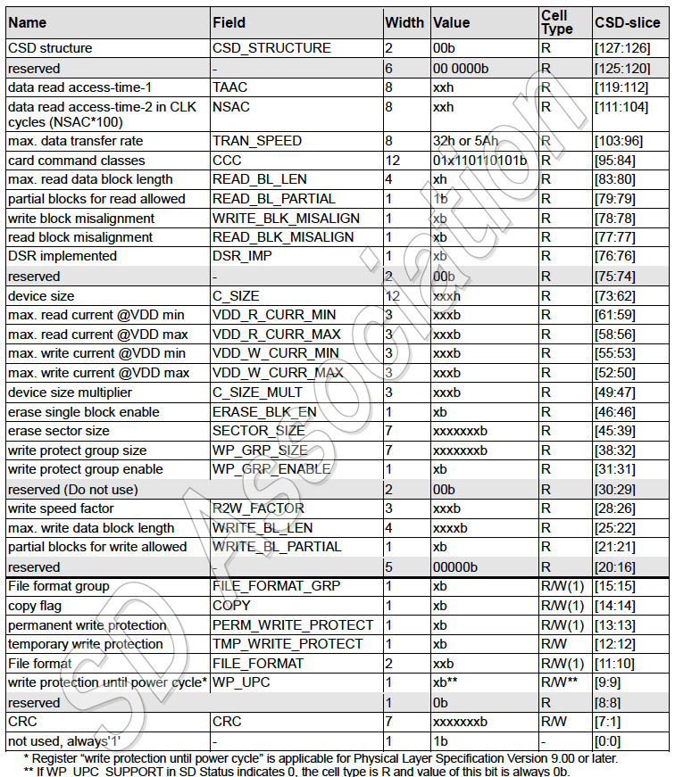

# 5. SDカードレジスタ

| 名前 | 幅 | 説明 |
|:-----|---:|:-----|
| [CID](#52-cid) | 128 | Card IDentification number: 識別用のカード個別番号, **必須** |
| [RCA](#54-rca) | 16 | Relative Card Address: カードのローカルシステムアドレス。初期化時に動的にカードにより提案され、ホストにより承認される, **必須** |
| DSR | 16 | Driver Stage Register: カードの出力ドライバを構成する, **任意** |
| [CSD](#53-csd) | 128 | Card Specific Data: カード動作条件に関する情報, **必須** |
| [SCR](#55-scr) | 64 | SD Configuratin Register: SDメモリカードの特殊機能のケーパビリティに関する情報, **必須** |
| [OCR](#51-ocr) | 32 | Operation Conditions Register, **必須** |
| [SSR](#4102-ssr) | 512 | SD Status: カード独自機能に関する情報, **必須** |
| [CSR](表4-42-カードステータス) | 32 | Card Status: カードステータスに関する情報, **必須** |

[SD仕様書: Part 1: Physical Layer Simplified Specifation Ver.8.00より]

## 5.1 OCR

Operation Conditionsレジスタ: 32ビット

| ビット位置 | フィールドの説明 |
|--------------:|:---------|
| [0:14] | 予約 |
| 15 | 2.7 - 2.8 |
| 16 | 2.8 - 2.9 |
| 17 | 2.9 - 3.0 |
| 18 | 3.0 - 3.1 |
| 19 | 3.1 - 3.2 |
| 20 | 3.2 - 3.3 |
| 21 | 3.3 - 3.4 |
| 22 | 3.4 - 3.5 |
| 23 | 3.5 - 3.6 |
| 24 | 1.8V受け入れに切り替える (S18A) |
| [25:26] | 予約 |
| 27 | 2TB以上サポートステータス (CO2T) |
| 28 | 予約 |
| 29 | UHS-IIカードステータス |
| 30 | カード容量ステータス (CCS) |
| 31 | パワーアップステータス (busy: 0) |

注: CCSはUHS-1カードのみサポート

## 5.2 CID

Card IDentificationレジスタ: 128ビット

| 名前 | フィールド | 幅 | CIDスライス |
|:-----|:-----------|---:|:------------|
| 製造者ID | MID | 8 | [127:120] |
| OEM/アプリケーションID | OID | 16 | [119:104] |
| 製品名 | PHM | 40 | [103:64] |
| 製品リビジョン | PRV | 8 | [63:56] |
| 製品シリアル番号 | PSN | 32 | [55:24] |
| 予約 | - | 4 | [23:20] |
| 製造日 | MDT | 12 | [19:8] |
| CRC7 | CRC | 7 | [7:1] |
| '1' | - | 1 | [0] |

## 5.3 CSD

Card Specific Dataレジスタ: 128ビット

### 5.3.1 CSD構造体

| CSD構造体 | CSD構造体バージョン | カード容量 |
|:---------:|:--------------------|:-----------|
| 0 | CSDバージョン1.0 | Standard Capacity |
| 1 | CSDバージョン2.0 | High and Extended Capacity |
| 2 | CSDバージョン3.0 | Ultra Capacity (SDUC) |
| 3 | 予約 | - |

### 5.3.2 CSDバージョン1.0

### 5.3.3 CSDバージョン2.0

| 名前 | フィールド | 幅 | 値 | タイプ | CSDスライス | レスポンスbit |
|:-----|:--------|------:|:-----|:----------|----------:|-----:|
| CSD structure | CSD STRUCTURE | 2 | 01b | R | [127:126] | r0[31:30] |
| reserved |  | 6 | 00 0000b | R | [125:120] | r0[29:24] |
| data read access-time | (TAAC) | 8 | 0Eh | R | [119:112] | r0[23:16] |
| data read access-time in CLK cycles (NSAC*100) | (NSAC) | 8 | 00h | R | [111:104] | r0[15:8] |
| max. data transfer rate | (TRAN_SPEED) | 8 | 32h, 5Ah, OBh or 2Bh R |  | [103:96] | r0[7:0] |
|  |  |  |  |  |  |  |
| card command classes | CCC | 12 | X1X1101101X1b | R | [95:84] | r1[31:20] |
| max. read data block length | (READ_BL_LEN) | 4 | 9 | R | [83:80] | r1[19:16]|
| partial blocks for read allowed | (READ_BL_PARTIAL) | 1 |  | R | [79:79] | r1[15] |
| write block misalignment | (WRITE_BLK_MISALIGN) | 1 | 0 | R | [78:78] | r1[14] |
| read block misalignment | (READ_BLK_MISALIGN) | 1 |  | R | [77:77] | r1[13] |
| DSR implemented | DSR_IMP | 1 | X | R | [76:76] | r1[12] |
| reserved |  | 6 | 00 0000b | R | [75:70] | r1[11:6] |
| device size | C SIZE | 22 | xxxxxxh | R | [69:48] | r1[5:0], r2[31:16] |
|  |  |  |  |  |  |  |
| reserved |  | 1 | 0 | R | [47:47] | r2[15] |
| erase single block enable | (ERASE_BLK_EN) | 1 | 1 | R | [46:46]  | r2[14] |
| erase sector size | (SECTOR_SIZE) | 7 | 7Fh | R | [45:39] | r2[13:7] |
| write protect group size | (WP_GRP_SIZE) | 7 | 0000000b | R | [38:32] | r2[6:0] |
|  |  |  |  |  |  |  |
| write protect group enable | (WP_GRP _ENABLE) | 1 | 0 | R | [31:31] | r3[31] |
| reserved |  | 2 | 00b | R | [30:29]  | r3[30:29] |
| write speed factor | (R2W_FACTOR) | 3 | 010b | R | [28:26] | R3[28:26] |
| max. write data block length | (WRITE_BL_LEN) | 4 | 9 | R | [25:22] | r3[25:22] |
| partial blocks for write allowed | (WRITE_BL_PARTIAL) | 1 |  | R | [21:21] | r3[21] |
| reserved |  | 5 | 00000b | R | [20:16] | r3[20:16] |
| File format group | (FILE FORMAT _GRP) | 1 | 0 | R | [15:15] | r3[15] |
| copy flag | COPY | 1 | X | R/W(1) | [14:14] | r3[14] |
| permanent write protection | PERM_WRITE_PROTECT | 1 | X | R/W(1) | [13:13] | r3[13] |
| temporary write protection | TMP WRITE PROTECT | 1 | X | R/W | [12:12] | r3[12] |
| File format | (FILE_FORMAT) | 2 | 00b | R | [11:10] | r3[11:10] |
| write protection until power cycle* | WP_UPC | 1 | Xb** | R/W** | [9:9] | r3[9] |
| reserved |  | 1 | Ob | R | [8:8] | r3[8] |
| CRC | CRC | 7 | xxxxxxxb | R/W | [7:1] | r3[7:1] |
| not used, always 1 |  | 1 | 1 | - | [0:0] | r3[0] |

**\*** "write protection until power cycle"レジスタは物理層仕様バージョン 9.00 以降で適用される。

**\*\*** SD StatusのWP_UPC_SUPPORTが0の場合、セルタイプは R であり、このビットの値は常に 0b である。

### 5.4 RCA (Relative Card Address)レジスタ: 16ビット

書き込み可能な16ビットレジスタで、カード識別処理でカードにより発行される
カードアドレスである。このアドレスはカード識別処理の後、アドレス指定による
ホスト-カード間通信に使用される。RCAレジスタのデフォルト値は0x0000である。
値`0x0000`はCMD7ですべてのカードをスタンバイ状態に設定するために予約されて
いる。

## 5.5 SCR

SC card Configurationレジスタ: 64ビット

| 記述 | フィールド | 幅 | セル種別 | SCRスライス |
|:-----|:-----------|---:|:--------:|:------------|
| SCR構造体 | SCR_STRUCTURE | 4 | R | [63:60] |
| SDメモリカード仕様バージョン | SD_SPEC | 4 | R | [59:56] |
| 消去後のデータステータス | DATA_STAT_AFTER_ERASE | 1 | R | [55] |
| CPRMセキュリティサポート | SD_SECURITY | 3 | R | [54:52] |
| データバス幅 | SD_BUSWIDTHS | 4 | R | [51:48] |
| バージョン3.0以降の仕様 | SD_SPEC3 | 1 | R | [47] |
| 拡張セキュリティサポート | EX_SECURITY | 4 | R | [46:43] |
| バージョン4.0以降の仕様 | SD_SPEC4 | 1 | R | [42] |
| バージョン5.0以降の仕様 | SD_SPEC5 | 4 | R | [41:38] |
| 予約 | - | 1 | R | [37] |
| コマンドサポート | CMD_SUPPORT | 5 | R | [36:32] |
| 製造者使用 | - | 32 | R | [31:0] |
