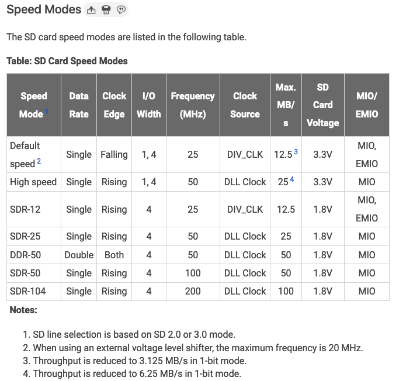
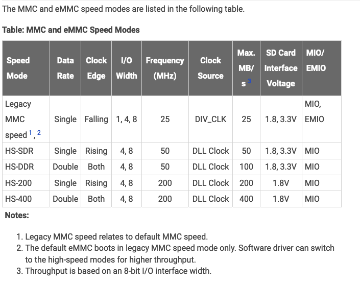

# SDカードに関するその他の情報

## Web記事

- [SDメモリカードのロゴと規格について](https://www.sdcard.org/ja/consumers-2/about-sd-memory-card-choices/)
- [UHS-I？スピードクラス？複雑怪奇なSDカードのロゴと規格をまとめてみる](https://pc.watch.impress.co.jp/docs/topic/feature/1459819.html)

## 容量によるSDカードの区分

- SDSC (Standard):      -   2GB
- SDHC (High):      2GB -  32GB
- SDXC (Extended): 32GB -   2TB
- SDUC (Ultra):     2TB - 128TB

[バスインターフェーススピード](https://www.sdcard.org/ja/developers-2/sd-standard-overview/bus-speed-default-speed-high-speed-uhs-sd-express/)

## スピードモード

### SDカードのスピードモード

### MMCとeMMCのスピードモード

**注**: [AMD Technical Information Portal](https://docs.amd.com/r/en-US/am011-versal-acap-trm/Speed-Modes)から引用
