# 第１章　SD標準ホストの概要

セキュアデジタル（SD）ホスト標準仕様はSDホストコントローラおよび関連ベンダー製品を設計する
ためのSDアソシエーション（SDA）のガイドラインです。SDのスコープにおいて、この仕様の遵守は
必須ではありません。SD仕様に準拠した製品の設計および可能であれば標準ホストドライバの使用は
ホストコントローラベンダの責任です。OSベンダとIHV、OEMは、独自のポリシーに従って
コンプライアンスを要求する可能性があるため、遵守は推奨です。

## 1.1 標準SDホストのスコープ

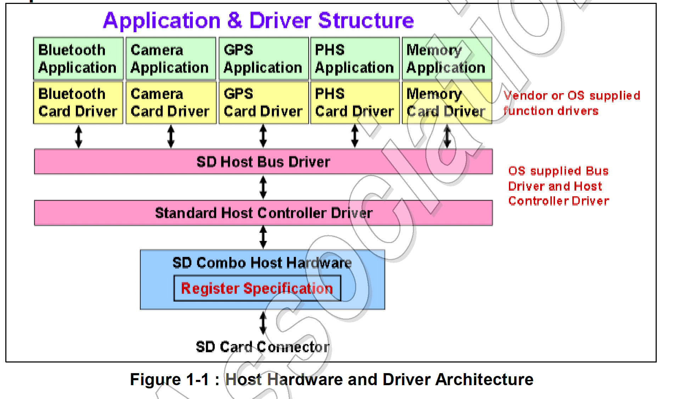

標準SDホストコントローラの定義はSDメモリカードとSDIOカードを使用できるSDホスト製品の増加を
促進することを目的としています。ホストコントローラの標準化によりオペレーティングシステム (OS)
ベンダはあらゆるベンダのホストコントローラと連携するホストドライバー (SDホストバスドライバ
および標準ホストコントローラドライバ) を開発できます。

アプリケーションはさらにカードベンダまたはOSベンダが提供するカードドライバを必要とするかも
しれません。カードドライバはOSで指定されたドライバインターフェイスを使用してSDホストバスドライバ
と通信します。

> **実装ノート**:
> この仕様は任意のシステムバスインタフェースに適用できます。ホストドライバとその親システムの
> ドライバ (ある場合) 間のインタフェースはこの仕様では定義されていません。

## 1.2 レジスタマップ

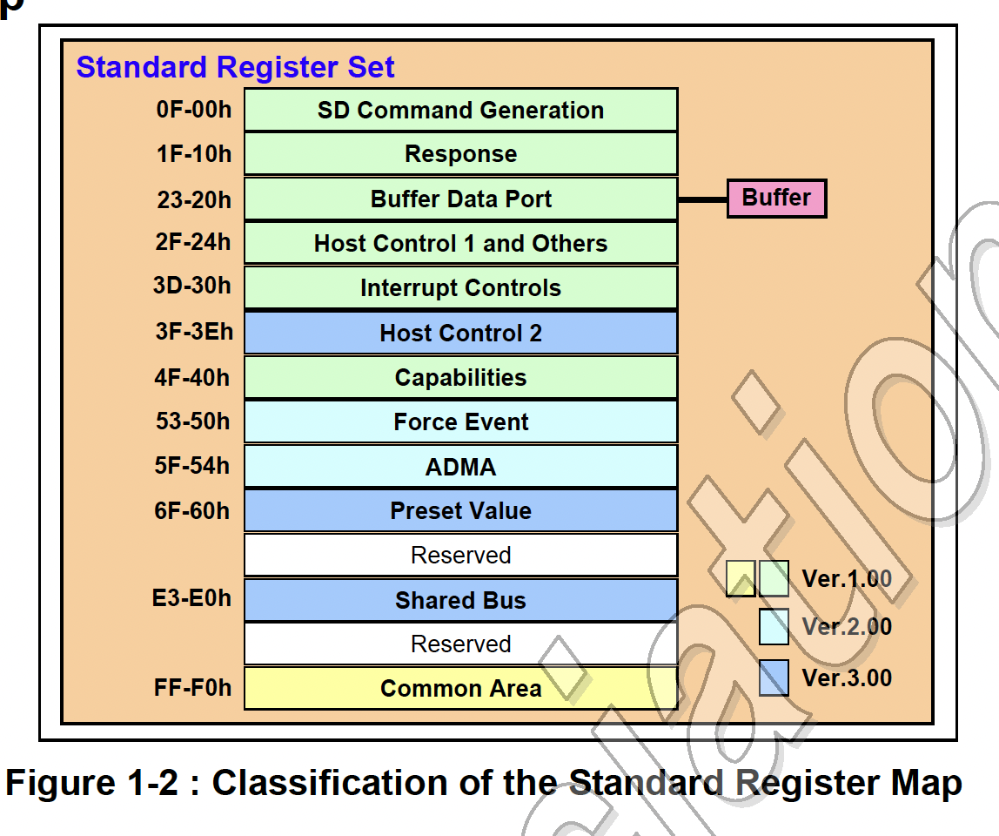

標準のレジスタマップは以下に示したように18に分類されます。ホストコントローラはこれらのレジスタに
バイト、ワード、ダブルワードでアクセスできる必要があります。すべてのレジスタの予約ビットはゼロに
固定する必要があります。ホストコントローラは予約ビットへの書き込みを無視する必要があります。
ただし、ホストドライバはこの仕様の将来の改訂との互換性を確保するためにそれらをゼロとして書き込む
必要があります。


## 1.3 複数スロットのサポート

[省略]

## 1.4 DMAのサポート

ホストコントローラはホストドライバーが _Buffer Data Port_ レジスタを使用してデータを
転送するための「プログラムされたI/O」メソッドを提供します。オプションで、ホストコントローラの
実装者はDMAを使用したデータ転送をサポートすることができます。SDホストコントローラ標準仕様
バージョン1.00で定義されたDMAアルゴリズムはSDMA (Single Operation DMA) と呼ばれます。
SDMA操作あたりに実行できるSDコマンドトランザクションは1つだけです。SDMAのサポートは
_Capabilities_ レジスタの **SDMA Support** ビットで確認できます。

この仕様ではADMA (Advanced DMA) と呼ばれるDMA転送アルゴリズムを定義します。ADMAは
CPUの実行を中断することのないシステムメモリとSDカード間のデータ転送を提供します。ADMAの
サポートは _Capabilities_ レジスタで確認できます。ADMAの詳細についてはセクション1.13を
参照してください。この文書で「DMA」という用語が使用される場合、SDMAとADMAの両方に適用されます。

ホストドライバはDMAを使用する前にホストコントローラとシステムバスの両方がDMAをサポートして
いることを確認する必要があります (PCIバスはDMAをサポートするとができます)。DMAはシングル
ブロック転送とマルチブロック転送の両者をサポートする必要があります。ホストコントローラレジスタは
DMA転送の実行中でも非DATラインコマンドを発行するために引き続きアクセス可能である必要があります。
DMA転送の結果はシステムバスデータ転送方式に関係なく同じでなければなりません。

ホストドライバは _Block Gap Control_ レジスタの制御ビットによりDMA操作を停止したり、
再開したりすることができます。**Stop At Block Gap Request** ビットを設定することにより、
DMA操作をブロックギャップで停止することができます。**Continue Request** ビットを設定する
ことにより、DMA操作を再開することができます。詳細については _Block Gap Control_ レジスタを
参照してください。エラーが発生した場合、DMA操作を停止する必要があります。DMA転送を中止する
には、ホストドライバは _Software Reset_ レジスタの **Software Reset For DAT Line**
ビットをリセットし、マルチブロックのRead/Writeコマンドを実行中の場合は、CMD12を発行
する必要があります。

## 1.5 SDコマンドの生成

### 1.5.1 SDモードのコマンド生成

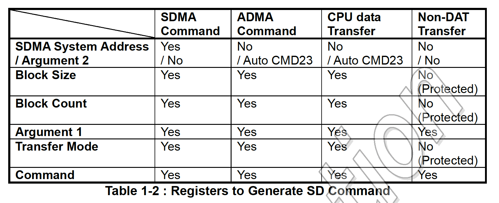

表1-2は3種類のトランザクション: SDMA生成転送、ADMA生成転送、CPUデータ転送（「プログラムI/O」を
使用）、および非データ転送に必要なレジスタ設定（レジスタセットの000hから00Fhまでのオフセット）を
示しています。トランザクションを開始する際、ホストドライバはこれらのレジスタを000hから00Fhまで
この順番にプログラムする必要があります。開始のレジスタオフセットはトランザクションの種類に基づいて
計算できます。最後の書き込みオフセットは常に00Fhにする必要があります。_Command_ レジスタの
上位バイトへの書き込みはSDコマンドの発行をトリガするためです。

ホストドライバは、転送が停止または一時停止されていない限り、データトランザクション中に
_SDMA System Address_、_Block Size_、_Block Count_ の各レジスタを読んではいけません。
値が変化して不安定だからです。コマンドを発行する際にデータ転送に使用しているレジスタの破壊を
防ぐために、_Present State_ レジスタの **Command Inhibit (DAT)** ビットに1がセット
されている間、ホストコントローラは _Block Size_、_Block Count_、_Transfer Mode_ の各
レジスタを書き込み保護をする必要があります（ _SDMA Syste Address_ レジスタはこの信号では保護
されません）。**Command Inhibit (CMD)** に1がセットされている間、ホストドライバは
_Argument 1_ レジスタと _Command_ レジスタに書き込んではいけません。

## 1.6 一時停止と再開のメカニズム

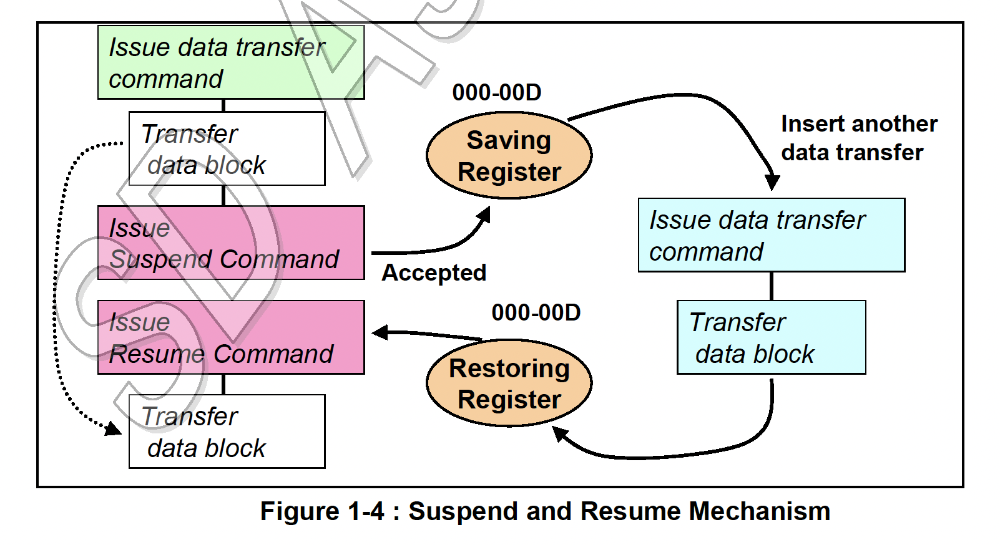

一時停止/再開のサポートは _Capabilities_ レジスタの **Suspend/ResumeSupport** ビットを
チェックすることで決定できます。SDカードが一時停止要求を受け入れると、ホストドライバは別の
SDコマンドを発行する前に、最初の14バイトのレジスタ（つまり、オフセット000h-00dh）に情報を
保存します。再開する際、ホストドライバはこれらのレジスタを復元し、Resumeコマンドを発行して
一時停止された操作を続行させます。

SDIOカードはResumeコマンドへのレスポンスで **DF** (Resume Data Flag) を設定します。
（SuspendコマンドとResumeコマンドはCMD52操作であるため、レスポンスデータは実際には
CCCRの _Function Select_ レジスタです）。**DF** に0が設定されている場合、SDIOカードは
一時停止中にデータ転送を継続できないことを意味します。このビットはデータ転送と割り込みの
サイクルを制御するために使用できます。**DF** が0に設定されている場合、再開される
トランザクションが4ビットモードの場合、データは転送されず、割り込みサイクルが開始されます。
**DF** が1に設定されている場合、データ転送は続行されます。一時停止/再開プロトコルは
SDIO仕様（SDカード仕様パートE1）に記載されています。

**注**: 一時停止/再開機能を使用するには、SDIOカードが一時停止/再開コマンドと
Read Wait制御機能をサポートしている必要があります。

## 1.7 バッファ制御

ホストコントローラはデータ転送用のデータバッファを持ちます。ホストドライバは32ビットの
_Buffer Data Port_ レジスタを介して内部バッファにアクセスします。以下はこのバッファに
アクセスする際の規則を示しています。

### 1.7.1 バッファポインタの制御

ホストコントローラは内部的にデータバッファを制御するためのポインタを維持します。
ホストドライバからポインタに直接アクセスすることはできません。_Buffer Data Port_ レジスタに
アクセスするたびに、バッファに書き込まれたデータの量に応じてポインタが増分されます。
さまざまなシステムバスに対応するために、このポインタはシステムバス幅に関係なく実装する必要が
あります（8ビット、16ビット、32ビット、64ビットのシステムバス幅をサポートできます）。
ポインタの制御を指定するにホストコントローラのデータバッファインタフェースは次の特性を持つ
必要があります。

1. システムバス幅とバイトイネーブルアドレス
   8ビット、16ビット、32ビット、64ビットのシステムバスがサポートされています。
   _Buffer Data Port_ レジスタ（4バイト）のバイト位置を指定するには **Byte Enable (BE[])**、
   または、**Lower Address (A[])** が使用されます。表1-3はシステムバス幅に応じた
   Lower AddressビットとByte Enableビットの関係を示しています。_Buffer Data Port_
   レジスタは、**BE**[7:0]を持つ64ビットシステムバスでは**BE**[3:0]でアクセスできます。

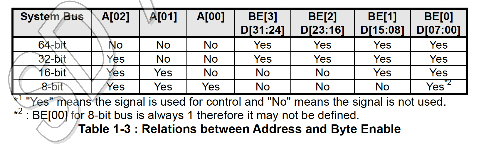

2. シーケンシャルおよび連続アクセス
   _Buffer Data Port_ レジスタはシーケンシャルかつ連続的な方法でアクセスされる必要があります。
   Buffer Data Portレジスタにアクセスする際、バッファポインタはByte Enableビットの
   パターンにより制御されます。したがって、Byte Enableパターンもシーケンシャルかつ連続的で
   なければなりません。Byte Enableの順序はリトルエンディアン方式に従います。たとえば、
   **BE[1]** がアクセスされたら、次のアクセスは**BE[2]**から開始されなければなりません。
   ランダムまたはスキップされたアクセスは許されません。

   表1-4はホストコントローラがサポートするべきByte Enableパターンを示しています。
   ただし、システムコントローラが書き込みマージをサポートしている場合、他のByte Enable
   パターンが生成される場合があります。32ビットまたは64ビットバスシステムでサポートされて
   いないByte Enableパターンの生成を避けるために、ホストドライバはすべてのブロックデータ
   への最後のアクセスを除いて、_Buffer Data Port_ レジスタへのワードまたはダブルワード
   アクセスを使用することが許されています。

```
    OK      BE[3:0]=0011b (2-byte) => BE[3:0]=1100b (2-byte) => BE[3:0]=0011b (2-byte)
    OK      BE[3:0]=1100b (2-byte) => BE[3:0]=1111b (4-byte) => BE[3:0]=0011b (2-byte)
    OK      BE[3:0]=1111b (4-byte) => BE[3:0]=1111b (4-byte) => BE[3:0]=1111b (4-byte)
    Not OK  BE[3:0]=0011b (2-byte) => BE[3:0]=0011b (2-byte) (BE[2]、BE[3]のスキップは不可)
    Not OK  BE[3:0]=0011b (2-byte) => BE[3:0]=1111b (4-byte) (BE[2]、BE[3]のスキップは不可)
```


3. ブロックサイズによるバッファ制御
   バッファは _Block Size_ レジスタで指定されたブロックサイズまでデータを保持します。
   バッファを制御する次の定義により、ホストドライバはブロックサイズに関係なく、32ビット幅で
   _Buffer Data Port_ レジスタに繰り返しアクセスすることができます。

   書き込み操作の場合、バッファは _Buffer Data Port_ レジスタを介して書き込まれたデータを
   蓄積します。バッファポインタがブロックサイズに達すると _Present State_ レジスタの
   **Buffer Write Enable** ビットが1から0に変更されます。これはこれ以上データをバッファに
   書き込めないことを意味します。最後に書き込まれた超過分のデータは無視されます。たとえば、
   下位2バイトのデータだけが書き込み可能なバッファに32ビット (4 バイト) のデータブロックを
   _Buffer Data Port_ レジスタに書き込むと、下位2バイトのデータはバッファに書き込まれるが、
   上位2バイトは無視されます。**Buffer Write Enable** ビットが0から1に変わるたびに、次の
   データブロックがバッファに書き込み可能であることを意味します。新しいブロックの書き込みは常に
   BE[00]位置から開始する必要があります。その後は**Buffer Write Enable** ビットを
   チェックをせずにデータブロックをバッファに書き込むことができます。

   読み取り操作の場合、_Present State_ レジスタの**Buffer Read Enable** ビットが0から1に
   変更になるたびに _Buffer Data Port_ レジスタからデータブロックを読み取ることができます。
   新しいブロック読み取りは常にBE[00]位置から開始する必要があります。その後は、**Buffer Read Enable** ビットを
   チェックすることなくバッファからデータブロックを読み取ることができます。最後に読み取りで余った
   データは無視されます。たとえば、バッファに下位2バイトのデータだけが残っている場合に、32ビット
   (4 バイト) の読み取りを行うと下位2バイトは有効ですが、上位2バイトは未定義です。バッファ
   ポインタがブロックサイズに達すると、**Buffer Read Enable** ビットは1から0に変更されます。
   これはこれ以上バッファからデータを読み取ることができないことを意味します。

> **実装ノート**: 表1-4はホストドライバはアクセスするバイト数に一致するアドレス境界にレジスタ
> アクセスをアラインする必要があることを暗示しています。つまり、シングルバイトアクセスはレジスタ
> セット内の任意のオフセットにアラインすることができ、ワード（ダブルバイト）アクセスは2バイト
> オフセットにアラインする必要があり、ダブルワード（クワッドバイト）アクセスは4バイトオフセットに
> アラインする必要があります。機能（3）によると、ホストドライバは常に _Buffer Data Port_
> レジスタにダブルワードアクセスでアクセスできます。

## 1.8 割り込み制御レジスタ間の関係

ホストコントローラは多くの割り込みソースを実装します。割り込みソースは、図1-6に示すように、
割り込みまたはシステムウェイクアップ信号として有効にすることができます。
_Normal Interrupt Enable_ レジスタ、または、 _Error Interrupt Status Enable_ レジスタの
割り込みソースに対応するビットが1で割り込みがアクティブになった場合、そのアクティブ状態はラッチされ、
ホストドライバが _Normal Interrupt Enable_ レジスタまたは _Error Interrupt Status Enable_
レジスタを利用できるようになります。_Interrupt Status Enable_ がクリアされたら
割り込みステータスがクリアされます（これは図1-6には表されていません）。

割り込みステータスレジスタでビットが設定された割り込みソースは、対応するビットが
_Normal Interupt Enable_ レジスタまたは _Error Interrupt Status Enable_ レジスタで
設定されている場合、システム割り込み信号をアサートします。信号が送信されると、ほとんどの割り込みは
割り込みステータスレジスタの関連するビットに1を書き込むことでクリアされます。ただし、カード
割り込みはカードドライバによってクリアされます。カード割り込みが生成された場合、ホストドライバは
カード割り込みステータスビットをクリアして、カードドライバが処理している間のカード割り込みを無効にする
ことができます。すべての割り込みソースがクリアされた後、他のカード割り込みが有効になるように
ホストドライバはカード割り込みステータスビットを再設定します。カード割り込みステータスイネーブルを
無効にすると割り込みサービスの処理中に複数の割り込みが生成されるのを回避できます。

_Wakeup Control_ レジスタでは**Card Interrupt**, **Card Inertion**, **Card Removal**の
ステータス変更を有効にしてシステムウェイクアップ信号を生成するように構成できます。これらの割り込みは
_Normal Interrupt Signal Enable_ レジスタとは独立に有効またはマスクされます。ウェイクアップ
イベントの種類は _Normal Interrupt Status_ レジスタから読み取ることができます。

割り込み信号とウェイクアップ信号は論理ORされ _Slot Interrupt Status_ スレジスタから読み
取られるものとします。

> **実装ノート**: ホストドライバはホストシステムがスリープモードになった際にはウェイクアップ信号を
> 有効に、割り込み信号を無効にする、ホストシステムが実行モードになった際にはウェイクアップ信号を
> 無効に、割り込み信号を有効にする責任があります。ホストドライバは両者を同時に有効にしては
> なりません。

> **実装ノート**: ホストシステムはさまざまな方法で割り込み信号とウェイクアップ信号を実装できます。
> たとえば、PCIバスはPCIクロックなしでアサートできる**PME#**をサポートして、割り込みは
> **INTx#**を使用し、ウェイクアップは**PME#**を使用します。あるいは、システムバスがホスト
> コントローラへの割り込みラインが1本しかサポートしていない場合、システムは割り込みと
> ウェイクアップのOR信号を使用することができます。

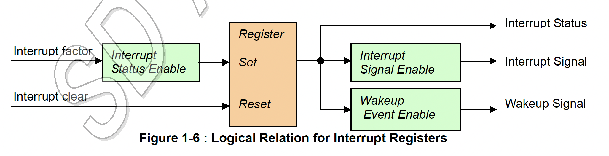

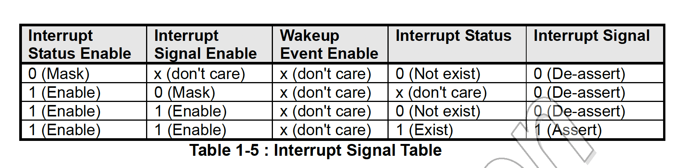

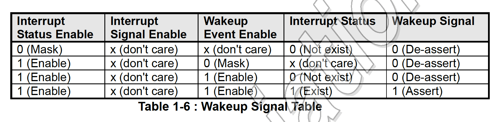

> **実装ノート**: ホストコントローラはウェイクアップまたは割り込みのアサート信号をアクティブハイ、
> またはアクティブローとして実装することができます。

## 1.9 ハードウェアブロックダイアグラムとタイミング

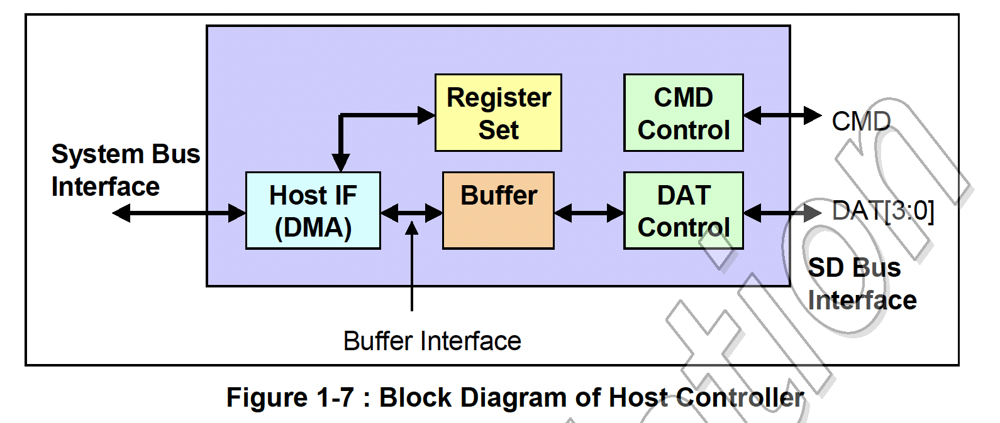

ホストコントローラにはシステムバスインタフェースとSDバスインタフェースの2つのバスインタフェースが
あります。ホストコントローラはこれらのインターフェースが非同期である（すなわち、異なるクロック
周波数で動作する）と仮定します。ホストドライバはシステムバスタイムで動作します (ホストコントローラ
CPUによってシステムクロックで実行されるソフトウェアだからです)。SDカードはSDバスタイムで操作します
（すなわち、その動作は**SDCLK**により同期されます）。ホストコントローラはこれらのインタフェース
間で通信するために信号を同期させる必要があります。データブロックはバッファモジュールで同期する
必要があります。すべてのステータスレジスタはシステムクロックにより同期され、システムインタフェースへの
出力中は同期を維持する必要があります。SDバストランザクションをトリガーする制御レジスタは**SCLK**に
より同期されます。したがって、2つのインタフェース間で信号を伝播する際にタイミングの遅延があります。
これは、ホストドライバはSDバスをリアルタイムで制御できず、レジスタ設定に従ってSDバスを制御する
ためにホストコントローラに依存する必要があることを意味します。

バッファインタフェースは内部のRead/Writeバッファを有効にします（セクション1.7「バッファ制御」で
説明されている _Present State_ レジスタの**Buffer Read Enable**ビットと**BUffer write Enable**
ビットの使用を参照してください）。**Tranfer Complete**割り込みステータスはDMA転送と非DMA転送の
両者のRead/Write転送の完了を示します。しかし、ReadとWriteのタイミングは異なります。Read転送は
すべての有効なデータがホストシステムに転送され、ホストドライバがアクセスする準備ができたら完了します。
Write転送はすべての有効なデータがSDカードとの間で転送され、ビジー状態が終了した後に完了する必要が
あります。

表1-7はデータ転送のステータスと割り込みの関係を示しています。

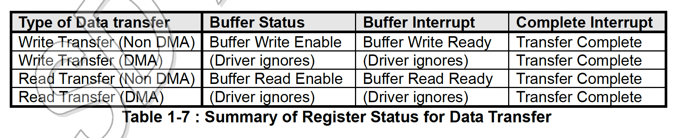

## 1.10 SDホストコントローラの電力状態定義

> **実装ノート**: 表1-8はコントローラの電力状態の定義を消費電力の昇順にリストしています。
> ホストコントローラはこれらの条件を使用することで消費電力を削減するべきです。

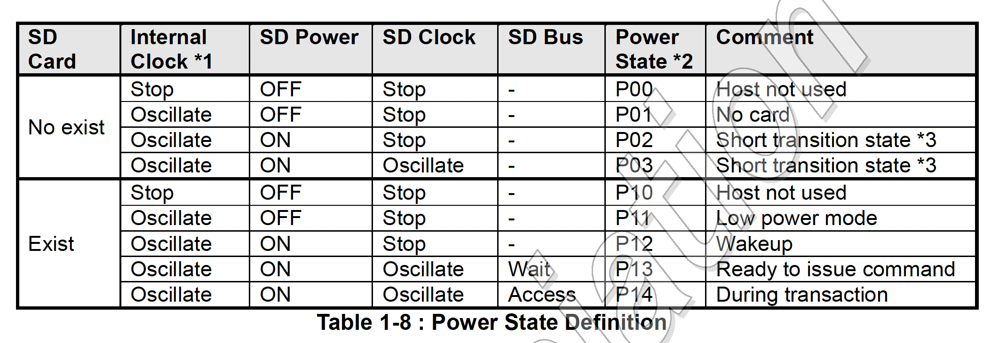

```
実装ノート:
*1：ホストシステムがホストコントローラを使用しない場合は内部クロックは停止するべきです。
*2: 電源状態は実際にはホストコントローラに実装されません。このラベルは参考用です。
*3: 短い移行状態: 一時的な電力状態。ホストコントローラはカードなしを検出すると自動的にP01に以降します。
```

カードの電源がオフの場合、SDクロックを供給してはいけません。

表1-8に記載されている状態は対応するレジスタビットを読み取ることで決定できます。

- 内部クロック振動/停止: _Clock Control_ レジスタの **Internal CLock Enable** ビット
- SDカードの存在/非存在: _Present State_ レジスタの **Card Inserted** ビット
- SDクロックのオン/オフ: _Power Control_ レジスタの **SD Bus Power** ビット
- SDバスのアクセス/待機 (idle): _Present State_ レジスタの **Command Inhibit (CMD)** ビットと **Data Inhibit (DAT)** ビット

## 1.11 Auto CMD12

SDメモリのマルチブロック転送にはトランザクションを停止するためにCMD12が必要です。
最後のブロック転送が完了するとホストコントローラは自動的にCMD12を発行します。ホスト
コントローラのこの機能はAuto CMD12と呼ばれています。ホストドライバはマルチブロック
転送コマンドを発行する際に _Transfer Mode_ レジスタの**Auto CMD12 Enable**ビットを
設定するべきです。最後のデータブロックとAuto CMD12のタイミング同期はホストコントローラの
ハードウェアが実行する必要があります。DATラインを使用しないコマンドはマルチブロック転送中に
発行できます。以後、これらのコマンドはCMD_WO_DATという記法を使用して言及します。

DATラインコマンドとCMD_wo_DATコマンドの競合を防ぐために、ホストコントローラはSDバスで
各コマンドが発行されるタイミングを仲裁する必要があります。したがって、ホストドライバが
_Command_ レジスタに書き込んでもコマンドがすぐに発行されない場合があります。コマンドは
タイミングに応じてAuto CMD12の前後に発行される場合があります。DAT行とCMD_wo_DATコマンドの
レスポンスを区別できるようにAuto CMD12レスポンスはレスポンスレジスタの上部4バイト
（標準レジスタセットのオフセット01Ch）から決定できます。

Auto CMD12に関連するエラーが検出された場合、ホストコントローラは**Auto CMD Error**割り込みを
発行する必要があります。ホストドライバは _Auto CMD Error Status_ レジスタを読み取ることで
Auto CMD12のエラーステータス (Command Index/End bit/CRC/Timeout Error) を確認できます。

表 1-9はAuto CMD 12エラーとホストドライバによって発行されたCMD_wo_DATコマンドとの関係を
示しています。

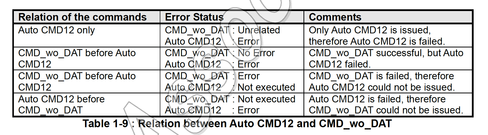

ホストドライバはAuto CMD Error割り込みが発生した際、_Auto CMD Error Status_ レジスタを
チェックすることで、これらのエラーケースのどれが発生したかを判断することができます。Auto CMD12が
実行されなかった場合、ホストドライバはCMD_wo_DATエラーから回復し、マルチブロック転送を停止する
ために CMD12 を発行する必要があります。CMD_ wo_DATが実行されなかった場合、ホストドライバは
Auto CMD12エラーから回復した後、そのコマンドを再度発行することができます。エラー割り込みと
Auto CMD12エラーから回復する手順はセクション3.10.1と3.10.2で説明されています。

UHSモードのSDR104（セクション2.2.24の _Host Control 2_ レジスタを参照）では、ホストドライバは
マルチブロックの読み取り/書き込み操作を停止するためにAuto CMD12ではなくAuto CMD23を使用する
必要があります。その他のバス速度モードでは、カードがCMD23をサポートしている場合、ホストドライバは
CMD12の代わりにAuto CMD23を使用するべきです。。

## 1.12 SDCLK制御

表1-10は、SDCLKが_Power Control_ レジスタの**SD Bus Poer**ビットと _Clock Control_
レジスタの**SD Clock Enable**ビットによりどのように制御されるかを示しています。

**SDCLK**のクロック周期は _Clock Control_ レジスタの**SDCLK Frequency select**ビットと
_ Capabilities_ レジスタの**base Clock Frequency For SD Clock**ビットにより指定されます。
SDカードはクロックの両端を使用することができるのでSDクロックのデューティは平均50%（45-55%以内で
分散）であり、High期間はクロック期間の半分である必要があります。**SDCLK**の振動は指定された
High期間の駆動から始まります。**SDCLK**が**SD Clock Enable**ビットにより停止された場合、
ホストコントローラはクロックデューティを維持するためにHigh期間を駆動した後、**SDCLK**を停止する
必要があります。**SDCLK**が**SD Bus Power**ビットにより停止された場合、ホストコントローラは
直ちに**SDCLK**を停止し（Lowに駆動）、**SD Clock Enable**ビットをクリアする必要があります。

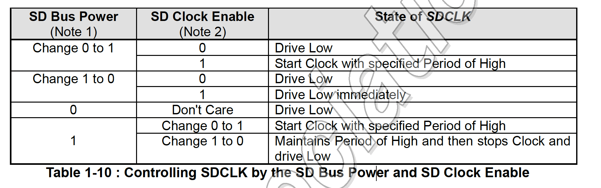

> 注1: カードの状態がデバウンシングからカードなしに変更された場合、ホストコントローラは
> **SD Bus Power**ビットをクリアする必要があります。
>
> 注2: カードの状態がカード挿入からデバウンシングに変更された場合、ホストコントローラは
>  **SD Clock Enable**ビットを直ちにクリアする必要があります。

ホストコントローラが共有バスをサポートしている場合、各デバイスはクロック出力ピンによって
選択され、特定のクロック制御が必要になります。詳細については _Shared Bus Control_ レジスタを
参照してください。

## 1.13 ADMA: Advanced DMA

[省略]

## テストレジスタ

テストレジスタはテスト目的で定義されています。何らかの割り込みを意図的に生成することが難しい場合、
この機能を使用してドライバのデバッグ用にこれらの割り込みを手動で生成することができます。
_Error Interrupt Status_ と _Auto CMd Error Status_ を制御するための _Force Even_
レジスタはこの目的のために定義されています。_Host Control 1_ レジスタの**Card Detect Signal Seleciton**
ビットと**Card Detect Test Level**ビットは _Present State_ レジスタの **Card Inserted**
の手動制御を可能とし、_Normal Interrupt state_ レジスタの**Card Insertion**割り込みと
**Card Removal**割り込みを生成します。テストレジスタのサポートは必須です。

## ブロックカウント

ブロックカウント設定コマンド（CMD23）は物理層仕様バージョン3.00によって定義されています。これは
マルチブロック操作を停止するためのタイミングフリーな方法を提供します。ブロックカウントはCMD23の
引数に設定され、次に実行されるCMD18またはCMD25の転送長を指定します。

Auto CMD23はCMD18またはCMD25が送信される前にCMD23を自動的に発行する機能です。この機能の目的は
CMD23の割り込みサービスを削除することでメモリアクセス中のパフォーマンスの低下を回避することです。
オフセット008hの _Argument 1_ レジスタがCMD18またはCMD25に使用されます。そして、オフセット
000hがCMD23の _Argument 2_ レジスタに割り当てられます。ホストコントローラはデータ転送長を
カウントする際に _Argument 2_ レジスタは使用しません。SDMAはAuto CMD23を使用することを意図
していません。ADMAと非ADMA転送はAuto CMD23を使用することができます。

ホスト側のデータ転送操作のデータ長は表1-14に記載されているように決定されます。非ADMAとADMAの
2つのケースがあります。AMDA記述子の全長は、ADMA記述子の各ライン用の16ビットデータ長の合計を
意味します。ADMAでは**Block Count Enable**ビットを無効にする必要があります。ホスト
コントローラの総データ転送長はカードのそれと同等でなければならないことに注意してください。

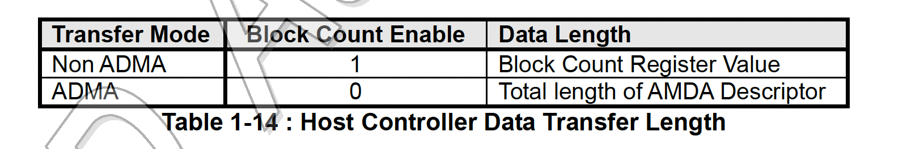

## 1.16　サンプリングクロックチューニング

UHS-IモードではSDバスは高クロック周波数モードで動作することができ、その場合、CMDラインと
DAT[3:0]ライン上のカードからのデータウィンドウが小さくなります。データウィンドウの位置は
カードとホストシステムの実装によって異なります。したがって、ホストコントローラはSDR104または
SDR50（_Capabilities_ レジスタの**Use Tuning for SDR50**ビットが1に設定されている場合）が
図2-29で定義されているチューニング手順を実行し、サンプリングクロックを調整することによって
サポートされている場合、チューニング回路をサポートする必要があります。_Host Control 2_
レジスタの**Execute Tunig**ビットと**Sampling clock Select**ビットがチューニング回路の
制御に使用されます。
