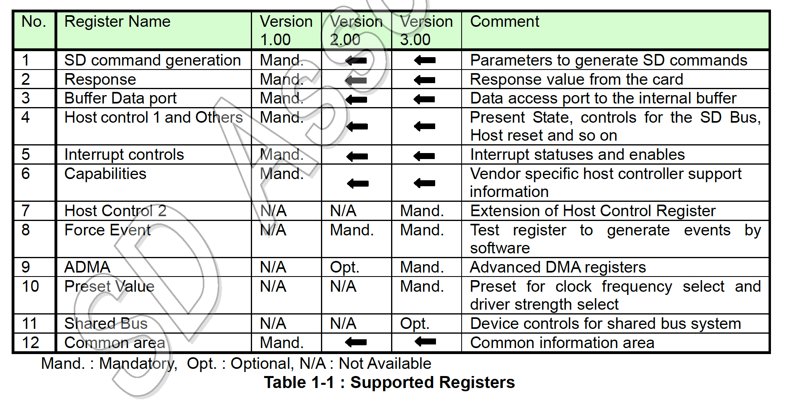
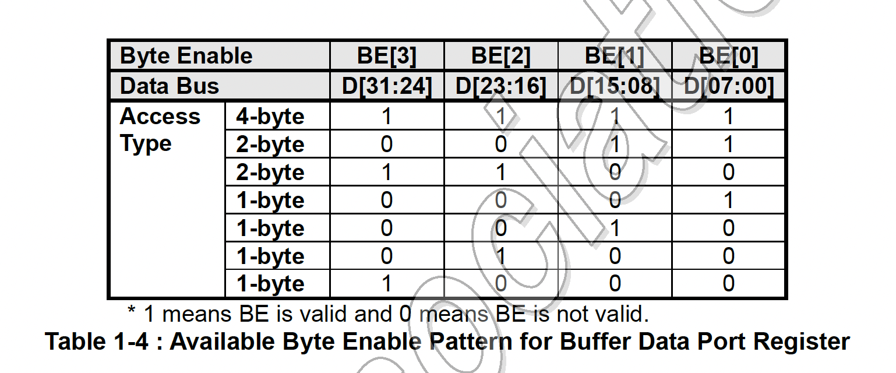

# 第１章　SD標準ホストの概要

セキュアデジタル（SD）ホスト標準仕様はSDホストコントローラおよび関連ベンダー製品を設計する
ためのSDアソシエーション（SDA）のガイドラインです。SDのスコープにおいて、この仕様の遵守は
必須ではありません。SD仕様に準拠した製品の設計および可能であれば標準ホストドライバの使用は
ホストコントローラベンダの責任です。OSベンダとIHV、OEMは、独自のポリシーに従って
コンプライアンスを要求する可能性があるため、遵守は推奨です。

## 1.1 標準SDホストのスコープ


標準SDホストコントローラの定義はSDメモリカードとSDIOカードを使用できるSDホスト製品の増加を
促進することを目的としています。ホストコントローラの標準化によりオペレーティングシステム (OS)
ベンダはあらゆるベンダのホストコントローラと連携するホストドライバー (SDホストバスドライバ
および標準ホストコントローラドライバ) を開発できます。

アプリケーションはさらにカードベンダまたはOSベンダが提供するカードドライバを必要とするかも
しれません。カードドライバはOSで指定されたドライバインターフェイスを使用してSDホストバスドライバ
と通信します。

> 実装注記:
> この仕様は任意のシステムバスインタフェースに適用できます。ホストドライバとその親システムの
> ドライバ (ある場合) 間のインタフェースはこの仕様では定義されていません。

## 1.2 レジスタマップ


標準のレジスタマップは以下に示したように18に分類されます。ホストコントローラはこれらのレジスタに
バイト、ワード、ダブルワードでアクセスできる必要があります。すべてのレジスタの予約ビットはゼロに
固定する必要があります。ホストコントローラは予約ビットへの書き込みを無視する必要があります。
ただし、ホストドライバはこの仕様の将来の改訂との互換性を確保するためにそれらをゼロとして書き込む
必要があります。



## 1.3 複数スロットのサポート

[省略]

## 1.4 DMAのサポート

ホストコントローラはホストドライバーが _Buffer Data Port_ レジスタを使用してデータを
転送するための「プログラムされたI/O」メソッドを提供します。オプションで、ホストコントローラの
実装者はDMAを使用したデータ転送をサポートすることができます。SDホストコントローラ標準仕様
バージョン1.00で定義されたDMAアルゴリズムはSDMA (Single Operation DMA) と呼ばれます。
SDMA操作あたりに実行できるSDコマンドトランザクションは1つだけです。SDMAのサポートは
_Capabilities_ レジスタの **SDMA Support** ビットで確認できます。

この仕様ではADMA (Advanced DMA) と呼ばれるDMA転送アルゴリズムを定義します。ADMAは
CPUの実行を中断することのないシステムメモリとSDカード間のデータ転送を提供します。ADMAの
サポートは _Capabilities_ レジスタで確認できます。ADMAの詳細についてはセクション1.13を
参照してください。この文書で「DMA」という用語が使用される場合、SDMAとADMAの両方に適用されます。

ホストドライバはDMAを使用する前にホストコントローラとシステムバスの両方がDMAをサポートして
いることを確認する必要があります (PCIバスはDMAをサポートするとができます)。DMAはシングル
ブロック転送とマルチブロック転送の両者をサポートする必要があります。ホストコントローラレジスタは
DMA転送の実行中でも非DATラインコマンドを発行するために引き続きアクセス可能である必要があります。
DMA転送の結果はシステムバスデータ転送方式に関係なく同じでなければなりません。

ホストドライバは _Block Gap Control_ レジスタの制御ビットによりDMA操作を停止したり、
再開したりすることができます。**Stop At Block Gap Request** ビットを設定することにより、
DMA操作をブロックギャップで停止することができます。**Continue Request** ビットを設定する
ことにより、DMA操作を再開することができます。詳細については _Block Gap Control_ レジスタを
参照してください。エラーが発生した場合、DMA操作を停止する必要があります。DMA転送を中止する
には、ホストドライバは _Software Reset_ レジスタの **Software Reset For DAT Line**
ビットをリセットし、マルチブロックのRead/Writeコマンドを実行中の場合は、CMD12を発行
する必要があります。

## 1.5 SDコマンドの生成

### 1.5.1 SDモードのコマンド生成


表1-2は3種類のトランザクション: SDMA生成転送、ADMA生成転送、CPUデータ転送（「プログラムI/O」を
使用）、および非データ転送に必要なレジスタ設定（レジスタセットの000hから00Fhまでのオフセット）を
示しています。トランザクションを開始する際、ホストドライバはこれらのレジスタを000hから00Fhまで
この順番にプログラムする必要があります。開始のレジスタオフセットはトランザクションの種類に基づいて
計算できます。最後の書き込みオフセットは常に00Fhにする必要があります。_Command_ レジスタの
上位バイトへの書き込みはSDコマンドの発行をトリガするためです。

ホストドライバは、転送が停止または一時停止されていない限り、データトランザクション中に
_SDMA System Address_、_Block Size_、_Block Count_ の各レジスタを読んではいけません。
値が変化して不安定だからです。コマンドを発行する際にデータ転送に使用しているレジスタの破壊を
防ぐために、_Present State_ レジスタの **Command Inhibit (DAT)** ビットに1がセット
されている間、ホストコントローラは _Block Size_、_Block Count_、_Transfer Mode_ の各
レジスタを書き込み保護をする必要があります（ _SDMA Syste Address_ レジスタはこの信号では保護
されません）。**Command Inhibit (CMD)** に1がセットされている間、ホストドライバは
_Argument 1_ レジスタと _Command_ レジスタに書き込んではいけません。

## 1.6 一時停止と再開のメカニズム


一時停止/再開のサポートは _Capabilities_ レジスタの **Suspend/ResumeSupport** ビットを
チェックすることで決定できます。SDカードが一時停止要求を受け入れると、ホストドライバは別の
SDコマンドを発行する前に、最初の14バイトのレジスタ（つまり、オフセット000h-00dh）に情報を
保存します。再開する際、ホストドライバはこれらのレジスタを復元し、Resumeコマンドを発行して
一時停止された操作を続行させます。

SDIOカードはResumeコマンドへのレスポンスで **DF** (Resume Data Flag) を設定します。
（SuspendコマンドとResumeコマンドはCMD52操作であるため、レスポンスデータは実際には
CCCRの _Function Select_ レジスタです）。**DF** に0が設定されている場合、SDIOカードは
一時停止中にデータ転送を継続できないことを意味します。このビットはデータ転送と割り込みの
サイクルを制御するために使用できます。**DF** が0に設定されている場合、再開される
トランザクションが4ビットモードの場合、データは転送されず、割り込みサイクルが開始されます。
**DF** が1に設定されている場合、データ転送は続行されます。一時停止/再開プロトコルは
SDIO仕様（SDカード仕様パートE1）に記載されています。

**注**: 一時停止/再開機能を使用するには、SDIOカードが一時停止/再開コマンドと
Read Wait制御機能をサポートしている必要があります。

## 1.7 バッファ制御

ホストコントローラはデータ転送用のデータバッファを持ちます。ホストドライバは32ビットの
_Buffer Data Port_ レジスタを介して内部バッファにアクセスします。以下はこのバッファに
アクセスする際の規則を示しています。

### 1.7.1 バッファポインタの制御

ホストコントローラは内部的にデータバッファを制御するためのポインタを維持します。
ホストドライバからポインタに直接アクセスすることはできません。_Buffer Data Port_ レジスタに
アクセスするたびに、バッファに書き込まれたデータの量に応じてポインタが増分されます。
さまざまなシステムバスに対応するために、このポインタはシステムバス幅に関係なく実装する必要が
あります（8ビット、16ビット、32ビット、64ビットのシステムバス幅をサポートできます）。
ポインタの制御を指定するにホストコントローラのデータバッファインタフェースは次の特性を持つ
必要があります。

1. システムバス幅とバイトイネーブルアドレス
   8ビット、16ビット、32ビット、64ビットのシステムバスがサポートされています。
   _Buffer Data Port_ レジスタ（4バイト）のバイト位置を指定するには **Byte Enable (BE[])**、
   または、**Lower Address (A[])** が使用されます。表1-3はシステムバス幅に応じた
   Lower AddressビットとByte Enableビットの関係を示しています。_Buffer Data Port_
   レジスタは、**BE**[7:0]を持つ64ビットシステムバスでは**BE**[3:0]でアクセスできます。


2. シーケンシャルおよび連続アクセス
   _Buffer Data Port_ レジスタはシーケンシャルかつ連続的な方法でアクセスされる必要があります。
   Buffer Data Portレジスタにアクセスする際、バッファポインタはByte Enableビットの
   パターンにより制御されます。したがって、Byte Enableパターンもシーケンシャルかつ連続的で
   なければなりません。Byte Enableの順序はリトルエンディアン方式に従います。たとえば、
   **BE[1]** がアクセスされたら、次のアクセスは**BE[2]**から開始されなければなりません。
   ランダムまたはスキップされたアクセスは許されません。

   表1-4はホストコントローラがサポートするべきByte Enableパターンを示しています。
   ただし、システムコントローラが書き込みマージをサポートしている場合、他のByte Enable
   パターンが生成される場合があります。32ビットまたは64ビットバスシステムでサポートされて
   いないByte Enableパターンの生成を避けるために、ホストドライバはすべてのブロックデータ
   への最後のアクセスを除いて、_Buffer Data Port_ レジスタへのワードまたはダブルワード
   アクセスを使用することが許されています。

```
    OK      BE[3:0]=0011b (2-byte) => BE[3:0]=1100b (2-byte) => BE[3:0]=0011b (2-byte)
    OK      BE[3:0]=1100b (2-byte) => BE[3:0]=1111b (4-byte) => BE[3:0]=0011b (2-byte)
    OK      BE[3:0]=1111b (4-byte) => BE[3:0]=1111b (4-byte) => BE[3:0]=1111b (4-byte)
    Not OK  BE[3:0]=0011b (2-byte) => BE[3:0]=0011b (2-byte) (BE[2]、BE[3]のスキップは不可)
    Not OK  BE[3:0]=0011b (2-byte) => BE[3:0]=1111b (4-byte) (BE[2]、BE[3]のスキップは不可)
```



3. ブロックサイズによるバッファ制御
   バッファは _Block Size_ レジスタで指定されたブロックサイズまでデータを保持します。
   バッファを制御する次の定義により、ホストドライバはブロックサイズに関係なく、32ビット幅で
   _Buffer Data Port_ レジスタに繰り返しアクセスすることができます。

   書き込み操作の場合、バッファは _Buffer Data Port_ レジスタを介して書き込まれたデータを
   蓄積します。バッファポインタがブロックサイズに達すると _Present State_ レジスタの
   **Buffer Write Enable** ビットが1から0に変更されます。これはこれ以上データをバッファに
   書き込めないことを意味します。最後に書き込まれた超過分のデータは無視されます。たとえば、
   下位2バイトのデータだけが書き込み可能なバッファに32ビット (4 バイト) のデータブロックを
   _Buffer Data Port_ レジスタに書き込むと、下位2バイトのデータはバッファに書き込まれるが、
   上位2バイトは無視されます。**Buffer Write Enable** ビットが0から1に変わるたびに、次の
   データブロックがバッファに書き込み可能であることを意味します。新しいブロックの書き込みは常に
   BE[00]位置から開始する必要があります。その後は**Buffer Write Enable** ビットを
   チェックをせずにデータブロックをバッファに書き込むことができます。

   読み取り操作の場合、_Present State_ レジスタの**Buffer Read Enable** ビットが0から1に
   変更になるたびに _Buffer Data Port_ レジスタからデータブロックを読み取ることができます。
   新しいブロック読み取りは常にBE[00]位置から開始する必要があります。その後は、**Buffer Read Enable** ビットを
   チェックすることなくバッファからデータブロックを読み取ることができます。最後に読み取りで余った
   データは無視されます。たとえば、バッファに下位2バイトのデータだけが残っている場合に、32ビット
   (4 バイト) の読み取りを行うと下位2バイトは有効ですが、上位2バイトは未定義です。バッファ
   ポインタがブロックサイズに達すると、**Buffer Read Enable** ビットは1から0に変更されます。
   これはこれ以上バッファからデータを読み取ることができないことを意味します。

> 実装注記: 表1-4はホストドライバはアクセスするバイト数に一致するアドレス境界にレジスタ
> アクセスをアラインする必要があることを暗示しています。つまり、シングルバイトアクセスはレジスタ
> セット内の任意のオフセットにアラインすることができ、ワード（ダブルバイト）アクセスは2バイト
> オフセットにアラインする必要があり、ダブルワード（クワッドバイト）アクセスは4バイトオフセットに
> アラインする必要があります。機能（3）によると、ホストドライバは常に _Buffer Data Port_
> レジスタにダブルワードアクセスでアクセスできます。

## 1.10 SDホストコントローラの電力状態定義

> 実装注記: 表1-8はコントローラの電力状態の定義を消費電力の昇順にリストしています。
> ホストコントローラはこれらの条件を使用することで消費電力を削減するべきです。


> 実装注記:
> *1：ホストシステムがホストコントローラを使用しない場合は内部クロックは停止するべきです。
> *2: 電源状態は実際にはホストコントローラに実装されません。このラベルは参考用です。
> *3: 短い移行状態: 一時的な電力状態。ホストコントローラはカードなしを検出すると自動的にP01に以降します。

カードの電源がオフの場合、SDクロックを供給してはいけません。

表1-8に記載されている状態は対応するレジスタビットを読み取ることで決定できます。

- 内部クロック振動/停止: _Clock Control_ レジスタの **Internal CLock Enable** ビット
- SDカードの存在/非存在: _Present State_ レジスタの **Card Inserted** ビット
- SDクロックのオン/オフ: _Power Control_ レジスタの **SD Bus Power** ビット
- SDバスのアクセス/待機 (idle): _Present State_ レジスタの **Command Inhibit (CMD)** ビットと **Data Inhibit (DAT)** ビット

## 1.11 Auto CMD12

SDメモリのマルチブロック転送にはトランザクションを停止するためにCMD12が必要です。
最後のブロック転送が完了するとホストコントローラは自動的にCMD12を発行します。ホスト
コントローラのこの機能はAuto CMD12と呼ばれています。ホストドライバはマルチブロック
転送コマンドを発行する際に _Transfer Mode_ レジスタの**Auto CMD12 Enable**ビットを
設定するべきです。最後のデータブロックとAuto CMD12のタイミング同期はホストコントローラの
ハードウェアが実行する必要があります。DATラインを使用しないコマンドはマルチブロック転送中に
発行できます。以後、これらのコマンドはCMD_WO_DATという記法を使用して言及します。

DATラインコマンドとCMD_wo_DATコマンドの競合を防ぐために、ホストコントローラはSDバスで
各コマンドが発行されるタイミングを仲裁する必要があります。したがって、ホストドライバが
_Command_ レジスタに書き込んでもコマンドがすぐに発行されない場合があります。コマンドは
タイミングに応じてAuto CMD12の前後に発行される場合があります。DAT行とCMD_wo_DATコマンドの
レスポンスを区別できるようにAuto CMD12レスポンスはレスポンスレジスタの上部4バイト
（標準レジスタセットのオフセット01Ch）から決定できます。

Auto CMD12に関連するエラーが検出された場合、ホストコントローラは**Auto CMD Error**割り込みを
発行する必要があります。ホストドライバは _Auto CMD Error Status_ レジスタを読み取ることで
Auto CMD12のエラーステータス (Command Index/End bit/CRC/Timeout Error) を確認できます。

表 1-9はAuto CMD 12エラーとホストドライバによって発行されたCMD_wo_DATコマンドとの関係を
示しています。


ホストドライバはAuto CMD Error割り込みが発生した際、_Auto CMD Error Status_ レジスタを
チェックすることで、これらのエラーケースのどれが発生したかを判断することができます。Auto CMD12が
実行されなかった場合、ホストドライバはCMD_wo_DATエラーから回復し、マルチブロック転送を停止する
ために CMD12 を発行する必要があります。CMD_ wo_DATが実行されなかった場合、ホストドライバは
Auto CMD12エラーから回復した後、そのコマンドを再度発行することができます。エラー割り込みと
Auto CMD12エラーから回復する手順はセクション3.10.1と3.10.2で説明されています。

UHSモードのSDR104（セクション2.2.24の _Host Control 2_ レジスタを参照）では、ホストドライバは
マルチブロックの読み取り/書き込み操作を停止するためにAuto CMD12ではなくAuto CMD23を使用する
必要があります。その他のバス速度モードでは、カードがCMD23をサポートしている場合、ホストドライバは
CMD12の代わりにAuto CMD23を使用するべきです。。
